#
# 3MF Volumetric Extension

## Specification & Reference Guide


| **Version** | 0.2.4 |
| --- | --- |
| **Status** | Draft |

## Table of Contents

[Preface](#preface)

[About this Specification](#11-about-this-specification)

[Document Conventions](#12-document-conventions)

[Language Notes](#13-language-notes)

[Software Conformance](#14-software-conformance)

[Part I: 3MF Documents](#part-i-3mf-documents)

[Chapter 1. Overview of Additions](#chapter-1-overview-of-additions)

[Chapter 2. Object](#chapter-2-object)


[Part II. Appendixes](#part-ii-appendixes)

[Appendix A. Glossary](#appendix-a-glossary)

[Appendix B. 3MF XSD Schema](#appendix-b-3mf-xsd-schema)

[Appendix C. Standard Namespace](#appendix-c-standard-namespace)

[Appendix D: Example file](#appendix-d-example-file)

[References](#references)


# Preface

## 1.1. About this Specification

This 3MF volumetric specification is an extension to the core 3MF specification. This document cannot stand alone and only applies as an addendum to the core 3MF specification. Usage of this and any other 3MF extensions follow an a la carte model, defined in the core 3MF specification.

Part I, "3MF Documents," presents the details of the primarily XML-based 3MF Document format. This section describes the XML markup that defines the composition of 3D documents and the appearance of each model within the document.

Part II, "Appendixes," contains additional technical details and schemas too extensive to include in the main body of the text as well as convenient reference information.

The information contained in this specification is subject to change. Every effort has been made to ensure its accuracy at the time of publication.

This extension MUST be used only with Core specification 1.x.

## Document Conventions

See [the standard 3MF Document Conventions documentation](https://github.com/3MFConsortium/spec_resources/blob/master/document_conventions.md).

## Language Notes

See [the standard 3MF Language Notes documentation](https://github.com/3MFConsortium/spec_resources/blob/master/language_notes.md).

## Software Conformance

See [the standard 3MF Software Conformance documentation](https://github.com/3MFConsortium/spec_resources/blob/master/software_conformance.md).


# Part I: 3MF Documents

# Chapter 1. Overview of Additions


This document describes new elements, each of which is OPTIONAL for producers, but MUST be supported by consumers that specify support for this volumetric extension of 3MF.

The central idea of this extension is to enrich the geometry notion of 3MF with volumetic elements that can represent spatially varying properties which are quite inefficient to handle with a mesh representation, especially in cases where the variation is continuous in space.

This extension is meant to be an exact specification of geometric, appearance, material and in fact arbitary properties, and consumers MUST interpret it as such. However, the intent is also to enable editors of 3MF files to use the data structures for efficient interoperability and post processing the geometry and properties described in this extension.

A producer using the boundary element of the volumetric specification MUST mark the extension as required, as described in the core specification. Producers only using the other specification elements, in particular color-, composite- and property-elements, MAY mark the extension as required. Consumers of 3MF files that do not mark the volumetric extension as are thus assured that the geometric shape of the objects in this 3MF file are not altered by the volmetric specification.

##### Figure 2-1: Overview of model XML structure of 3MF with volumetric additions

#####
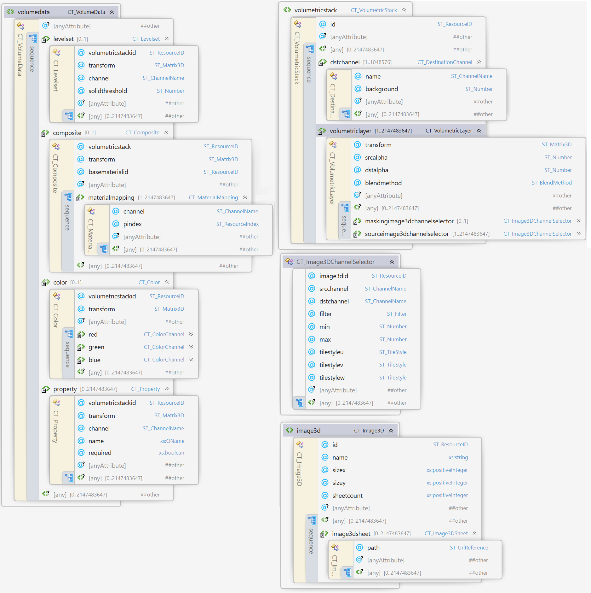

# Chapter 2. Introduction
## 2.1 Volumetric Modeling
This extension to the 3MF core speficiation and support data that has been generated by .

A brief ... explanation


# Chapter 3. Additions to Resources

## 3.1 3D Image Resources

Element **\<image3d>**


| Name   | Type   | Use | Annotation |
| --- | --- | --- | --- |
| id | ST\_ResourceID | required | Specifies an identifier for this image3d resource. |
| name | xs:string | required | 3d image resource name used for annotations purposes. |
| sizex | xs:positiveinteger | required | Size of all child \<image3dsheet>-elements in first dimension in pixels. |
| sizey | xs:positiveinteger | required | Size of all child \<image3dsheet>-elements in second dimension in pixels. |
| sheetcount | xs:positiveinteger | required | Number of \<image3dsheet>-elements within this \<image3d> element. |

Volumetric data can be encoded as 3d images that consist of voxels. Each \<image3d> element is assumed to represent a unit cube from which data can be sampled at any point. Volumetric images can be embedded inside a 3MF file using groups of PNG images that represent a stack of images.

All image3dsheets within an image3d MUST have the same x- and y-size that is specified in the sizex and sizey-attributes, respecitvely. sizex, sizey and sheetcount MUST not exceed 1024^3, each. The total number of voxels MUST be limited by XXX. There MUST be exactly sheetcount \<image3dsheet>-elements under \<image3d> that are implicitly ordered starting with index 0.

Image3D objects, and thus the underlying \<image3dsheet> elements, SHOULD provide the channels "R", "G", "B" or "A". All image3dsheets within an image3d MUST provide the same channels, and each channel MUST have the same bit-depth accross all image3dsheets.

Specific rules apply if an image3dsheet does not provide these channels:
- If an  \<image3dsheet> does not provide a color channel "R", "B" or "G" but provides a greyscale channel, sampling any color channel will
return the value of the greyscale channel.
- If an  \<image3dsheet> does not provide an alpha channel "A", sampling "A" will behave as if the  \<image3dsheet> contained a fully saturated alpha channel.


## 3.1.1 File Formats
PNG images can provide acceptable compression and bitdepth for the levelset-function, color information, material mixing ratios or arbitrary property information.

The following describes recommendations for the channel bit depth of PNG images used in this specification and is based on the nomenclature in the specification of the Portable Network Graphics (PNG, https://www.w3.org/TR/PNG) format.

- Color information, material mixing ratios and arbitrary properties can be deduced from PNG images with arbitrary channel depth. It is RECOMMENDED to store color into RGB-channels within a PNG.

- It is RECOMMENDED to store information that will be used as levelset to represent a boundary in PNGs with one channel only. A levelset-function can be deduced from a channel with binary values, i.e. from images of image type "Greyscale" with bit-depth of 1 or an indexed-color with bit depths of 1.

To achieve high accuracy, producers SHOULD store such information in image channels with bit depth of 16. Most professional image editing tools an standard implementations of the PNG format support channels with 16 bit.


## 3.1.2 OPC package layout
It is RECOMMENDED that producers of 3MF Documents use the following part naming convention:

Paths of  \<image3dsheet> SHOULD consist four segments. "/3D/volumetric/" as the first two segments, the name of a image3d-element that references this  \<image3dsheet> as third segment (for example "/3D/volumetric/mixingratios/", and the name of the image3dsheet as last segment (for example "sheet0001.png"). The 3D Texture part that is the  \<image3dsheet> MUST be associated with the 3D Model part via the 3D Texture relationship.

This implies that all  \<image3dsheet> parts for an image3d-object SHOULD be located in same OPC folder.


## 3.2 3D Image Sheet

Element **\<image3dsheet>**

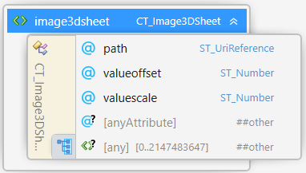

| Name   | Type   | Use | Annotation |
| --- | --- | --- | --- |
| path | ST\_UriReference | required | Specifies the OPC part name (i.e. path) of the image data file |
| minvalue | ST\_Number | _0.0_ | Specifies how the minimal possible value of a channel in this image is interpreted as output. |
| maxvalue | ST\_Number | _1.0_ | Specifies how the maximal possible value of a channel in this image is interpreted as output. |

Each \<image3dsheet> element has one required attribute. The path property determines the part name (i.e. path) of the 2D image data (see chapter 6 of the Materials & Properties Extension specification for more information).

The `minvalue` and `maxvalue` determine how the minamal and maximal value of any channel within the referenced PNG-file shall be interpreted. Channel values inbetween must be linearly interpolated. Specifying different `minvalue` and `maxvalue`-attributes for different \<image3dsheet>s is optional, but allows producers to more efficiently encode values in different regions of an object.

## 3.3. Channel from Image3D
 
Element type
**\<channelfromimage3d>**

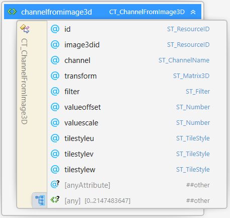

| Name   | Type   | Use | Annotation |
| --- | --- | --- | --- |
| id | ST\_ResourceID | required | The resource id of this ChannelFromImage3D resource |
| image3did | ST\_ResourceID | required | Specifies the id of the 3d image resource |
| channel | ST\_ChannelName | required | Specifies which channel to reference in the 3d image resource |
| valueoffset | ST\_Number | _0.0_ | Specifies a numerical offset for the values obtained from the `channel` within the `image3d` refered to by this CT_ChannelFromImage3D |
| valuescale | ST\_Number | _1.0_ | Specifies a numerical scaling for the values obtained from the `channel` within the `image3d` refered to by this CT_ChannelFromImage3D. |
| filter |ST\_Filter | _linear_ | "linear" or "nearest" neighbor interpolation |
| tilestyleu | ST\_TileStyle | Required |	Determines the behavior of the sampler for texture coordinate u outside the [0,1] range |
| tilestylev | ST\_TileStyle | Required |	Determines the behavior of the sampler for texture coordinate v outside the [0,1] range |
| tilestylew | ST\_TileStyle | Required |	Determines the behavior of the sampler for texture coordinate w outside the [0,1] range |

Elements of type \<CT_ChannelFromImage3D> define the way in which individual channels from volumetric image resources can be referenced inside the volumetric layer elements. Each channel reference MUST contain a resource id that maps to an actual \<image3d> element.

In addition, the elements of type \<CT_ChannelFromImage3D> MUST contain two string attributes which determine which channel to reference and how they should be mapped within the volumetric image. The srcchannel name string can use any of the reserved channel names (i.e. "R", "G", "B", or "A"). 

For grayscale images "R", "G", and "B" are interchangeable and SHOULD always map to the same value. For images, which lack an alpha channel, any sampling operation on channel "A" should always return an alpha value of 1.0. The \<image3d> resource MUST be defined before being referenced by an element of type \<CT_ChannelFromImage3D> in the 3MF model document to simplify the parser.

**tilestyle-u, -v or -w**:

MUST be one of "wrap", "mirror", "clamp", and "none". This property determines the behavior of the sampler of this channel for 3d texture coordinates (u,v,w) outside the [0,1]x[0,1]x[0,1] cell. The different modes have the following interpretation (for s = u, s = v, or s = w):

1. "wrap" assumes periodic texture sampling. A texture coordinate s that falls outside the [0,1] interval will be transformed per the following formula:
</br>s’ = s – floor(s)

2. "mirror" means that each time the texture width or height is exceeded, the next repetition of the texture SHOULD be reflected across a plane perpendicular to the axis in question following this formula:
</br>s’ = s ... TODO

3. "clamp" will restrict the texture coordinate value to the [0,1] range. A texture coordinate s that falls outside the [0,1] interval will be transformed according to the following formula:
</br>s’ = min(1, max(0,s))

4. "none" will discard the channelselector's value if the 3d texture coordinate s falls outside the [0,1] range. This is useful if a 3d texture is used as a volumetric decal of sorts that affects only a limited region in the volume.

**filter**:
The filter attribute defines the interpolation method.

- If the interpolation method of an elements of type \<CT_ChannelFromImage3D> is "nearest", sampling it at an arbitrary (u,v,w) returns the floating point value defined by the closest point (u',v',w') to (u,v,w) which transforms back to a voxel center in the 3D image ressource.

- If the interpolation method of an elements of type \<CT_ChannelFromImage3D> is "linear", sampling it at an arbitrary (u,v,w) returns the floating point defined by trilinearly interpolating between the eight closest points coordinates which transforms back to voxel centers in the 3D image ressource.

**The workings of instances of type \<CT_ChannelFromImage3D>**:
1. The referenced 3D Image contains a voxel grid of values (e.g. RGB, Grey-Alpha, Grey) values distributed in a cuboid ([0..res_x] x [0..res_y] x [0..res_z]). The centers of each voxel (ix, iy, iz) are at the half integer positions (ix + 0.5, iy + 0.5, iz + 0.5).

2. Each channel in a 3D Image can be sampled at these half integer positions and returns the value of the respecitve channel which is scaled between its `minvalue` and `maxvalue`.

3. The \<CT_ChannelFromImage3D> selects one of those channels and gives integer values (between 0 and 2^bitdepth-1) at the half integer positions (ix + 0.5, iy + 0.5, iz + 0.5) with ix = 0..res_x – 1, iy = 0..res_y – 1, iz = 0..res_z – 1.
    ρ1:[0,1,...,res_x-1]x[0,1,...,res_y-1]x[0,1,...,res_z-1]→R

4. The **tilestyle** maps extends the voxel grid of the image3d to infite integer 3D space: they extend the pointwise defined pixel values to a mapping
  
    ρ:Z^3→R through the rules 1-4 defined above.

5. The `filter` method defines a function on the full coordinate space. In mathematical terms, this defines a mapping

    ρ':R^3→R through the filter-rules defined above.

6. In a final scaling step, the coordinates are mapped to the unit cube, and the values linearly scaled via offsetvalue and scalevalue, thus giving a normalized function

    φ:R^3→R:
    
    (x,y,z) → offsetvalue ⁡+ ρ'(x\*res_x,y\*res_y,z\*res_z)*scalevalue

The following image illustrates the channel selection process OUTDATED!:

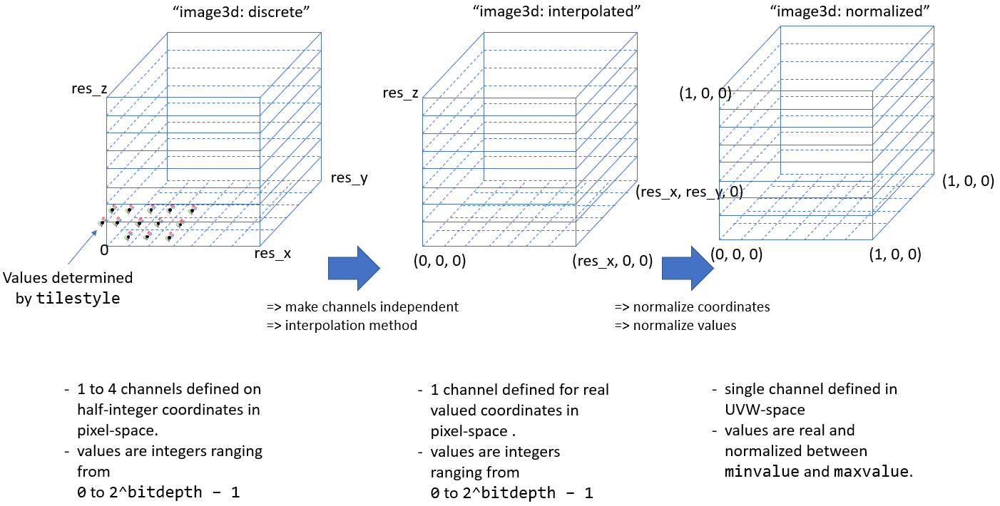


## 3.4. Volumetric Stack element

Element **\<volumetricstack>**

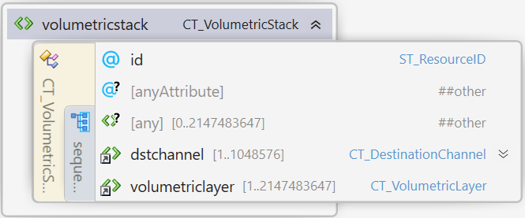

| Name   | Type   | Use | Annotation |
| --- | --- | --- | --- |
| id | ST\_ResourceID | required | Specifies the id of this volumetricstack |

The volumetric stack is a resource within a 3MF model that defines how volumetric data
from multiple \<CT_ChannelFromImage3D> is composited to yield multiple custom scalar field (dstchannels) in 3d. This custom scalar field of a \<volumetricstack> element can then be used to define volumetric properties inside the \<volumedata>-element of an object, see []().

1. It defines multiple destination channels, \<dstchannel>-elements. Each destinaton channel is a scalar field in 3d, whose values can be retrieved by sampling this volumetricstack.

2. The sampled values of each destination channel are built up by blending multiple layers, the \<volumetriclayer>-elements. This allows e.g. boolean opeartions on the scalar fields provided by different \<sourceimage3dchannelselector> elements.

The volumetricstack element MUST contain at least one \<dstchannel> child element and MUST NOT contain more than 2^20 \<dstchannel> child-elements. The volumetricstack element MUST NOT contain more than 2^31-1 \<volumetriclayer> child-elements.


## 3.4.1 Destination channel element

Element **\<dstchannel>**

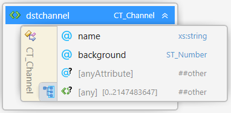

| Name   | Type   | Use | Annotation |
| --- | --- | --- | --- |
| name | ST\_ChannelName | required | Specifies the name of this destination channel |
| background | ST\_Number | required | Specifies the background value of this channel |

A destination channel specifies a name of a channel that can be sampled from a volumetricstack element.
The background value is the value that serves as a base for the blending that takes place in the volumetriclayer elements
within the \<volumetricstack>-element.

The names of \<dstchannel>-elements must be unique within a \<volumetricstack>-element.

## 3.4.2 Volumetric Layer element

Element **\<volumetriclayer>**

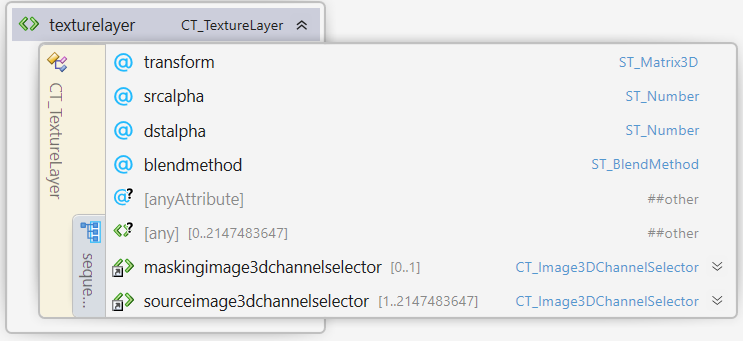

| Name   | Type   | Use | Annotation |
| --- | --- | --- | --- |
| transform | ST\_Matrix3D | required | Transformation of the volumetricstack coordinate system into the volumetriclayer coordinate system |
| blendmethod | ST\_BlendMethod | required | Determines how this layer is applied to its sublayers. Allowed values are "weightedsum", "multiply", "min", "max" or "mask". |
| srcalpha | ST\_Number | optional |	Numeric scale factor for the source layer. Required if blendmethod is "weightedsum". |
| dstalpha | ST\_Number | optional |	Numeric scale factor for the destination layer. Required if blendmethod is "weightedsum".  |
| maskid | ST\_ResourceId | optional |	The resource id of a ChannelFromImage3D resource which shall be used for masking. Required if blendmethod is "mask".  |

Each \volumetriclayer>-element modify the accumulated value of the destination channels of a volumetric stack. This modification is defined by the following attributes:

**blendmethod**: controls according to which formula the current layer (known as the source layer) is blended with the layers below it or with the stack’s background value.

Let "s" denote the value of the source channel, "d" the current value of the destination channel, then the modified value of the destination channel "d'" after blending is calculated according to the blendmethod:

- "weightedsum":

    d' = src_alpha * s + dst_alpha * d

    **srcalpha**: is a scalar value which is multiplied with the sampled values in the source layer during the blending process.

    **dstalpha**: is a scalar value which is multiplied with the sampled values in the destination during the blending process.
    
    TODO: Refer to example image below, add example using e.g. [0.5, 0.5] for a physical quantiy, and [1,-1] for a levelset.
    TODO: The producer is responsible to choose parameters srcalpha and dstalpha, such that sampling them e.g. a physical property, is sensible.

- "multiply":

    d' = s * d

- "min"/"max": (this is used for boolean operations of distance. distance fields being special cases of levelset functions)
   
    d' = min(s,d) or d' = max(s,d) 

- "mask":

    The blendmethod "mask" provides a means to use another 3d texture as a volumetric decal that only affects a region of complex shape within the volume.

    d' = m * s + (1 - m) * d
    
    Here, m is the value of the channel provided by the \<channelfromimage3d> refered to by the "maskid" attribute of this volumetriclayer.
    
    __Note__: The blendmethod "mask" implements the same formula as the blendmethod "mix" for the rgb-values of an \<multiproperties>-element in the [Materials and Properties Extension specification, Chapter 5](https://github.com/3MFConsortium/spec_materials/blob/1.2.1/3MF%20Materials%20Extension.md#chapter-5-multiproperties).


Figure 4-1 shows an example of two layers within a volumetric stack and the result using various blending functions with different source and destination alpha values.
A volumetriclayer MUST contain at least one \<channelmapping> element. The dstchannel attribute of the each \<channelmapping> within a volumetriclayer element MUST match a \<dstchannel> element within this \<volumetriclayer>.
The name of each \<dstchannel> element MUST occur at most once as dstchannel attribute in one of the \<channelmapping>.

Destination channels that are not mentioned in as dstchannel attribute in this list are not modifed by this \<volumetriclayer>.

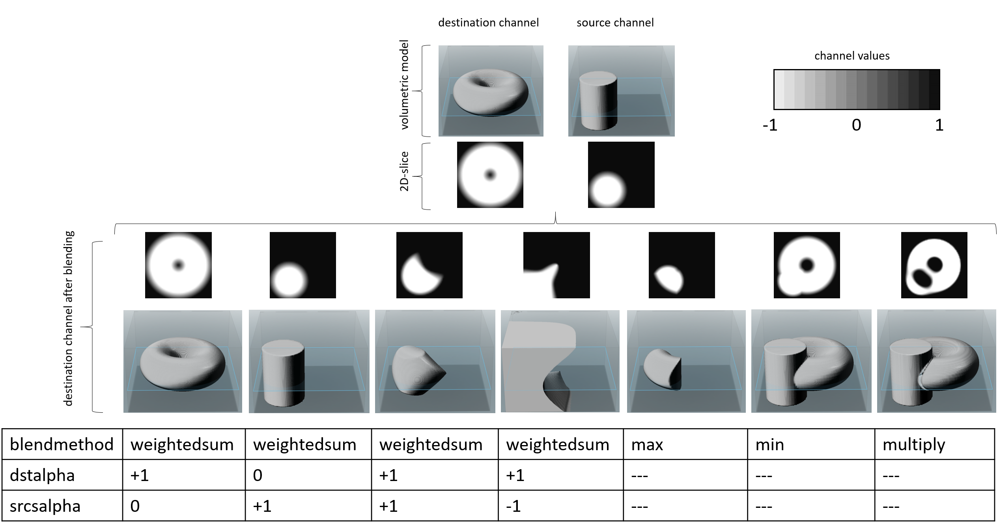

## 3.4.3 Channelmapping element
Element **\<channelmapping>**

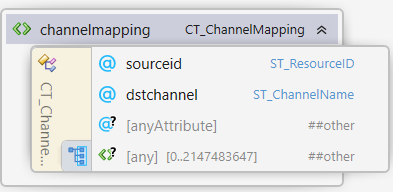

| Name   | Type   | Use | Annotation |
| --- | --- | --- | --- |
| sourceid | ST\_ResourceID | required | The resource id of a ChannelFromImage3D resource |
| dstchannel | ST\_ChannelName | required | Name of the destination channel that should be manipulated by this channelmapping within this volumetric layer |

# Chapter 4 Additions to Mesh

## 4.1. Volumetric Data extension to Mesh
 
Element **\<mesh>**


| Name   | Type   | Use | Annotation |
| --- | --- | --- | --- |
| v:volumedata | CT\_VolumeData | optional | The entry point to volumetric information of this specification. |

The volumetric data \<volumedata> element is a new OPTIONAL element which extends the root triangular mesh representation (i.e. \<mesh> element).


## 4.2. Volumetric Data
 
Element **\<volumedata>**


The \<volumedata> element references the volumetric data given by \<volumetricstack>-elements and defines how their various channels are mapped to specific properties within the interior volume of the enclosing mesh.

Any property defined in the volumedata element is clipped by a specific clipping geometry.

The basic clipping geometry is defined by the surface of the enclosing \<mesh> element. This implicitly takes into account geometry defined by e.g. the beamlattices specification.

If \<boundary> exists, the printable geometry is defined by the intersection of basic clipping geometry and the interior of the levelset.
Otherwise printable geometry equals the basic clipping geometry.

- Boundary element (if exists) needs to be clipped by surface geometry of enclosing mesh. This defines the clipping geometry for all other elements within the volumedata element 
The surface of the enclosing \<mesh object> determines the boundary geometry that acts as a trimming surface for any volumetric data defined therein. Any data outside the mesh's bounds MUST be ignored. Volumedata MUST only be used in a mesh of object type "model" or "solidsupport".

The volumedata element can contain up to one \<boundary> child element, up to one \<composite> child element,
up to one \<color> element, and an arbitray number of \<property> elements.

Volumetric content is always clipped to the surface of the mesh that embedds it. If a property (color or properties) defined at the surface of an object conflicts with the property within the object defined by this extension, a surface layer should be defined with a thickness as small as possible to achieve the surface property on the outside of the object. Outside of this thin surface region, the volumetric property should be applied everywhere within the object.

The properties at surface regions that are not explicitly specified are given by the volumetric properties.

## 4.2.1 Boundary element

Element **\<boundary>**


| Name   | Type   | Use | Annotation |
| --- | --- | --- | --- |
| volumetricstackid | ST\_ResourceID | required | ResourceID of the volumetricstack that holds a levelset function which defines the boundary |
| channel | ST\_ChannelName | required | Name of the channel that holds a levelset function which defines the boundary |
| solidthreshold | ST\_Number | *0.0* | All locations whose levelset function evaluates to a value \< or \>= than solidthreshold are consired within or outside of the specified object, respecively.|
| transform | ST\_Matrix3D | required | Transformation of the object coordinate system into the volumetricstack coordinate system |


The \<boundary> element is used to define the boundary of the enclosing \<object>-element as
the set of locations where the value of the referenced levelset function equals the solidthreshold attribute.
Locations where the levelset function is smaller and larger than the solidthreshold indicate the interior and exterior of the object, respectively.

The levelset function is given by the "destination channel" within the \<volumetricstack>
with resource id matching the volumetricstackid-attribute and with name matching the "channel"-attribute of the \<boundary>-element.

The mapping from object coordinates to the coordiante system of the corresponding volumetricstack is given by the transform attribute.

##### Figure  4-1: Illustration of different local coordinate systems and blendmethods


## 4.2.2 Color element

Element **\<color>**


| Name   | Type   | Use | Annotation |
| --- | --- | --- | --- |
| transform | ST\_Matrix3D | required | Transformation of the object coordinate system into the volumetricstack coordinate system |
| volumetricstackid | ST\_ResourceID | required | ResourceID of the volumetricstack that holds the channels to be used in the child color elements. |

The \<color> element is used to define the color of the object.
The color MUST be interpreted in linearized sRGB color space as defined in the Materials and Properties specification https://github.com/3MFConsortium/spec_materials/blob/master/3MF%20Materials%20Extension.md#12-srgb-and-linear-color-values. If the value of the srcchannel of a \<red>-, \<green>- and \<blue>-element is \<0 or \>1 it has to be truncated at 0 or 1, respectively.

The \<color>-element MUST contain exactly three \<red>-, \<green>- and \<blue>-element.

## 4.2.3 Color channel elements

Elements **\<red>, \<green> and \<blue>**

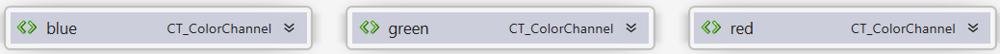

of

Complex type **\<colorchannel>**

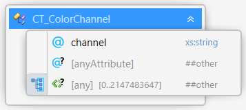

| Name   | Type   | Use | Annotation |
| --- | --- | --- | --- |
| srcchannel | ST\_ChannelName | required | Source channel for the values of this color channel |

Each element instance of CT\_ColorChannel MUST have an attribute "srcchannel" that
references a destination channel from the \<volumetricstack> with Id matching the volumetricstackid of the parent \<color> element.

If the value of the srcchannel of a \<red>-, \<green>- and \<blue>-element is \<0 or \>1 it has to be truncated at 0 or 1, respectively. 


## 4.2.4 Composite element

Element **\<composite>**


| Name   | Type   | Use | Annotation |
| --- | --- | --- | --- |
| transform | ST\_Matrix3D | required | Transformation of the object coordinate system into the volumetricstack coordinate system |
| volumetricstackid | ST\_ResourceID | required | ResourceID of the volumetricstack that holds the channels used in the child \<materialmapping>-elements |
| basematerialid | ST\_ResourceID | required | ResourceID of the basematerial that holds the \<base>-elements referenced in the child \<materialmapping>-elements |

The \<composite> element describes a mixing ratio of printer materials at each position in space. The CONSUMER can determine the halftoning, mixing or dithering strategy that can be used to achieve these mixtures.

This element MUST contain at least one \<materialmapping> element, which will encode the relative contribution of a specific basematerial to the material mix.

## 4.2.5 Material mapping element

Element **\<materialmapping>**


| Name   | Type   | Use | Annotation |
| --- | --- | --- | --- |
| srcchannel | ST\_ChannelName | required | Source channel for the values of this material |
| pindex | ST\_ResourceIndex | required | ResourceIndex of the \<base>-element within the parent's associated \<basematerial>-element |

The \<materialmapping> element defines the relative contribution of a specific material to the mixing of materials in it's parent
\<composite>-element.

If the sampled value of a channel is \<0 it must be evaluated as "0".

Procuer MUST not create files where the sum of all values in it's child \<materialmapping>-elements is smaller then Epsilon TODO. If the total is smaller than this threshold, the mixing ratio is up to the consumer.

- If we have N materials, then 
Ratio of Material i at point X: value of channel i at point X / sum(all N channels at point X)

Each element instance of CT\_MaterialMapping MUST have an attribute "srcchannel" that
references a destination channel from the \<volumetricstack> with id matching the volumetricstackid of the parent \<composite> element.

## 4.2.4 Property element

Element **\<property>**


| Name   | Type   | Use | Annotation |
| --- | --- | --- | --- |
| transform | ST\_Matrix3D | required | Transformation of the object coordinate system into the volumetricstack coordinate system |
| volumetricstackid | ST\_ResourceID | required | ResourceID of the volumetricstack that holds the channel used by this property |
| channel | ST\_ChannelName | required | Name of the channel that serves as source for the scalar value representing this property. |
| name | xs:QName | required | Namespace and name of this property property |
| required | xs:boolean | optional | Indicator whether this property is required to process this 3MF document instance. |

The \<property> element allows to assign any point in space a scalar value of a freely definable property.
This can be used to assign, e.g. opacity, conductivity, ...

The names of \<property>-elements MUST be unique within a \<volumedata>. This name MUST be prefixed with a valid XML namespace name declared on the <model> element.
The interpretation of the value MUST be defined by the owner of the namespace. 

If the interpretation of a property might result in a conflict with the standard volumedata-elements (boundary, color, composite) the namespace-owner MUST specify a resolution to the conflict. A producer MUST NOT create files with properties that conflict with each other.

If a physical unit is necessary the namespace owner MUST define a unique and unambiguous physical unit system for the namespace. The unit system SHOULD be metric.

The specifications of private namespaces (i.e. that are not ratified by the 3MF Consortium) need to be negotiated between parties in the ecosystem.

If a \<property> is marked as `required`, and a consumer does not support it, it MUST warn the user or the appropriate upstream processes that it cannot process all contents in this 3MF document instance.
Producers of 3MF files MUST mark all volumetric \<properties> required to represent the design intent of a model as `required`.

TODO:
- rules for property versus composite (if they do not make sense together)
- rules for physical units
- rules for where to put namespace information ... ? Print ticket?

# Part II. Appendixes

# Appendix A. Glossary

See [the standard 3MF Glossary](https://github.com/3MFConsortium/spec_resources/blob/master/glossary.md).

## Appendix B. 3MF XSD Schema
see: [volumetric.xsd](volumetric.xsd)
```xml
```

# Appendix C. Standard Namespace

Volumetric [http://schemas.microsoft.com/3dmanufacturing/volumetric/2018/11](http://schemas.microsoft.com/3dmanufacturing/volumetric/2018/11)

# Appendix D: Example file

see: [Examples/3dmodel.model](Examples/3dmodel.model)
```xml
```

# References

See [the standard 3MF References](https://github.com/3MFConsortium/spec_resources/blob/master/references.md).

Copyright 3MF Consortium 2019.
