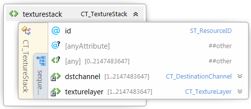

#
# 3MF Volumetric Extension

## Specification & Reference Guide


| **Version** | 0.1.0 |
| --- | --- |
| **Status** | Draft |

## Table of Contents

[Preface](#preface)

[About this Specification](#11-about-this-specification)

[Document Conventions](#12-document-conventions)

[Language Notes](#13-language-notes)

[Software Conformance](#14-software-conformance)

[Part I: 3MF Documents](#part-i-3mf-documents)

[Chapter 1. Overview of Additions](#chapter-1-overview-of-additions)

[Chapter 2. Object](#chapter-2-object)


[Part II. Appendixes](#part-ii-appendixes)

[Appendix A. Glossary](#appendix-a-glossary)

[Appendix B. 3MF XSD Schema](#appendix-b-3mf-xsd-schema)

[Appendix C. Standard Namespace](#appendix-c-standard-namespace)

[Appendix D: Example file](#appendix-d-example-file)

[References](#references)


# Preface

## 1.1. About this Specification

This 3MF volumetric lattice specification is an extension to the core 3MF specification. This document cannot stand alone and only applies as an addendum to the core 3MF specification. Usage of this and any other 3MF extensions follow an a la carte model, defined in the core 3MF specification.

Part I, "3MF Documents," presents the details of the primarily XML-based 3MF Document format. This section describes the XML markup that defines the composition of 3D documents and the appearance of each model within the document.

Part II, "Appendixes," contains additional technical details and schemas too extensive to include in the main body of the text as well as convenient reference information.

The information contained in this specification is subject to change. Every effort has been made to ensure its accuracy at the time of publication.

This extension MUST be used only with Core specification 1.x.

## Document Conventions

See [the standard 3MF Document Conventions documentation](https://github.com/3MFConsortium/spec_resources/blob/master/document_conventions.md).

## Language Notes

See [the standard 3MF Language Notes documentation](https://github.com/3MFConsortium/spec_resources/blob/master/language_notes.md).

## Software Conformance

See [the standard 3MF Software Conformance documentation](https://github.com/3MFConsortium/spec_resources/blob/master/software_conformance.md).

# Part I: 3MF Documents

# Chapter 1. Overview of Additions
This document describes new elements, each of which is OPTIONAL for producers, but core features with some exceptions (see below, various types of 3d volumetric data types) MUST be supported by consumers that specify support for this volumetric extension of 3MF. Not all types of volumetric textures make sense for all printing technologies and consumers may choose to ignore color, composite materials, or properties that do not match their hardware. 
The proposed extensions enable the embedding of voxel data within 3mf files. This would enable the representation of objects that are characterized by variable material properties throughout their volume, like opacity, color, strength etc. 

Addition:
-	explain how surface/volume properties work together
-	Proposed language for volumetric / surface property language: (from Alan)
-	Volumetric content always clipped to mesh surface. Surface properties are as thin as possible to achieve the affect (printer dependent).  Unspecified surface properties come from the volumetric material.


# Part I: 3MF Documents

# Chapter 1. Overview of Additions


This document describes new elements, each of which is OPTIONAL for producers, but MUST be supported by consumers that specify support for this beam lattice extension of 3MF.

The central idea of this extension is to enrich the geometry notion of 3MF with beam lattice elements that can represent small-scale lattices as well as larger truss structures – both of which are quite inefficient to handle with a mesh representation, especially in cases where the element count grows into large numbers.

In order to find a balance between implementation complexity and capabilities, in this version of the specification all lattice beams are required to have a circular cross section. This reduces anisotropy issues that would be introduced by non-rotational geometries. Any additional capabilities MAY be handled by further (either public or private) extensions.

While this is meant to be an exact specification of the lattice geometry, and consumers MUST interpret it as such, the intent is also for applications in which editors can use the data structures for efficient interoperability and post processing the geometry in an intermediate step.

A producer using the lattice specification MUST mark the extension as required, as described in the core specification.

##### Figure 2-1: Overview of model XML structure of 3MF with volumetric additions

#####


# Chapter 2. Additions to Resources

## 2.1 3D Image Resources

Element **\<image3d>**


| Name   | Type   | Use | Annotation |
| --- | --- | --- | --- |
| id | ST\_ResourceID | required | Specifies an identifier for this image3d resource. |
| name | xs:string | required | 3d image resource name used for annotations purposes. |
| resolutionx | xs:positiveinteger | required | Resolution of all child \<image3dsheet>-elements in first dimension in pixels. |
| resolutiony | xs:positiveinteger | required | Resolution of all child \<image3dsheet>-elements in second dimension in pixels. |
| resolutionz | xs:positiveinteger | required | Resolution of all child \<image3dsheet>-elements in third dimension in pixels. |

Volumetric data can be encoded as 3d images that consist of voxels. Each \<image3d> element is assumed to represent a unit cube from which data can be sampled at any point. Volumetric images can be embedded inside a 3MF file using groups of PNG or JPEG images that represent a stack of images.

There MUST be exactly resolutionz \<image3dsheet>-elements under \<image3d> that are implicitly ordered starting with index 0.

All images in an image stack MUST have the same x- and y-resolution that is specified in the resolutionx and resolutiony-attributes, respecitvely.

Each image MUST contain the same channels that have a name tag that describes its purpose and can be referenced inside the texture objects that make up the volumetric texture compositing layers.
For PNG and JPEG images, the channel tags "R","G", "B" and "A" have been reserved. 


## 2.1.1 File Formats
PNG and JPEG images provide acceptable compression and bitdepth for color or property information and material mixing ratios.

TODO: i.e. 16 bit per channel; possible as RGB or RGBA  ("truecolor"/"truecolor with alpha" 16 bit https://www.w3.org/TR/PNG/#11IHDR )
For PNG and JPEG images, the channel names "R", "G", "B" and "A" are reserved.

## 2.1.2 OPC package layout
TODO


## 2.2 3D Image Sheet

Element **\<image3dsheet>**


| Name   | Type   | Use | Annotation |
| --- | --- | --- | --- |
| source | ST\_UriReference | required | Specifies the OPC part name (i.e. path) of the image data file |


Each \<image3dsheet> element has one property which MUST be present. The source property determines the part name (i.e. path) of the 2d image data (see chapter 6 of the Materials & Properties Extension specification for more information).


## 2.3. 3D Image Channel Selector

Element **\<image3dchannelselector>**


| Name   | Type   | Use | Annotation |
| --- | --- | --- | --- |
| image3dresourceid | ST\_ResourceID | required | Specifies the id of the 3d image resource |
| srcchannel | ST\_ChannelName | required | Specifies which channel to reference in the 3d image resource |
| dstchannel | ST\_ChannelName | _srcchannel_ | Specifies which channel the source channel should be mapped to during a sampling procedure. Will default to srcchannel if not given |
| minvalue | xs:double | _0.0_ | Specifies how the minimal possible value of the source channel is interpreted in the output. |
| maxvalue | xs:double | _0.0_ | Specifies how the maxmimal possible value of the source channel is interpreted in the output. MUST be larger than minvalue. |
|interpolationmethod | ST\_InterpolationMethod | _linear_ | "linear" or "nearest" neighbor interpolation |
| tilestyleu | ST\_TileStyle | Required |	Determines the behavior of the sampler for texture coordinate u outside the [0,1] range |
| tilestylev | ST\_TileStyle | Required |	Determines the behavior of the sampler for texture coordinate v outside the [0,1] range |
| tilestylew | ST\_TileStyle | Required |	Determines the behavior of the sampler for texture coordinate w outside the [0,1] range |

The \<image3dchannelselector> element defines the way in which individual channels from volumetric image resources can be referenced inside various texture objects. Each channel reference MUST contain a texture resource id that maps to an actual \<image3d> element.

In addition, the \<image3dchannelselector> element MUST contain two string attributes which determine which channel to reference and how they should be mapped within the volumetric image. The channel name string can use any of the reserved channel names (i.e. "R", "G", "B", or "A"). 

For grayscale images "R", "G", and "B" are interchangeable and SHOULD always map to the same value. For images, which lack an alpha channel, any sampling operation on channel "A" should always return an alpha value of 1.0. The \<image3d> resource MUST be defined before being referenced by a \<image3dchannelselector> in the 3MF model document to simplify the parser.

**tilestyle-u, -v or -w**:

MUST be one of "repeat", "mirror", "clamp", "ignore" and "solid". This property determines the behavior of the sampler of this texture for texture coordinates (u,v,w) outside the [0,1]x[0,1]x[0,1] cell. The different modes have the following interpretation:

1. "repeat" assumes periodic texture sampling. A texture coordinate s that falls outside the [0,1] interval will be transformed per the following formula:
</br>s’ = s – floor(s)

2. "mirror" means that each time the texture width or height is exceeded, the next repetition of the texture SHOULD be reflected across a plane perpendicular to the axis in question following this formula:
</br>s’ = s ... TODO

3. "clamp" will restrict the texel value to the [0,1] range. A texture coordinate s that falls outside the [0,1] interval will be transformed according to the following formula:
</br>s’ = min(1, max(0,s))

4. "ignore" will discard this texel if the texture coordinate s falls outside the [0,1] range. This is useful if a texture is used as a volumetric Decal of sorts that affects only a limited region in the volume.

5. "solid" will return the property defined in the background attribute.

**interpolationmethod**:

- If the interpolation method of a \<image3dchannelselector> is "nearest", sampling it at an arbitrary (u,v,w) returns the floating point value defined by the closest point (u',v',w') to (u,v,w) which transforms back to a voxel center in the 3D image ressource.

- If the interpolation method of a <image3dchannelselector> is "linear", sampling it at an arbitrary (u,v,w) returns the floating point defined by linearly interpolating between the eight closest points coordinates which transforms back to voxel centers in the 3D image ressource. 

**Function of the \<image3dchannelselector>**:
1. The referenced 3D Image Stack gives a voxel grid of RGBA (RGB, Grey-Alpha, Grey) values distributed in a cube ([0..res_x] x [0..res_y] x [0..res_z]). The centers of each voxel (ix, iy, iz) are at the half integer positions (ix + 0.5, iy + 0.5, iz + 0.5).

2. The channel selector selects one of those channels and gives integer values (between 0 and 2^bitdepth-1) at the half integer positions (ix + 0.5, iy + 0.5, iz + 0.5) with ix = 0..res_x – 1, iy = 0..res_y – 1, iz = 0..res_z – 1.

3. The **tilestyle** extends the voxel grid to infinity: to extend the pointwise defined pixel values to a mapping ρ:Z^3→Z through the rules ...  defined above.

4. The interpolation method defines a function on the full coordinate space. In mathematical terms, this defines a well-defined map ρ:R^3→Z, with values between 0 and 2^bitdepth-1.

5. In a final normalization step, the coordinates are mapped to the unit cube, and the values are mapped between the minvalue and maxvalue, thus giving a normalized function
φ:R^3→R, 
(x,y,z)→minvalue⁡+ (ρ (x*res_x,y*res_y,z*res_z))/(2^bitdepth-1)*(maxvalue-minvalue)


The following image shows the channel selection process:


## 2.4. Texture stack element

Element **\<texturestack>**



| Name   | Type   | Use | Annotation |
| --- | --- | --- | --- |
| id | ST\_ResourceID | required | Specifies the id of the texturestack |

The texture stack has two purposes:
1. It defines multiple destination channels whose values are filled by sampled values of 
a \<image3dchannelselector> with the matching "dstchannel" attribute.

2. In each of the desitnation channels multiple layers of values can be composited, e.g. to allow boolean opeartions on these scalar fields.

The texturestack element MUST contain at least one destination channel child.

## 2.4.1 Destination channel element

Element **\<dstchannel>**


| Name   | Type   | Use | Annotation |
| --- | --- | --- | --- |
| name | ST\_ChannelName | required | Specifies the name of this destination channel |
| background | xs:number | required | Specifies the background value of this channel |

A destination channel specifies a name of a channel that can be sampled from a texturestack element.
The background value is the value tha serves as a base for the compositing that takes place in the texturelayer elements
within the \<texturestack>-element, and serves as a base for when a \<solid> channelselector is evaluated outside its range according to ... .

The names of <dstchannel> must be unique within a \<texturestack>-element.


## 2.4.2 texturelayer element

Element **\<texturelayer>**


| Name   | Type   | Use | Annotation |
| --- | --- | --- | --- |
| compositing | ST\_CompositingFunction | required | Determines whether a layer is added or multiplied with its sublayers |
| srcalpha | ST_Number | required |	Numeric scale factor [-1,1] for the source layer |
| dstalpha | ST_Number | required |	Numeric scale factor [-1,1] for the destination layer |

Each <texturelayer> element MUST contain three properties which determine how it should be composited with the texture layers
below it in the texture stack. These properties are:

**compositing**: controls how the current layer (known as the source layer) is blended with the layers below it as well as with the stack’s background value and potential overlapping object. This compositing value SHOULD either be "add" or "multiply".  These functions either add or multiply the voxel values of the source layer with the corresponding voxels in the destination layer.

**srcalpha**: is a scalar value that SHOULD be in the range [-1, 1] which is multiplied with the voxel values in the source layer during the compositing process.

**dstalpha**: is a scalar value that SHOULD be in the range [-1, 1] which is multiplied with the voxel values in the destination during the compositing process.

Figure 4-1 shows an example of two layers within a texture stack and the result using various compositing functions with different source and destination alpha values.

A texturelayer MUST contain at least one \<image3dchannelselector> element. The dstchannel attribute of the each \<image3dchannelselector> within a texturelayer element must match a \<destinationlayer> element within this \<texturelayer>.
The name of each \<destinationlayer> element must only occur at most once as dstchannel attribute in one of the \<image3dchannelselector>.

Destination channels that are not mentioned in as dstchannel attribtue in this list are not modifed by this \<texturelayer>.


# Chapter 3 Additions to Mesh

## 3.1. Volumetric Data extension to Mesh
 
Element **\<mesh>**


| Name   | Type   | Use | Annotation |
| --- | --- | --- | --- |
| v:volumedata | CT\_VolumeData | optional | The entry point to volumetric information in this specification. |


The volumetric data \<volumedata> element is a new OPTIONAL element which extends the root triangular mesh representation (i.e. \<mesh> element).


## 3.2. Volumetric Data
 
Element **\<volumedata>**


| Name   | Type   | Use | Annotation |
| --- | --- | --- | --- |
| requiredproperties | ... | optional | comma sperated list of required properties for this volumedata element |

The \<volumedata> element references voxel based 3D texture resources and determines how the various channels in these \<texturestack>s are mapped to specific properties of the part to be defined by this addition. The root mesh object determines the boundary geometry that acts as a trimming mesh for any volumetric data defined therein. Any data outside the mesh's bounds MUST be ignored. Volumedata MUST only be used in a mesh of object type model or solidsupport.

The volumedata element can contain up to one <levelset> child element, up to one <composite> child element,
up to one \<color> element, and an arbitray number of \<property> elements.

If a consumer does not support any of the required volumedata elements, it MUST warn the user or the appropriate upstream processes
that it cannot process all contents in this 3MF instance.

## 3.3. Levelset element

Element **\<levelset>**


| Name   | Type   | Use | Annotation |
| --- | --- | --- | --- |
| texturestackid | ST\_ResourceID | required | ResourceID of the texturestack that holds the levelset function |
| channel | ST\_ChannelName | required | Name of the channel that holds the levelset function |
| solidthreshold | ST_Number | *0.0* | All locations whose levelset function evaluates to a value \< or \>= than solidthreshold are consired within or outside of the specified object, respecively.|


The \<levelset> element is used to defines the boundary of the object to be specified as
the set of locations where the value of the levelset function equals the solidthreshold attribute.

The levelset function is given by "destination channel" within the \<texturestack> with id matching texturestackid-attribute with name = "channel"-attribute of the \<levelset>-element.
The mapping from object coordinates to the coordiante system of the corresponding texturestack is given by the transform attribute.


## 3.3. Color element

Element **\<color>**


## 3.4. Composite element

Element **\<composite>**


## 3.4. Property element

Element **\<property>**


# Part II. Appendixes

# Appendix A. Glossary

See [the standard 3MF Glossary](https://github.com/3MFConsortium/spec_resources/blob/master/glossary.md).

## Appendix B. 3MF XSD Schema

```xml
<?xml version="1.0" encoding="UTF-8"?>
<xs:schema xmlns="http://schemas.microsoft.com/3dmanufacturing/beamlattice/2017/02" xmlns:xs="http://www.w3.org/2001/XMLSchema" xmlns:xml="http://www.w3.org/XML/1998/namespace"targetNamespace="http://schemas.microsoft.com/3dmanufacturing/volumetric/2018/11" elementFormDefault="unqualified" attributeFormDefault="unqualified" blockDefault="#all">
  <xs:annotation>
    <xs:documentation>
      <![CDATA[
    Schema notes:
 
    Items within this schema follow a simple naming convention of appending a prefix indicating the type of element for references:
 
    Unprefixed: Element names
    CT_: Complex types
    ST_: Simple types
   
    ]]>
    </xs:documentation>
  </xs:annotation>
  
</xs:schema>
```


# Appendix C. Standard Namespace

BeamLattice    [http://schemas.microsoft.com/3dmanufacturing/volumetric/2018/11](http://schemas.microsoft.com/3dmanufacturing/volumetric/2018/112)

# Appendix D: Example file

```xml
<?xml version="1.0" encoding="utf-8"?>
<model xmlns="http://schemas.microsoft.com/3dmanufacturing/core/2015/02" unit="millimeter" xmlns:v="http://schemas.microsoft.com/3dmanufacturing/volumetric/2018/11" requiredextensions="v">

</model>
```

# References

See [the standard 3MF References](https://github.com/3MFConsortium/spec_resources/blob/master/references.md).

Copyright 3MF Consortium 2018.
