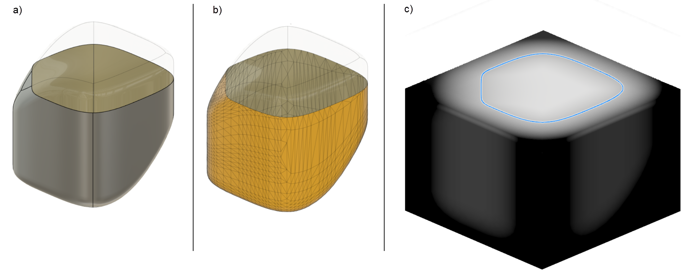
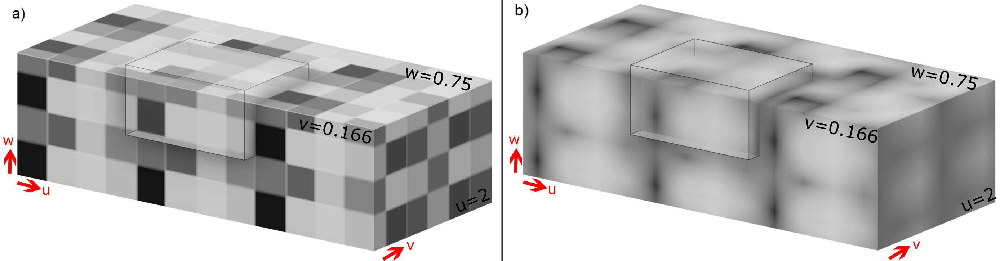
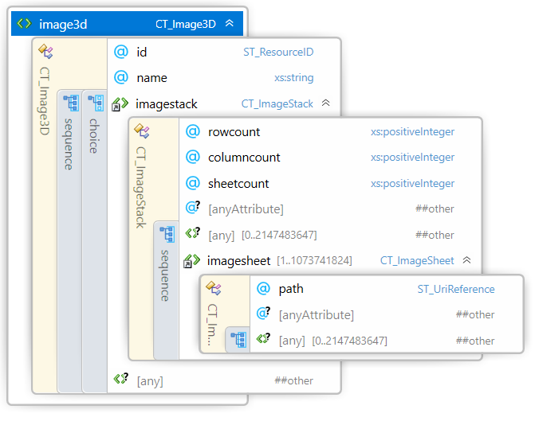
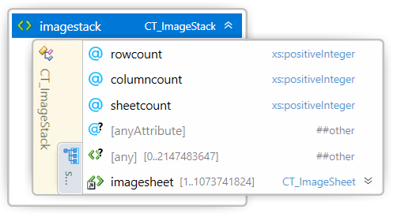
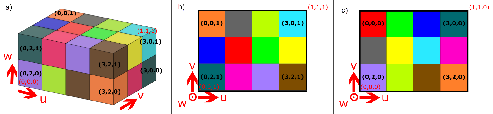

#
# 3MF Volumetric & Implicit Extensions

## Specification & Reference Guide


| **Version** | 0.8.0 |
| --- | --- |
| **Status** | Draft |

**Note**

## Table of Contents

- [Preface](#preface)
  * [Introduction](#introduction)
  * [About this Specification](#about-this-specification)
  * [Document Conventions](#document-conventions)
  * [Language Notes](#language-notes)
  * [Software Conformance](#software-conformance)
- [Part I: Volumetric Extension](#part-i-volumetric-extension)
  * [Chapter 1. Overview of Volumetric Additions](#chapter-1-overview-of-volumetric-additions)
  * [Chapter 2. DataTypes](#chapter-2-datatypes)
  * [Chapter 3. Functions](#chapter-3-functions-and-function-types)
  * [Chapter 4. 3D Image](#chapter-4-3d-image)
  * [Chapter 5. Volumetric Data](#chapter-4-volumetric-data)
  * [Chapter 6. Notes](#chapter-6-notes)
- [Part II. Implicit Extension](#3mf-volumetric-implicit-extensions)
  * [Chatper 1. Overview of Implicit Additions](#chapter-1-overview-of-implicit-additions)
  * [Chapter 2. Function Implicit](#chapter-2-function-implicit)
  * [Chapter 3. Nodes](#chapter-3-nodes)
  * [Chapter 4. Native Nodes](#chapter-4-native-nodes)
  * [Chapter 5. Implicit Evaluation](#chapter-5-implicit-evaluation)
  * [Chapter 6. Notes](#chapter-6-notes)
- [Part III. Appendices](#part-ii-appendices)
  * [Appendix A. Glossary](#appendix-a-glossary)
  * [Appendix B. 3MF XSD Schema for the Volumetric and Implicit Extensions](#appendix-b-3mf-xsd-schema-for-the-volumetric-extension)
  * [Appendix C. Standard Namespace](#appendix-c-standard-namespace)
  * [Appendix D: Example file](#appendix-d-example-file)
- [References](#references)


# Preface

## Introduction
Volumetric/Implicit Modeling is an efficient approach to encode geometrical shapes and spatial properties and is based on a volumetric description.
Traditional, explicit modeling methodologies are based on surfaces (e.g. NURBS, triangular meshes) that describe the boundaries of an object. This is illustrated in Figure 1-1. a) a NURBS surface delimitates a region of space. Figure 1-1 b) shows a triangular mesh that describes the same surface. In each case, the top part of the described object is being shown transparently to allow viewing the "inside" of the described object.

The implicit modeling approach relies on a mathematical, field-based description of the whole volume of the object. This is illustrated in Figure 1-1 c). Every point in space has a scalar (grey-scale) value. The iso-surface at value 0 describes the surface of the same object as in Figure 1-1 a). A section of this iso-surface is indicated by the blue line.

The true advantage of volumetric modeling shows when properties of an object vary in space gradually, e.g. color or material-distribution and -composition of an object vary in space. E.g. in Figure 1-2 a) the object has a uniform color except for a red stripe at the front-left surface that gradually turns into turquoise. Note that not only the surface, but also the interior volume has a non-uniform color in this region. Figure 1-2 b) shows a distribution of three different materials, indicated by three different colors, red, blue and green.

This is only a brief illustration of the implicit modeling approach to geometric design and more information can be found in [references](#references) \[1\] and \[2\].

_Figure 1-1. Explicit (a) and (b) vs. implicit (c) representation_


_Figure 1-2. Spatially varying properties_


## About this Specification


This 3MF volumetric specification is an extension to the core 3MF specification. This document cannot stand alone and only applies as an addendum to the core 3MF specification. Usage of this and any other 3MF extensions follow an a la carte model, defined in the core 3MF specification.

This 3MF implicit specification is an extension to the core 3MF specification and the 3MF volumetric specification. This document cannot stand alone and only applies as an addendum to the core 3MF specification. Usage of this and any other 3MF extensions follow an a la carte model, defined in the core 3MF specification.

Part I, "Volumetric Extension," presents the details of the primarily XML-based 3MF Document format. This section describes the XML markup that defines the composition of 3D documents and the appearance of each model within the document.

Part II, "Implicit Extension," describes the XML markup for describing implicit functions and their evaluation by defining a graph of nodes and their connections.

Part III, "Appendices," contains additional technical details and schemas too extensive to include in the main body of the text as well as convenient reference information.

The information contained in this specification is subject to change. Every effort has been made to ensure its accuracy at the time of publication.

This extension MUST be used only with Core specification version 1.3. or higher.

## Document Conventions

See [the 3MF Core Specification conventions](https://github.com/3MFConsortium/spec_core/blob/1.2.3/3MF%20Core%20Specification.md#document-conventions).

In this extension specification, as an example, the prefix "m" maps to the xml-namespace "http://schemas.microsoft.com/3dmanufacturing/material/2015/02". See Appendix [E.3 Namespaces](#e3-namespaces).

## Document Conventions

See [the standard 3MF Document Conventions documentation](https://github.com/3MFConsortium/spec_resources/blob/master/document_conventions.md).

## Language Notes

See [the standard 3MF Language Notes documentation](https://github.com/3MFConsortium/spec_resources/blob/master/language_notes.md).

## Software Conformance

See [the standard 3MF Software Conformance documentation](https://github.com/3MFConsortium/spec_resources/blob/master/software_conformance.md).


# Part I. Volumetric Extension

## Chapter 1. Overview of Volumetric Additions

_Figure 1-1: Overview of model XML structure of 3MF with volumetric additions_


This document describes new elements, each of which is OPTIONAL for producers, but MUST be supported by consumers that specify support for this volumetric extension of 3MF.

The central idea of this extension is to enrich the geometry notion of 3MF with volumetric elements that can represent spatially varying properties which are quite inefficient to handle with a mesh representation, especially in cases where the variation is continuous in space.

This extension is meant to be an exact specification of geometric, appearance-related, material and in fact arbitrary properties, and consumers MUST interpret it as such. However, the intent is also to enable editors of 3MF files to use the designated data structures for efficient interoperability and post-processing of the geometry and properties described in this extension.

A producer using the boundary element of the volumetric specification MUST mark the extension as required, as described in the core specification. Producers only using the other specification elements, in particular color-, composite- and property-elements, MAY mark the extension as REQUIRED, and MAY be marked as RECOMMENDED. Consumers of 3MF files that do not mark the volumetric extension as required are thus assured that the geometric shape of objects in this 3MF file are not altered by the volumetric specification.

# Chapter 2. DataTypes

The volumetric extension of 3MF, defines 4 new datatypes that are used for definition of the outputs of functions for volumetric evaluation. 
They allow to reference the output of nodes in a graph for the implicit extension or define the mapping of the output channels for the sampling of an image3d with functionFromImage3D. The References are of the type ST_NodeOutputIdentifier.

## 2.1 ST_NodeOutputIdentifier
The `ST_NodeOutputIdentifier` is a simple type used to represent an identifier for a node output in the format of "nodename.outputname".

ST_ScalarID, ST_VectorID, ST_MatrixID and ST_ResourceOutputID are derived from ST_NodeOutputIdentifier.

### Format
The format of `ST_NodeOutputIdentifier` is "nodename.outputname". The identifier must consist of alphanumeric characters and underscores. The dot (.) separates the node name and the output name.

## 2.2 ScalarReference
Element \<scalarref>


| Name      | Type             | Use      | Default | Annotation                                                                 |
| --------- | ---------------- | -------- | ------- | -------------------------------------------------------------------------- |
| identifier| ST_Identifier    | required |         | Specifies an identifier for this scalar resource.                          |
| displayname| xs:string       | optional |         | The name to be displayed e.g. for annotation
| ref       | ST_ScalarID      | required |         | Reference to the scalar in the form "NodeIdentifier.ScalarIdentifier".  

## 2.3 VectorReference
Element \<vectorref>


| Name      | Type             | Use      | Default | Annotation                                                                 |
| --------- | ---------------- | -------- | ------- | -------------------------------------------------------------------------- |
| identifier| ST_Identifier    | required |         | Specifies an identifier for this vector resource.                          |
| displayname| xs:string       | optional |         | The name to be displayed e.g. for annotation
| ref       | ST_VectorID      | required |         | Reference to the scalar in the form "NodeIdentifier.VectorIdentifier".  
                              |

## 2.4 MatrixReference
Element \<matrixref>

References to functions are only used for the implicit extension.


| Name      | Type             | Use      | Default | Annotation                                                                 |
| --------- | ---------------- | -------- | ------- | -------------------------------------------------------------------------- |
| identifier| ST_Identifier    | required |         | Specifies an identifier for this matrix resource.                          |
| displayname| xs:string       | optional |         | The name to be displayed e.g. for annotation
| ref       | ST_MatrixID      | required |         | Reference to the scalar in the form "NodeIdentifier.VectorIdentifier".                              |

## 2.5 ResourceReference
Element \<resourceref>

References to resources are only used for the implicit extension.


| Name      | Type             | Use      | Default | Annotation                                                                 |
| --------- | ---------------- | -------- | ------- | -------------------------------------------------------------------------- |
| identifier| ST_Identifier    | required |         | Specifies an identifier for this function resource.                          |
| displayname| xs:string       | optional |         | The name to be displayed e.g. for annotation
| ref       | ST_ResourceOutputID      | required |         | Reference to the resource output in the form "NodeIdentifier.OutputIdentifier".                              |


# Chapter 3. Functions and Function Types

## 3.1 Functions
Element **\<function>**


| Name   | Type   | Use | Default | Annotation |
| --- | --- | --- | --- | --- |
| id | ST\_ResourceID | required | | Specifies an identifier for this function resource. |
| displayname | xs:string | | | Function resource name used for annotations purposes. |

Volumetric data is created with functions that are evaluatable for at given model position. Each \<function> element is assumed to represent a method which can be evaluated within the model being described. Functions have input arguments and output arguments, each argument MUST be one of the supported datatypes enumerated in Chapter 2.

\<function> is a container for one of three distinct function types: FunctionFromImage3d, PrivateExtensionFunction, FunctionImplicit. The only function type that MUST be supported for the volumetric extension is FunctionFromImage3D which requires an Image3d resource.

## 3.2 FunctionFromImage3D
Element **\<functionFromImage3d>**


| Name   | Type   | Use | Default | Annotation |
| --- | --- | --- | --- | --- |
| id | ST\_ResourceID | required | | Specifies an identifier for this function resource. |
| displayname | xs:string | | | Function resource name used for annotations purposes. |
| image3did | ST\_ResourceID | required | | Specifies an identifier for the image3d resource that this function uses during evaluation. |
| valueoffset | xs:double | optional | 0.0 | Specifies a numerical offset for the samples values |
| valuescale | xs:double | optional | 1.0 | Specifies a numerical scaling of the sampled values |
| filter |ST\_Filter | | linear | "linear" or "nearest" neighbor interpolation. |
 tilestyleu | ST\_TileStyle | | wrap | Determines the behavior of the sampler for texture coordinate u outside the [0,1] range. |
| tilestylev | ST\_TileStyle | | wrap | Determines the behavior of the sampler for texture coordinate v outside the [0,1] range. |
| tilestylew | ST\_TileStyle | | wrap | Determines the behavior of the sampler for texture coordinate w outside the [0,1] range. |

Elements of type \<functionfromimage3d> define a function which can be sampled at any point in space from values on a voxel grid defined in the \<image3d> element. The function is evaluated by sampling the image3d at the UVW coordinates of the model position. The UVW coordinates are determined by the filter-rule and the tilestyle attributes of the \<functionfromimage3d>-element.

To simplify parsing, producers MUST define \<image3d>-elements prior to referencing them via imaged3did in a \<functionfromimage3d>-element.

**tilestyle-u, -v or -w**:

MUST be one of "wrap", "mirror" or  "clamp". This property determines the behavior of the sampler of this \<functionfromimage3d> for 3d texture coordinates (u,v,w) outside the [0,1]x[0,1]x[0,1] cell. The different modes have the following interpretation (for s = u, s = v, or s = w):

1. "wrap" assumes periodic texture sampling, see Figure 3-1 a). A texture coordinate s that falls outside the [0,1] interval will be transformed per the following formula:
</br>s’ = s – floor(s)

2. "mirror" means that each time the texture width or height is exceeded, the next repetition of the texture MUST be reflected across a plane perpendicular to the axis in question, see Figure 3-1 b). This behavior follows this formula:
</br>s’ = 1 - abs( s - 2 * floor(s/2) - 1 )

3. "clamp" will restrict the texture coordinate value to the [0,1] range, see Figure 3-1 c). A texture coordinate s that falls outside the [0,1] interval will be transformed according to the following formula:
</br>s’ = min(1, max(0,s))

	_Figure 3-1: Illustration of different tilestyles. a) tilestyle wrap illustrated throughout the second \<imagesheet>. b) tilestyle mirror illustrated throughout the second \<imagesheet>. c) tilestyle clamp along the u-direction illustrated throughout the second \<imagesheet>_
	

**filter**:
The filter attribute defines the interpolation method used when a \<functionfromimage3d> is being sampled. This is illustrated in Figure 3-4.

- If the interpolation method of an elements of type \<channelfromimage3d> is "nearest", sampling it at an arbitrary (u,v,w) returns the floating point value defined by the closest point (u',v',w') to (u,v,w) which transforms back to a voxel center in the 3D image resource. If a coordinate u,v, or w maps exactly at the middle between to voxel centers, sampling (u,v,w) should return the floating point value defined by the voxel center with the lower index value of the two voxel centers in question.

	_Figure 3-3: voxel lookup using filter method "nearest" neighbor: sampling at uvw=(1/8,2/3,0) evaluates the voxel with index-triple (0,0,0) (not (1,0,0)), and sampling at (u,v,w)=(0.5,0.5,0) evaluates the voxel with index-triple (1,1,0) (not (1,2,0))._

	


- If the interpolation method of an elements of type \<functionfromimage3d> is "linear", sampling it at an arbitrary (u,v,w) returns the floating point defined by trilinearly interpolating between the eight closest points coordinates which transforms back to voxel centers in the 3D image resource.

_Figure 3-4: filter attributes "nearest" (a) and "linear" (b). The consider that the greyscale channel ("Y") of the image 3d of Figure 2-1 is reused in this example. The region shown is clipped at w=0.75, v=1/6 and u=2. The grey wireframe box indicates the UVW unit box. The tilesyle is "wrap" in all directions._


**`offsetvalue` and `scalevalue`**:

The values `V'` sampled from the \<image3d> are linearly scaled via `offsetvalue` and `scalevalue` giving a sampled value `V'' = V'*scalevalue + offsetvalue`


A \<functionfromimage3d> is a container for an image3D which is evaluatable. In contrast to implict functions, the inputs and outputs of a functionfromimage3d are fixed and are not defined in the markup, but can be referenced by volumedata elements or as an output of a functionCall-Node in the implicit extension.
It has the following input and outputs:

**Inputs:**
| Identifier | Type |	Description |
|------------|-------------|-------------|
| pos        | vector    | Normaliced position in the model space  |

**Outputs:**
| Identifier | Type |	Description |
|------------|-------------|-------------|
| color      | vector    | Vector containg the rgb values |
| red		 | scalar    | Scalar containing the red value |
| green		 | scalar    | Scalar containing the green value |
| blue		 | scalar    | Scalar containing the blue value |
| alpha      | scalar    | Scalar containing the alpha value |

The appearance of color and red, green, blue might seem redundant, but allows to also use the output directly as a vectorial field. 

**Example Usage:**
```xml 
<v:image3d id="2">
			<v:imagestack rowcount="821" columncount="819" sheetcount="11">
				<v:imagesheet path="/volume/layer_01.png"/>
				...
			</v:imagestack>
		</v:image3d>
<v:functionfromimage3d id="3" displayname="function from image3d" image3dID="2" offset="0" scale="1400" tilestyleu="wrap" tilestylev="clamp" tilestylew="mirror" filter="linear"></v:functionfromimage3d>
...
<mesh>
	<vertices>
		...
	</vertices>
	<triangles>
		...
	</triangles>
	<v:volumedata>
		<v:property name="Temp" transform="0.01 0 0 0 0.01 0 0 0 0.01 0.5 0.5 0.5" functionid="3" channel="red"/>
	</v:volumedata>
</mesh>
```

## 3.3 PrivateExtensionFunction
Element **\<PrivateExtensionFunction>


| Name   | Type   | Use | Default | Annotation |
| --- | --- | --- | --- | --- |
| id | ST\_ResourceID | required | | Specifies an identifier for this function resource. |
| displayname | xs:string | | | Function resource name used for annotations purposes. |
| xmlns | ST\_namespace | required | | Specifies the namespace of the function. |

PrivateExtensionFunction is an OPTIONAL function type to support. This function can take either a <scalar> or <vector> input and returns either a <scalar> or <vector>. The intent of this function type is to allow users to extend the volumetric specification for custom functionality that is not possible with the existing functions.

## 3.4 FunctionImplicit
Element **\<functionImplict>


| Name   | Type   | Use | Default | Annotation |
| --- | --- | --- | --- | --- |
| id | ST\_ResourceID | required | | Specifies an identifier for this function resource. |
| displayname | xs:string | | | Function resource name used for annotations purposes. |
| xmlns | ST\_namespace | required | implict | Specifies the namespace of the function. |

FunctionImplicit is an OPTIONAL function type to support for the Volumetric specification. The function requires an input DataType and an output DataType. 

# Chapter 4. 3D Image

## 4.1 3D Image

Element **\<image3d>**



| Name   | Type   | Use | Default | Annotation |
| --- | --- | --- | --- | --- |
| id | ST\_ResourceID | required | | Specifies an identifier for this image3d resource. |
| name | xs:string | | | 3d image resource name used for annotations purposes. |

Volumetric data can be encoded as 3d images that consist of voxels. Each \<image3d> element is assumed to represent a finite voxel grid from which data can be sampled.

\<image3d> is a container for different representations of voxeldata. This specification defines only the \<imagestack>-elements. Later versions of this specification might provide alternative child elements for the \<image3d> element.

## 4.2 ImageStack

Element **\<imagestack>**



| Name   | Type   | Use | Default | Annotation |
| --- | --- | --- | --- | --- |
| rowcount | xs:positiveinteger | required || Number of pixel rows in all child \<imagesheet>-elements. |
| columncount | xs:positiveinteger | required || Number of pixel columns in all child \<imagesheet>-elements. |
| sheetcount | xs:positiveinteger | required || Number of \<imagesheet>-elements within this \<imagestack> element. |

Volumetric images can be embedded inside a 3MF file using groups of PNG images that represent a stack of images.

All \<imagesheet>-elements within an imagestack MUST have the same number of rows and columns that is specified in the rowcount and columncount-attributes, respectively. rowcount, columncount and sheetcount MUST not exceed 1024^3, each. The total number of voxels MUST be limited by 1024^5. There MUST be exactly sheetcount \<imagesheet>-elements under \<imagestack> that are implicitly ordered starting with index 0.

Imagestack objects, and thus all underlying \<imagesheet> elements, MUST follow one of the input pixel layouts shown in the table below. All imagesheets within an imagestack MUST have the same input pixel layouts, and each channel MUST have the same bit-depth across all imagesheets. Pixel values sampled from a PNG file with a bitdepth of `N` bits will be normalized to 
`pixelvalue / (2^N-1)`, i.e. a fully separated channel is normalized to 1, the minimum sampled value is normalized to 0.

The following table shows the logical interpretation of sampling the "R", "G", "B" or "A"-channel depending on the input pixel layouts. The meaning of symbols is as follows: R – red, G – green, B – blue, A – alpha, Y – greyscale.

| Input pixel layout | | | | | |
| --- | --- | --- | --- | --- | --- |
| RGBA | R | G | B | A |
| RGB | R | G | B | 1 |
| YA | Y | Y | Y | A |
| Y | Y | Y | Y | 1 |

For example, if a function output from \<functionfromimage3d> in a 3MF-file that maps to the R(ed) channel, but the referenced image is only monochromatic, then the greyscale channel is interpreted as the R color channel. Similarly, color values sampled from a monochromatic image are interpreted as if all "R", "G", "B" color channels share the same greyscale value. If there is no alpha channel present in the image, the highest possible value `1` MUST be used.

The \<imagestack>-element defines a voxel grid of values (e.g. RGB, grey-Alpha, grey) values distributed in a cuboid ({0,1,...,rowcount-1} x {0,1,...,columncount-1} x {0,1,...,sheetcount-1}). The left-front-bottom corner of this grid corresponds to the (0,0,0)-UVW coordinate when this 3D Image is being sampled, whereas the right-back-top corner corresponds to the (1,1,1) UVW-coordinate. Each \<imagesheet> corresponds to one PNG-file in the package. Figure 2-1 a) illustrates a voxel grid with `rowcount=3`, `columncount=4` and `sheetcount=2` voxels. Voxel indices are shown as bold black triple, the UVW-coordinate values as red triples.
Figure 2-1 b) illustrates the voxel indices and the UVW-values throughout the first \<imagesheet>, Figure 2-1 c) illustrates these quantities throughout the second \<imagesheet>. A voxel index triple `(i,j,k)` corresponds to a voxel with rowindex `i`, columnindex `j` and sheetindex `k`.

__Note__: The columnindex (`j`) relates to the UVW-coordinate `U`, whereas the rowindex `i` relates to the UVW-coordinate `V`. This definition is inline with the
Materials and Properties specification https://github.com/3MFConsortium/spec_materials/blob/1.2.1/3MF%20Materials%20Extension.md#chapter-6-texture-2d.

The sampling rules for UVW values are determined by the filter-rule, and the behavior for UVW-values outside the unit-cube are determined by the tilestyle attributes [of the \<functionfromimage3d>](#32-functionfromimage3d).

_Figure 2-1: Voxel indixes and UVW-texture space of a sample voxel grid: a) shows a voxel grid of 3x4x2 voxels. b) shows a section view of the bottom voxels, c) shows a section view of the top voxels. The orange voxel at the right, front and bottom of a) has rowindex=2, columnindex=3 and sheetindex=0. d) shows the voxelcenters of this configuration._


## 4.1.1 File Formats
PNG images can provide acceptable compression and bit-depth for the boundary-function, color information, material mixing ratios or arbitrary property information.

The following describes recommendations for the channel bit depth of PNG images used in this specification and is based on the nomenclature in the specification of the Portable Network Graphics (PNG, https://www.w3.org/TR/PNG) format.

- Color information, material mixing ratios and arbitrary properties can be deduced from PNG images with arbitrary channel depth. It is RECOMMENDED to store color into RGB-channels within a PNG.

- It is RECOMMENDED to store image information that will be used as levelset-function to represent a boundary in PNGs with one channel only. A typical approach to store this levelset information is to encode the signed distance field of the boundary of the object in this channel, or to limit the encoding to a narrow region around the boundary of the object. A different option is to deduce the levelset-function from a channel with binary values, i.e. from images of image type "greyscale" with bit-depth of 1 or an indexed-color with bit depths of 1, but with a very high spatial resolution.

	_Figure 2-2: 2D-slice through the levelset representation of a sphere of radius 5 illustrated as red circle. a) the greyscale values of the image represent the signed distance function in a box around the sphere. Values range from -10 to 10. b) High resolution image of the slice. White indicates a point that is inside the sphere, black outside the sphere. c) Image encoding the signed distance in a narrow band of thickness 2 around the boundary of the sphere. Values outside this band only indicate whether the point is inside or outside the sphere, as in b)._
	


- Producers SHOULD store information for which they require high resolution in image channels with bit depth of 16. Most professional image editing tools and standard implementations of the PNG format support channels with 16 bit.


## 4.2.2 OPC package layout
__Note__: Introductory information about the Open Packaging Conventions (OPC) can be found in the 3MF Core Specification (see https://github.com/3MFConsortium/spec_core/blob/1.3.0/3MF%20Core%20Specification.md#11-package).

It is RECOMMENDED that producers of 3MF Documents with the Volumetric Extension specification use the following part naming convention:

Paths of \<imagesheet> SHOULD consist of four segments. "/3D/volumetric/" as the first two segments, the name of a \<image3d>-element that references this \<imagesheet> as third segment (for example "/3D/volumetric/mixingratios/", and the name of the imagesheet as last segment (for example "sheet0001.png"). Each part in the 3MF package that is referred to by the path of an \<imagesheet> MUST be associated with the 3D Model part via the 3D Texture relationship.

This implies that all parts for \<imagesheet> in an imagestack SHOULD be located in the same OPC folder.

_Figure 2-3: OPC package layout_


## 4.2.3 3D Image Sheet

Element **\<imagesheet>**


| Name   | Type   | Use | Default | Annotation |
| --- | --- | --- | --- | --- |
| path | ST\_UriReference | required | | Specifies the OPC part name (i.e. path) of the image data file |

Each \<imagesheet> element has one required attribute. The path property determines the part name (i.e. path) of the 2D image data (see chapter 6 of the Materials & Properties Extension specification for more information).

__Note__:
Other file formats like OpenVDB, OpenEXR, or VTK offer similar functionality as a stack of PNGs and are more efficient at doing so. However, their use in a manufacturing environment is hard as these formats are conceptually more complex and harder to implement. Therefore, this specification relies on the human readable and conceptually simpler stack of PNGs. Later versions of this extension, or private extension of the 3MF format MAY use different 3D image formats to encode a volumetric data as different child elements of \<image3d> and benefit from their advanced features. The remainder of this specification deals with the mapping of volumetric data onto mesh-objects in a 3MF file and giving this volumetric data a meaning for additive manufacturing processes. Adding a different data format for a voxel grid as child under \<image3d> would not affect the remaining parts of this specification.


# Chapter 4. Volumetric Data

## 4.1. Volumetric Data extension to Mesh
 
Element **\<mesh>**


The volumetric data \<volumedata> element is a new OPTIONAL element which extends the root triangular mesh representation (i.e. the \<mesh> element).


## 4.2. Volumetric Data

Element **\<volumedata>**


The \<volumedata> defines the volumetric properties in the interior of a \<mesh> element.

The child-element of the \<volumedata> element reference a function, that has to match the signature requirements of the child element. 
Volumedata MUST only be used in a mesh of object type "model" or "solidsupport". This ensures that the \<mesh> defines a volume.
Moreover, the volumedata-element MUST not be used in a mesh that is referenced as "originalmesh" by any other mesh. This excludes the possibility to implicitly mirror volumedata, which makes it easier to consume files with this extension.

The \<volumedata> element can contain up to one \<boundary> child element, up to one \<composite> child element, up to one \<color> element, and up to 2^31-1 of \<property> elements.

The child elements modify the enclosing \<mesh> in two fundamentally different ways:
1. the child \<boundary> element (if it exists) determines the geometry of the \<mesh> object.
2. the other child elements modify color, material composition and other arbitrary properties of the \<mesh> object.

To rationalize how this specification modifies the definition of geometry within a 3MF model, the concept of a "clipping surface" of a mesh with a \<volumedata> element is introduced.
The clipping surface is defined as follows:
1. If no \<boundary> element exists, the clipping surface is defined by the surface of the enclosing \<mesh> element. This implicitly takes into account any geometry defined by e.g. the beamlattices specification.
2. If the \<boundary> element exists, the clipping surface is defined by the intersection of the geometry from 1. and the interior of the levelset-channel used in the \<boundary> element.

This clipping surface trims any volumetric data defined therein. Any data outside the clipping surface MUST be ignored. The geometry that should be printed is defined by the interior of the clipping surface.


__Note__
At least some closed mesh is required to enclose any volumedata element, for example a simple box that represents the bounding box of the geometry encoded in the \<boundary>-element. An empty mesh would not represent infinite space.

Volumetric content is always clipped to the clipping surface of the mesh that embeds it.
If a property (color, composite or properties) defined at the surface of an object conflicts with the property within the object defined by this extension, the surface property has precedence in the following sense:
The consumer MUST define a surface layer with a thickness as small as possible to achieve the surface property on the outside of the object. Outside of this thin surface region, the volumetric property MUST be applied everywhere within the object.

__Note__
Defining conflicting surface- and volumetric properties can be very powerful, e.g. if one wants to add a high resolution surface texture over a lower resolution volumetric color. However, producers MUST be aware that the thickness of this surface layer can vary between consumers depending on the manufacturing technology they employ.

The properties at surface regions that are not explicitly specified are instead given by the volumetric properties.

Conflicting properties must be handled as follows:
1. Producers MUST not define colors, materials or properties via child elements of the \<volumedata> element that are impossible on physical grounds (e.g. non-conducting copper).
2. Consumers that read files with properties that cannot be realized due to limitations specific to them (e.g. a specific manufacturing device that does not support a material in a specific color), SHOULD raise a warning, but MAY handle this in any appropriate way for them. If there is an established process between Producer and Consumer, resolution of such conflicts SHOULD be performed e.g. via negotiation through printer capabilities and a print ticket.

__Note__: In the case where objects with different \<volumedata> child elements overlap, only the \<volumedata> child elements from last object can be used.
This makes sure that \<volumedata> child elements of an overlapped object do not determine the value of any \<volumedata> child elements of an overlapping object. Figure 5-1 illustrates this behavior.

_Figure 5-1: a) Mesh object A (circle) with \<volumedata> child element X. b) Mesh object B (rectangle) with \<volumedata> child element Y. The mesh objects are defined in the order A-B. c) shows the volume defined by the overlapped mesh objects. d) shows \<volumedata> child element X in object A, and \<volumedata> child element Y in object B. The table lays out how these \<volumedata> child elements are sampled at positions p1 to p4._


### 4.2.1 Boundary element

Element **\<boundary>**


| Name           | Type         | Use      | Default | Annotation                                                           |
| -------------- | ------------ | -------- | ------- | -------------------------------------------------------------------- |
| functionid     | ST_ResourceID| required |         | ResourceID of the \<function> that provides the boundary as a levelset. |
| channel      | xs:QName  |          |         | Name of the output of the function to be used for the levelset. The output must be a scalar |
| transform      | ST_Matrix3D  |          |         | Transformation of the object coordinate system into the \<function> coordinate system. |
| minfeaturesize | ST_Number    |          | 0.0     | Specifies the minimum size of features to be considered in the boundary. |
| meshbboxonly   | xs:boolean   |          | false   | Indicates whether to consider only the bounding box of the mesh for the boundary. |

The boundary element is used to describe the interior and exterior of an object via a levelset function.

To simplify parsing, producers MUST define a \<function>>-element prior to referencing it via the functionid-attribute in a \<boundary>-element.

**functionid**:

ResourceID of the \<function> that provides the boundary as a levelset. The function MUST have an input of type vector with the name "pos" and an output of type scalar that matches the name given as the channel attribute of the \<boundary> element.

**channel**:
Defines which function output channel is used as the levelset function. The channel MUST be of type scalar.

**transform**:

The transformation of the object coordinate system into the scalar field coordinate system.
If the boundary-property of the enclosing mesh is being sampled at position `(x,y,z)` in the mesh's local object coordinate system, the referenced scalar field must be sampled at position `(x',y',z') = T*(x,y,z)`.
See Figure 6-1 for an illustration of this transform in the sampling process.

**solidthreshold**:

The value of the levelset function `f` at a position `(x,y,z)` and the solidthreshold determine whether (x,y,z) is inside or outside the specified object:
 - If `f<=solidthreshold`, then `(x,y,z)` is inside the specified object, otherwise it is outside (also for `nan`)

**minfeaturesize**:

The minimum size of features to be considered in the boundary. This is used as a hint for the consumer to determine the resolution of the boundary. If the consumer is not able to resolve features of this size, it SHOULD raise a warning.

**meshbboxonly**:

If this attribute is set to "true", the boundary is only intersected with the bounding box of the mesh. This allows the consumer to evaluate the boundary without computing the intersection with the mesh.

### 4.2.2 Color element

Element **\<color>**


| Name            | Type           | Use      | Default | Annotation                                                |
| --------------- | -------------- | -------- | ------- | --------------------------------------------------------- |
|| functionid      | ST_ResourceID  | required |         | Model Resource Id of the function providing the color                                                          |
| transform       | ST_Matrix3D    |          |         | Transformation of the object coordinate system into the \<function> coordinate system. |
| channel         | xs:QName       | required |         | Name of the function ouput to be used as color. The output must be of type vector |
| minfeaturesize  | ST_Number      |          |  0       | Hint for the minimum size of features. |

To simplify parsing, producers MUST define a \<vector3dfield>-element prior to referencing it via the vector3dfieldid in a \<color>-element.

The \<color> element is used to define the color of the object.
The color MUST be interpreted in linearized sRGB color space as defined in the Materials and Properties specification https://github.com/3MFConsortium/spec_materials/blob/1.2.1/3MF%20Materials%20Extension.md#12-srgb-and-linear-color-values.

The vector components `x`, `y` and `z` of the 3D vector field are interpreted as the "R", "G" and "B" channels of the color of the enclosing meshobject, respectively. If either channel evaluates to a value \<0 or \>1 it has to be truncated at 0 or 1, respectively.

This specification does not capture well the properties for semi-transparent, diffusive materials. This specification is useful for defining parts with non transparent, opaque materials, e.g. for indicating wear and tear, sectioning the models and printing with non transparent materials.

**transform**:

The transformation of the object coordinate system into the coordinate system of the function (e.g. noramlized coordinates for functionFromImage3D).
If this \<color>>-element is being sampled at position `(x,y,z)` in the mesh's local object coordinate system, the 3D vector field must be sampled at position `(x',y',z') = T*(x,y,z)`.

**channel**

Name of the function ouput to be used as color. The output must be of type vector.

**minfeaturesize**:

The minimum size of features to be considered in the color. This is used as a hint for the consumer to determine the resolution of the color estimation. It might also be used to determine the level of super sampling requiered, if the printer cannot reproduce the resolution. If the consumer is not able to resolve features of this size, it SHOULD raise a warning.

## 4.2.3 Composite element

Element **\<composite>**


| Name   | Type | Use | Default | Annotation |
| --- | --- | --- | --- | --- |
| basematerialid | ST\_ResourceID | required | | ResourceID of the \<basematerials> element that holds the \<base>-elements referenced in the child \<materialmapping>-elements. |

The \<composite> element describes a mixing ratio of printer materials at each position in space. The CONSUMER can determine the halftoning, mixing or dithering strategy that can be used to achieve these mixtures.

This element MUST contain at least one \<materialmapping> element, which will encode the relative contribution of a specific basematerial to the material mix.

The number of \<base>-elements in the \<basematerials> element referenced by a \<composite> element MUST equal the number of \<materialmapping>-elements in the \<composite> element. To simplify parsing, producers MUST define the referenced \<basematerials>-element prior to referencing it via the basematerialid in a \<composite>-element.

## 4.2.4 Material mapping element

Element **\<materialmapping>**


| Name           | Type          | Use      | Default | Annotation                                                |
| -------------- | ------------- | -------- | ------- | --------------------------------------------------------- |
| functionid  | ST_ResourceID | required |         | ResourceID of the \<function> providing the mixing contribution value for a material in the \<basematerial>-element. |
| transform      | ST_Matrix3D   |          |         | Transformation of the object coordinate system into the \<function> coordinate system |
| channel        | xs:QName      | required |         | Name of the function output to be used for the mixing contribution. The output must be a scalar. |
| minfeaturesize | ST_Number     |          | 0       | Hint for the minimum size of features. |

The \<materialmapping> element defines the relative contribution of a specific material to the mixing of materials in it's parent \<composite>-element.

To simplify parsing, producers MUST define the referenced \<function>-element prior to referencing it via the functionid in a \<materialmapping>-element.

**transform**:

The transformation of the object coordinate system into the scalar field coordinate system.
If any channel of a \<materialmapping> is being sampled at position `(x,y,z)` in the mesh's local object coordinate system, the referenced scalar field must be sampled at position `(x',y',z') = T*(x,y,z)`.

**channel**:

Name of the function output to be used for the mixing contribution. The output must be a scalar. The value is clamped to the range [0,1].

**minfeaturesize**:

The minimum size of features to be considered in the mixing contribution. This is used as a hint for the consumer to determine the resolution of the mixing contribution. If the consumer is not able to resolve features of this size, it SHOULD raise a warning.

If the sampled value of a \<function> is `<0` it must be evaluated as "0".

Producers MUST NOT create files where the sum of all values in its child \<materialmapping>-elements is smaller than `10^-5`. If the total is smaller than this threshold, the mixing ratio is up to the consumer.

- If there are `N` materials, then the mixing ration of material `i` at point `X` is given by:
   ```
   value of channel i / sum(value of all N mixing contributions at point X)
   ```

The order of the <materialmapping>-elements defines an implicit 0-based index. This index corresponds to the index defined by the \<base>- elements in the \<basematerials>-element of the core specification.

### 4.2.4.1 Property element

Element **\<property>**


| Name   | Type   | Use | Default | Annotation |
| --- | --- | --- | --- | --- |
| functionid | ST\_ResourceID | required | | ResourceID of the \<function> that provides the value of this property |
| transform | ST\_Matrix3D | | | Transformation of the object coordinate system into the \<function> coordinate system |
| channel | xs:QName | required |  | Name of the function output to be used for the property. |
| name | xs:QName | required | | Contains either the name of the property, defined in a 3MF extension specification, or the name of a vendor-defined property. Either MUST be prefixed with a valid XML namespace name declared on the \<model> element. |
| required | xs:boolean | | false | Indicator whether this property is required to process this 3MF document instance. |

The \<property> element allows to assign any point in space a scalar or vectorial value of a freely definable property. This can be used to assign, e.g. opacity, conductivity, or translucency.

To simplify parsing, producers MUST define the referenced \<function>-element prior to referencing it via the functionid in a \<property>-element.

**transform**:

The transformation of the object coordinate system into the \<function> coordinate system.
If a \<property>-element is being sampled at position `(x,y,z)` in the mesh's local object coordinate system, the referenced \<function> must be sampled at position `(x',y',z') = T*(x,y,z)`.

**channel**:

Name of the function output to be used for the property. Note that the type of the output determines the type of the property.

This specification does not provide qualified names for such properties as part of the standard volumetric namespace.
A later extension of the 3MF format might define such qualified names as part of a different extension specification or a later version of the volumetric extension specification. Producers that want to specify such properties now, SHOULD define a qualified name that can e.g. be called "http://www.vendorwwebsite.com/3mf/vendor13mfextension/2021/05".
The specifications of private namespaces (that are not ratified by the 3MF Consortium) MUST be negotiated between producer and consumer of a 3MF file.

The names of \<property>-elements MUST be unique within a \<volumedata>. This name MUST be prefixed with a valid XML namespace name declared on the <model> element.
The interpretation of the value MUST be defined by the owner of the namespace. 
	
__Note__:
The producer of a 3MF file is responsible for assembling the values in the \<property> (and the referenced \<function> such that sampling it in the print-bed coordinate system as a e.g. physical property, is sensible. This requirement is particularly important if the accumulated transformation `T0` between print-bed coordinates and local object coordinates is not a rigid body transformation.
(The transformation `T0` of the print-bed coordinate system into the object coordinate system is given by the `transform`-attributes on the `item` and `component`-elements in the path that leads to this object in the `build`-hierarchy of the 3MF Core Specification (see https://github.com/3MFConsortium/spec_core/blob/1.3.0/3MF%20Core%20Specification.md#3431-item-element and https://github.com/3MFConsortium/spec_core/blob/1.3.0/3MF%20Core%20Specification.md#421-component, and Figure 6.2 in this document).

If the interpretation of a property might result in a conflict with the standard volumedata-elements (boundary, color, composite) the namespace-owner MUST specify a resolution to the conflict. A producer MUST NOT create files with properties that conflict with each other.

If a physical unit is necessary, the namespace owner MUST define a unique and unambiguous physical unit system for the namespace. The unit system SHOULD be metric.

If a \<property> is marked as `required`, and a consumer does not support it, it MUST warn the user or the appropriate upstream processes that it cannot process all contents in this 3MF document instance.
Producers of 3MF files MUST mark all volumetric \<property>-elements required to represent the design intent of a model as `required`.

# Chapter 5. Notes

## 5.1. Evaluation Graph

The elements in this specification form an acyclic directed graph when evaluating the value of any volumedata-subelement.

It is RECOMMENDED that calculations during evaluation of the graph are performed in at least single-precision floating-point arithmethic, according to IEEE 754.

## 5.2. Evaluation Process

Equipped with the language elements of this specification, one can recapitulate the core concepts with an overview of the sampling process.

Figure 5-1 illustrates the 3MF elements, the different coordinate systems and transforms between them when a \<volumedata> element (in this case \<color>) is sampled in the object coordinate space.

Figure 5-1 a) The object's color is sampled at position (+) in the print-bed coordinate system. The clipping surface is hinted at with a wireframe. The transformation `T0` of the print-bed coordinate system into the object coordinate system is given by the `transform`-attributes on the `item` and `component`-elements in the path that leads to this object in the `build`-hierarchy of the 3MF Core Specification (see https://github.com/3MFConsortium/spec_core/blob/1.3.0/3MF%20Core%20Specification.md#3431-item-element and https://github.com/3MFConsortium/spec_core/blob/1.3.0/3MF%20Core%20Specification.md#421-component).

Figure 5-1 b) shows the \<functionfromimage3d> underlying the color of the object. The sampling point is represented in the coordinate system of the \<functionfromimage3d>. The transformation `T1` from object coordinate space to \<functionfromimage3d> coordinate system is given by the `transform`-element in the \<color>-element. The original clipping surface from a) is only shown for illustration porpuses. It does not exist in the \<functionfromimage3d> context.
The color value sampled in this illustration directly originates from a \<functionfromimage3d> element.

Figure 5-1 c) Shows the \<functionfromimage3d> again. The unit box of the UVW coordinate system is shown as a wireframe. The transformation `T2` between \<functionfromimage3d> coordinate system and UVW space is given according to the `transform`-attribute of the \<functionfromimage3d> element.

Figure 5-1 d) Shows the UVW coordinate space of the \<image3d>-element and where the sampling point (+) is evaluated, and the UVW-locations to which the voxel centers of the underlying \<imagestack>-element map.

Figure 5-1 e) illustrates where the sampling point (+) ends up in the voxel index space of the \<imagestack>. The mapping of UVW to voxel indices in the \<imagestack>-element is described in [Chapter 2. 3D Image](#chapter-2-3d-image).

_Figure 5-1: Illustration of the different coordinate systems and 3MF elements in the sampling process. a) the object to be sampled at position (+). b) A view into the \<functionfromimage3d>. The original clipping surface from a) is only shown for illustration porpuses. c) Shows the \<functionfromimage3d> again. The unit box of the UVW coordinate system is shown as a wireframe. d) The UVW coordinate space and the UVW-locations to which the voxel-centers map. e) The sampling point (+) in the voxel index space._


## 5.3. Limitations

This speciication is limited in scope. Three notoworthy limitations are

1. One cannot overlay a function over a meshless (composite) object, one has to duplicate the volume data elements at the object leaves.

# Part II. Implicit Extension

## Chapter 1. Overview of Implicit Additions
_Figure 1-1: Overview of model XML structure of 3MF with implicit additions_
 Implicit adds FunctionImplicit and Native nodes. Optionally PrivateExtensionFunction can be defined.

## Chapter 2. Function Implicit


## Chapter 3. Nodes

## Chapter 4. Native Nodes

Overview of native nodes

| Node Type                 | Description                                |
|---------------------------|--------------------------------------------|
| [addition](#addition)     | addition of two values                     |
| [subtraction](#subtraction)    | subtraction operation                      |
| [multiplication](#multiplication) | multiplication operation                   |
| [division](#division)       | division operation                         |
| [constant](#constant)       | constant scalar value                      |
| [constvec](#constvec)       | constant vector                            |
| [constmat](#constmat)       | constant matrix                            |
| [composevector](#composevector) | vector composition operation               |
| [decomposevector](#decomposevector) | vector decomposition operation             |
| [composematrix](#composematrix) | matrix composition operation               |
| [composematrixfromcolumnvectors](#composematrixfromcolumnvectors) | matrix composition from column vectors |
| [composematrixfromrowvectors](#composematrixfromrowvectors)       | matrix composition from row vectors    |
| [dot](#dot)                | dot product operation                      |
| [cross](#cross)            | cross product operation                    |
| [matvecmultiplication](#matvecmultiplication) | matrix-vector multiplication operation |
| [transpose](#transpose)        | matrix transpose operation                 |
| [inverse](#inverse)          | matrix inverse operation                   |
| [sin](#sin)                | sine function operation                    |
| [cos](#cos)                | cosine function operation                  |
| [tan](#tan)                | tangent function operation                 |
| [arcsin](#arcsin)          | arcsine function operation                 |
| [arccos](#arccos)          | arccosine function operation               |
| [arctan](#arctan)          | arctangent function operation              |
| [arctan2](#arctan2)        | two-argument arctangent function operation |
| [min](#min)                | minimum value operation                    |
| [max](#max)                | maximum value operation                    |
| [abs](#abs)                | absolute value operation                   |
| [fmod](#fmod)              | floating-point modulus operation           |
| [pow](#pow)                | power function operation                   |
| [sqrt](#sqrt)              | square root function operation             |
| [exp](#exp)                | exponential function operation             |
| [log](#log)                | natural logarithm function operation        |
| [log2](#log2)              | base 2 logarithm function operation         |
| [log10](#log10)            | base 10 logarithm function operation        |
| [select](#select)          | selection operation                        |
| [clamp](#clamp)            | clamping operation                         |
| [cosh](#cosh)              | hyperbolic cosine function operation        |
| [sinh](#sinh)              | hyperbolic sine function operation          |
| [tanh](#tanh)              | hyperbolic tangent function operation       |
| [round](#round)            | rounding operation                         |
| [ceil](#ceil)              | ceiling operation                          |
| [floor](#floor)            | floor operation                            |
| [sign](#sign)              | signum operation                           |
| [fract](#fract)            | fractional part extraction operation        |
| [functioncall](#functioncall) | function call operation                  |
| [mesh](#mesh)              | signed distance to mesh operation           |
| [length](#length)          | length operation                           |
| [resourceid](#resourceid)  | constant resource ID                       |


## addition

**Description:**
Performs an addtion of the inputs "A" and "B" and writes the result to the output "result". 

**Inputs:**

| Identifier   | Description                                 |
|--------------|---------------------------------------------|
| A      | First summand                |
| B      | Second summand               |


**Outputs:**

| Identifier   | Description                                 |
|--------------|---------------------------------------------|
| result      | Sum of A and B                |

The operation can be used for the following types of inputs and outputs:

| A   | B   | result   | comment   |
|-----|-----|----------|------------|
| scalar   | scalar   | scalar   |  |
| vector   | vector   | vector   | vector is added componentwise |
| matrix   | matrix   | matrix   | matrix elements are added componentwise |
| scalar   | vector   | vector   | scalar is added to each component of the vector |	
| scalar   | matrix   | matrix   | scalar is added to each component of the matrix |
| vector   | scalar   | vector   | scalar is added to each component of the vector |
| matrix   | scalar   | matrix   | scalar is added to each component of the matrix |


**Example Usage:**

```xml
<addition identifier="addition1" displayname="Addition 1">
    <in>
        <scalarref identifier="A" ref="constant1.c1"/>
        <scalarref identifier="B" ref="inputs.radius"/>
    </in>
    <out>
        <scalar identifier="result"/>
    </out>
</addition>
```


## constant

**Description:** Node for a constant scalar value. The output must have the identifier "value".

Example:
```xml
<constant identifier="constant1" displayname="Constant 1" value="1.0">
    <out>
        <scalar identifier="value"/>
    </out>
</constant>
```

**Inputs:**

| Identifier   | Description                                 |
|--------------|---------------------------------------------|
| None         |                                             |

**Outputs:**

| Identifier   | Description                                 |
|--------------|---------------------------------------------|
| value        | Constant scalar value                       |


## constvec

**Description:** Node for a constant vector value. The output must have the identifier "vector".

**Inputs:**

None

**Outputs:**

| Identifier | Description |
|------------|-------------|
| vector     | Constant vector value |

**Attributes:**

| Attribute | Type    | Required | Description                  |
|-----------|---------|----------|------------------------------|
| x         | double  | yes      | X-component of the vector     |
| y         | double  | yes      | Y-component of the vector     |
| z         | double  | yes      | Z-component of the vector     |

**Example Usage:**

```xml
<constvec identifier="constant1" displayname="Constant 1" x="1.0" y="2.0" z="3.0">
    <out>
        <vector identifier="vector"/>
    </out>
</constvec>
```

## constmat

**Description:** Node for a constant 4x4 matrix value. The output must have the identifier "matrix".

**Inputs:**

None

**Outputs:**

| Identifier | Description            |
|------------|------------------------|
| matrix     | Constant 4x4 matrix    |

**Attributes:**

| Attribute | Type          | Required | Description                            |
|-----------|---------------|----------|----------------------------------------|
| matrix    | ST_Matrix4x4 | yes      | The constant 4x4 matrix representation |

**Example Usage:**

```xml
<constmat identifier="constant1" displayname="identity" 
    matrix="1.0 0.0 0.0 0.0
            0.0 1.0 0.0 0.0
            0.0 0.0 1.0 0.0 
            0.0 0.0 0.0 1.0">
    <out>
        <matrix identifier="matrix"/>
    </out>
</constmat>
```

# resourceid

**Description:** Defines a model resource id as a constant value.

**Inputs:**

None

**Outputs:**

| Identifier | Description            |
|------------|------------------------|
| value      | Resource ID            |

**Attributes:**

| Attribute | Type               | Required | Description                         |
|-----------|--------------------|----------|-------------------------------------|
| value     | ST_ResourceID     | yes      | The model resource id|

**Example Usage:**

```xml
<resourceid identifier="resourceid1" displayname="Resource Id 1" value="1">
    <out>
        <resourceid identifier="value"/>
    </out>
</resourceid>
```

## composevector

**Description:** Node for composing a vector from 3 scalar values. The inputs must have the identifiers x, y and z.

**Inputs:**

| Identifier | Description            | Type      |
|------------|------------------------|-----------|
| x          | X-coordinate           | scalar    |
| y          | Y-coordinate           | scalar    |
| z          | Z-coordinate           | scalar    |

**Outputs:**

| Identifier | Description            | Type     |
|------------|------------------------|----------|
| vector     | Composed vector        | vector   |

**Example Usage:**

```xml
<composevector>
    <in>
        <scalarref identifier="x" ref="inputs.x"/>
        <scalarref identifier="y" ref="inputs.y"/>
        <scalarref identifier="z" ref="inputs.z"/>
    </in>
    <out>
        <vector identifier="vector"/>
    </out>
</composevector>
```

## decomposevector

**Description:** Node for decomposing a vector into 3 scalar values. The input must have the identifier "A", and the outputs must have the identifiers x, y, and z.

**Inputs:**

| Identifier | Description            | Type      |
|------------|------------------------|-----------|
| A          | Vector to decompose    | vector    |

**Outputs:**

| Identifier | Description            | Type     |
|------------|------------------------|----------|
| x          | X-coordinate           | scalar   |
| y          | Y-coordinate           | scalar   |
| z          | Z-coordinate           | scalar   |

**Example Usage:**

```xml
<decomposevector>
    <in>
        <vectorref identifier="A" ref="inputs.vector"/>
    </in>
    <out>
        <scalar identifier="x"/>
        <scalar identifier="y"/>
        <scalar identifier="z"/>
    </out>
</decomposevector>
```

## composematrix
**Description:** Composes a matrix from 16 scalar values.

**Inputs:**

| Identifier | Description |
|------------|-------------|
| m00        | Scalar value for element (0,0) of the matrix |
| mRC 		 | Scalar value for element (R,C) of the matrix |
| ...		 | ... |
| m33        | Scalar value for element (3,3) of the matrix |

**Outputs:**

| Identifier | Description |
|------------|-------------|
| matrix     | Composed matrix |

**Example Usage:**

```xml
<composematrix identifier="composeMatrix_0" displayname="composed matrix">
	<in>
		<scalarref identifier="m00" ref="constantM00.value"/>
		<scalarref identifier="m01" ref="constantM01.value"/>
		<scalarref identifier="m02" ref="constantM02.value"/>
		<scalarref identifier="m03" ref="constantM03.value"/>
		<scalarref identifier="m10" ref="constantM10.value"/>
		<scalarref identifier="m11" ref="constantM11.value"/>
		<scalarref identifier="m12" ref="constantM12.value"/>
		<scalarref identifier="m13" ref="constantM13.value"/>
		<scalarref identifier="m20" ref="constantM20.value"/>
		<scalarref identifier="m21" ref="constantM21.value"/>
		<scalarref identifier="m22" ref="constantM22.value"/>
		<scalarref identifier="m23" ref="constantM23.value"/>
		<scalarref identifier="m30" ref="constantM30.value"/>
		<scalarref identifier="m31" ref="constantM31.value"/>
		<scalarref identifier="m32" ref="constantM32.value"/>
		<scalarref identifier="m33" ref="constantM33.value"/>
	</in>
	<out>
		<matrix identifier="matrix"/>
	</out>
</composematrix>
```

## composevector

**Description:** Node for composing a matrix from column vectors. The 4th row is set [0,0,0,1]. 

**Inputs:**

| Identifier   | Description                                 |
|--------------|---------------------------------------------|
| A      | First column vector                |
| B      | Second column vector               |
| C      | Third column vector                |
| D      | Fourth column vector               |

**Outputs:**

| Identifier   | Description                                 |
|--------------|---------------------------------------------|
| matrix      | Composed matrix               |

The operation can be used for the following types of inputs and outputs:

| A   | B   | C   | D   | matrix   |
|-----|-----|-----|-----|----------|
|vector|vector|vector|vector|matrix|

**Example Usage:** 
```xml
<composevector identifier="composeMatrixFromColumnVectors" displayname="composed matrix">
    <in>
        <vectorref identifier="A" ref="vector0.vector"/>
        <vectorref identifier="B" ref="vector1.vector"/>
        <vectorref identifier="C" ref="vector2.vector"/>
        <vectorref identifier="D" ref="vector3.vector"/>
    </in>
    <out>
        <matrix identifier="matrix"/>
    </out>
</composevector>
```

## composematrixfromrowvectors

**Description:** Node for composing a Matrix from row vectors. The 4th column is set to (0,0,0,1). 

**Inputs:**
| Identifier   | Description                                 |
|--------------|---------------------------------------------|
| A      | First row vector                |
| B      | Second row vector               |
| C      | Third row vector               |
| D      | Fourth row vector               |

**Outputs:**
| Identifier   | Description                                 |
|--------------|---------------------------------------------|
| matrix      | Composed matrix                |

The operation can be used for the following types of inputs and outputs:
| A   | B   | C   | D   | matrix   | comment   |
|-----|-----|-----|-----|----------|------------|
| vector   | vector   | vector   | vector   | matrix   | Each row vector represents each row in the matrix |

**Example Usage:**

```xml
<composematrixfromrowvectors identifier="composeMatrixFromRowVectors" displayname="composed vector">
    <in>
        <vectorref identifier="A" ref="vector0.vector"/>
        <vectorref identifier="B" ref="vector1.vector"/>
        <vectorref identifier="C" ref="vector2.vector"/>
        <vectorref identifier="D" ref="vector3.vector"/>
    </in>
    <out>
        <matrix identifier="matrix"/>
    </out>
</composematrixfromrowvectors>
```

## multiplication  
**Description:** Performs the multiplication A x B = result. The inputs must have the identifier "A" and "B", and the output must have the identifier "result". If only one of the inputs is a scalar, the operation is component-wise. 

**Inputs:**  

| Identifier   | Description                                 |
|--------------|---------------------------------------------|
| A      | First value to be multiplied                |
| B      | Second value to be multiplied               |

**Outputs:**  

| Identifier   | Description                              |
|--------------|------------------------------------------|
| result      | Result of the multiplication             |

The operation can be used for the following types of inputs and outputs:  

| A         | B        | result       | comment                            |
|-----------|----------|--------------|------------------------------------|
| scalar    | scalar   | scalar       |                                  |
| vector    | vector   | vector       | vector is multiplied componentwise |
| matrix    | matrix   | matrix       | matrix elements are multiplied componentwise |
| scalar    | vector   | vector       | scalar is multiplied with each component of the vector |
| scalar    | matrix   | matrix       | scalar is multiplied with each component of the matrix |
| vector    | scalar   | vector       | scalar is multiplied with each component of the vector |
| matrix    | scalar   | matrix       | scalar is multiplied with each component of the matrix |

**Example Usage:**  

```xml 
<multiplication identifier="multiplication1" displayname="Multiplication 1">
	<in>
		<scalarref identifier="A" ref="constant1.c1"/>
		<scalarref identifier="B" ref="inputs.radius"/>
	</in>
	<out>
		<scalar identifier="result"/>
	</out>
</multiplication>
```

## subtraction
**Description:** Performs subtracts the inputs "A" and "B" and writes the difference to the output "result".

**Inputs:**

| Identifier | Description                               |
|------------|-------------------------------------------|
| A          | First value to subtract                   |
| B          | Second value to subtract                  |

**Outputs:**

| Identifier | Description                               |
|------------|-------------------------------------------|
| result     | Difference of A and B                      |

The operation can be used for the following types of inputs and outputs:

| A        | B          | result  | comment                                   |
|----------|------------|---------|-------------------------------------------|
| scalar   | scalar     | scalar  |                                           |
| vector   | vector     | vector  | Vector is subtracted component-wise       |
| scalar   | vector     | vector  | Scalar is subtracted from each component of the vector |
| scalar   | matrix     | matrix  | Scalar is subtracted from each component of the matrix |
| vector   | scalar     | vector  | Scalar is subtracted from each component of the vector |
| matrix   | scalar     | matrix  | Scalar is subtracted from each component of the matrix |

**Example Usage:**

```xml 
<subtraction identifier="subtraction1" displayname="Subtraction 1">     
    <in>         
        <scalarref identifier="A" ref="constant1.c1"/>         
        <scalarref identifier="B" ref="inputs.radius"/>     
    </in>     
    <out>         
        <scalar identifier="result"/>     
    </out> 
</subtraction> 
```

## division
**Description:** Performs a division of the inputs "A" and "B" and writes the quotient to the output "result".

**Inputs:**

| Identifier | Description |
|------------|-------------|
| A          | Dividend    |
| B          | Divisor     |

**Outputs:**

| Identifier | Description |
|------------|-------------|
| result     | Quotient    |

The operation can be used for the following types of inputs and outputs:

| A       | B       | result  | comment                               |
|---------|---------|---------|---------------------------------------|
| scalar  | scalar  | scalar  |                                       |
| vector  | vector  | vector  | Vector is divided componentwise        |
| matrix  | matrix  | matrix  | Matrix elements are divided componentwise |
| scalar  | vector  | vector  | Scalar is divided by each component of the vector |
| scalar  | matrix  | matrix  | Scalar is divided by each component of the matrix |
| vector  | scalar  | vector  | Vector components are divided by the scalar     |
| matrix  | scalar  | matrix  | Matrix components are divided by the scalar     |

**Example Usage:**

```xml
<division identifier="division1" displayname="Division 1">
    <in>
        <scalarref identifier="A" ref="constant1.c1"/>
        <scalarref identifier="B" ref="inputs.radius"/>
    </in>
    <out>
        <scalar identifier="result"/>
    </out>
</division>
```

## dot

**Description:** Performs a dot product of two vectors "A" and "B" and writes the result to the output "result".

**Inputs:**

| Identifier | Description |
|------------|-------------|
| A          | First vector |
| B          | Second vector |

**Outputs:**

| Identifier | Description |
|------------|-------------|
| result     | Dot product of A and B |

The operation can be used for the following types of inputs and outputs:

| A       | B       | result  | comment                            |
|---------|---------|---------|------------------------------------|
| vector  | vector  | scalar  | dot product of the two vectors     |

**Example Usage:**

```xml
<dot identifier="dotproduct1" displayname="Dot Product 1">
    <in>
        <vectorref identifier="A" ref="inputs.vector1"/>
        <vectorref identifier="B" ref="inputs.vector2"/>
    </in>
    <out>
        <scalar identifier="result"/>
    </out>
</dot>
```

## cross

**Description:** Performs a cross product of the inputs "A" and "B" and writes the result to the output "result".

**Inputs:**

| Identifier | Description |
|------------|-------------|
| A          | First vector |
| B          | Second vector |

**Outputs:**

| Identifier | Description            |
|------------|------------------------|
| result     | Cross product of A and B |

The operation can be used for the following types of inputs and outputs:

| A       | B       | result  | comment                              |
|---------|---------|---------|--------------------------------------|
| vector  | vector  | vector  | cross product of the two vectors      |

**Example Usage:**

```xml
<cross identifier="crossproduct1" displayname="Cross Product 1">
    <in>
        <vectorref identifier="A" ref="inputs.vector1"/>
        <vectorref identifier="B" ref="inputs.vector2"/>
    </in>
    <out>
        <vector identifier="result"/>
    </out>
</cross>
```

## matrixvectormultiplication

**Description:** Performs the matrix vector multiplication `A x B = result`. The output must be a vector with the name "result".

**Inputs:**

| Identifier   | Description                                 |
|--------------|---------------------------------------------|
| A      | Matrix                |
| B      | Vector               |

**Outputs:**

| Identifier   | Description                                 |
|--------------|---------------------------------------------|
| result      | Product of A and B                |

The operation can be used for the following types of inputs and outputs:

| A   | B   | result   | comment   |
|-----|-----|----------|------------|
| matrix   | vector   | vector   | 

**Example Usage:**
```xml
<matrixvectormultiplication identifier="matVec1" displayname="Matrix Vector Multiplication 1">
    <in>
        <matrixref identifier="A" ref="inputs.matrix1"/>
        <vectorref identifier="B" ref="inputs.vector1"/>
    </in>
    <out>
        <vector identifier="result"/>
    </out>
</matrixvectormultiplication>
```

## transpose 

**Description:** Performs the transpose of a matrix. The input 'A' must be a matrix and the output must be a matrix with the identifier "result".

**Inputs:** 

| Identifier   | Description                                 |
|--------------|---------------------------------------------|
| A      | Matrix to be transposed                |

**Outputs:**  

| Identifier   | Description                                 |
|--------------|---------------------------------------------|
| result      | Transposed matrix                |

The operation can be used for the following types of inputs and outputs:  

| A   | result   | 
|-----|----------|
| matrix   | matrix   |

**Example Usage:**  

```xml
<transpose identifier="transpose1" displayname="Transpose 1">
	<in>
		<matrixref identifier="A" ref="inputs.matrix1"/>
	</in>
	<out>
		<matrix identifier="result"/>
	</out>
</transpose>
```

## inverse
**Description:** Computes the inverse of a matrix. The input "A" must be a matrix and the output must be a matrix with the identifier "result".

**Inputs:**

| Identifier   | Description                                 |
|--------------|---------------------------------------------|
| A      | Matrix to compute inverse                |

**Outputs:**

| Identifier   | Description                                 |
|--------------|---------------------------------------------|
| result      | Inverse of matrix A               |

The operation can be used for the following types of inputs and outputs:

| A   | result   | 
|-----|----------|
| matrix   | matrix   |

**Example Usage:**
```xml
<inverse identifier="inverse1" displayname="Inverse 1">
    <in>
        <matrixref identifier="A" ref="inputs.matrix1"/>
    </in>
    <out>
        <matrix identifier="result"/>
    </out>
</inverse>
```

## sin

**Description:** Computes sin(A) and writes the result to the output "result".

**Inputs:**

| Identifier  | Description                        |
|-------------|------------------------------------|
| A           | Input for sine function            |

**Outputs:**

| Identifier  | Description                        |
|-------------|------------------------------------|
| result      | Result of the sine function        |

The operation can be used for the following types of inputs and outputs:

| A       | result  |
|---------|---------|
| scalar  | scalar  |
| vector  | vector  |

Example usage:

```xml
<sin identifier="sinus1" displayname="Sinus 1">
    <in>
        <scalarref identifier="A" ref="inputs.scalar1"/>
    </in>
    <out>
        <scalar identifier="result"/>
    </out>
</sin>
```

## cos

**Description:** Computes cos(A) and writes the result to the output "result".

**Inputs:**

| Identifier   | Description                                 |
|--------------|---------------------------------------------|
| A      | Input for cosine function               |

**Outputs:**

| Identifier   | Description                                 |
|--------------|---------------------------------------------|
| result       | Cosine of A                |

The operation can be used for the following types of inputs and outputs:

| A       | result    | comment                                   |
|---------|-----------|-------------------------------------------|
| scalar  | scalar    |                                           |
| vector  | vector    | Cosine of each component of the vector     |

**Example Usage:**

```xml
<cos identifier="cosinus1" displayname="Cosinus 1">
    <in>
        <scalarref identifier="A" ref="inputs.scalar1"/>
    </in>
    <out>
        <scalar identifier="result"/>
    </out>
</cos>
```

## tan

**Description:** Performs the tangent function on the input "A" and writes the result to the output "result".

**Inputs:**

| Identifier   | Description                                 |
|--------------|---------------------------------------------|
| A      | Input value                |

**Outputs:**

| Identifier   | Description                                 |
|--------------|---------------------------------------------|
| result      | Tangent of A                |

The operation can be used for the following types of inputs and outputs:

| A   | result   |
|-----|----------|
| scalar   | scalar   |
| vector   | vector (tangent of each component)  |

**Example Usage:**

```xml
<tan identifier="tan1" displayname="Tan 1">
    <in>
        <scalarref identifier="A" ref="inputs.value"/>
    </in>
    <out>
        <scalar identifier="result"/>
    </out>
</tan>
```

## arcsin

**Description:** Performs an arcsin function with a scalar or vector as output and a scalar or vector input. The input must have the identifier "A", and the output must have the identifier "result".

**Inputs:**

| Identifier   | Description                                 |
|--------------|---------------------------------------------|
| A            | Input for the arcsin function               |

**Outputs:**

| Identifier   | Description                                 |
|--------------|---------------------------------------------|
| result       | Arcsin of the input                         |

The operation can be used for the following types of inputs and outputs:

| A         | result  | comment                               |
|-----------|---------|---------------------------------------|
| scalar    | scalar  |                                       |
| vector    | vector  | Arcsin of each component of the vector |

**Example Usage:**

```xml
<arcsin identifier="arcsin1" displayname="Arcsin 1">
    <in>
        <scalarref identifier="A" ref="inputs.scalar1"/>
    </in>
    <out>
        <scalar identifier="result"/>
    </out>
</arcsin>
```

## arccos

**Description:** Performs the arccos function on the input "A" and writes the result to the output "result".

**Inputs:**

| Identifier   | Description                 |
|--------------|-----------------------------|
| A            | Input value                 |

**Outputs:**

| Identifier   | Description                |
|--------------|----------------------------|
| result       | Arccos of A                |

The operation can be used for the following types of inputs and outputs:

| A         | result | comment                      |
|-----------|--------|------------------------------|
| scalar    | scalar | -                            |
| vector    | vector | Arccos of each component     |

**Example Usage:**

```xml
<arccos identifier="arccos1" displayname="Arccos 1">
	<in>
		<vectorref identifier="A" ref="inputs.vector1"/>
	</in>
	<out>
		<vector identifier="result"/>
	</out>
</arccos>
```

## arctan

**Description:** Performs an arctan function with a scalar or vector as input and a scalar or vector as output. The input must have the identifier "A", and the output must have the identifier "result". 

**Inputs:**

| Identifier   | Description                                 |
|--------------|---------------------------------------------|
| scalarref    | Scalar input                                |
| vectorref    | Vector input                                |

**Outputs:**

| Identifier   | Description                                 |
|--------------|---------------------------------------------|
| scalar       | Scalar output                               |
| vector       | Vector output (arctan of each component)    |

The operation can be used for the following types of inputs and outputs:

| A        | result                     | comment                             |
|----------|----------------------------|-------------------------------------|
| scalar   | scalar                     |                                     |
| vector   | vector                     | arctan of each component of the vector |											

**Example Usage:**

```xml
<arctan identifier="arctan1" displayname="Arctan 1">
	<in>
		<vectorref identifier="A" ref="inputs.vector1"/>
	</in>
	<out>
		<vector identifier="result"/>
	</out>
</arctan>
```

## arctan2

**Description:** Performs the arctangent of the inputs "A" and "B" and writes the result to the output "result".

**Inputs:**

| Identifier   | Description                                 |
|--------------|---------------------------------------------|
| A      | First input                |
| B      | Second input               |

**Outputs:**

| Identifier   | Description                                 |
|--------------|---------------------------------------------|
| result      | Result of the arctan2 operation                |

The operation can be used for the following types of inputs and outputs:

| A   | B   | result   | comment   |
|-----|-----|----------|------------|
| scalar   | scalar   | scalar   |   |
| vector   | vector   | vector   | arctan2 applied to each component of the vectors |

**Example Usage:**

```xml
<arctan2 identifier="arctan21" displayname="Arctan2 1">
    <in>
        <vectorref identifier="A" ref="inputs.vector1"/>
        <vectorref identifier="B" ref="inputs.vector2"/>
    </in>
    <out>
        <vector identifier="result"/>
    </out>
</arctan2>
```

## min

**Description:** Performs a minimum operation on the inputs "A" and "B" and writes the result to the output "result".

**Inputs:**

| Identifier   | Description                                 |
|--------------|---------------------------------------------|
| A            | First operand                               |
| B            | Second operand                              |

**Outputs:**

| Identifier   | Description                                 |
|--------------|---------------------------------------------|
| result       | Minimum value of A and B                     |

The operation can be used for the following types of inputs and outputs:

| A        | B        | result    | comment                                    |
|----------|----------|-----------|--------------------------------------------|
| scalar   | scalar   | scalar    |                                            |
| vector   | vector   | vector    | Minimum value of each component of vectors |
| matrix   | matrix   | matrix    | Minimum value of each component of matrices|
| scalar   | vector   | vector    | Minimum value of scalar and each component of the vector |
| vector   | scalar   | vector    | Minimum value of scalar and each component of the vector |
| scalar   | matrix   | matrix    | Minimum value of scalar and each component of the matrix |
| matrix   | scalar   | matrix    | Minimum value of scalar and each component of the matrix |

**Example Usage:**

```xml
<min identifier="min1" displayname="Min 1">
    <in>
        <vectorref identifier="A" ref="inputs.vector1"/>
        <vectorref identifier="B" ref="inputs.vector2"/>
    </in>
    <out>
        <vector identifier="result"/>
    </out>
</min>
```

## max

**Description:** Performs a max function on the inputs "A" and "B" and writes the result to the output "result".

**Inputs:**

| Identifier   | Description                                 |
|--------------|---------------------------------------------|
| A      | First value               |
| B      | Second value              |

**Outputs:**

| Identifier   | Description                                 |
|--------------|---------------------------------------------|
| result      | Maximum value of A and B                |

The operation can be used for the following types of inputs and outputs:

| A   | B   | result   | comment   |
|-----|-----|----------|------------|
| scalar   | scalar   | scalar   |        |
| vector   | vector   | vector   | Maximum of each component of the vectors |
| matrix   | matrix   | matrix   | Maximum of each component of the matrices |
| scalar   | vector   | vector   | Maximum of the scalar and each component of the vector |
| scalar   | matrix   | matrix   | Maximum of the scalar and each component of the matrix |
| vector   | scalar   | vector   | Maximum of the scalar and each component of the vector |
| matrix   | scalar   | matrix   | Maximum of the scalar and each component of the matrix |

**Example Usage:**

```xml
<max identifier="max1" displayname="Max 1">
    <in>
        <vectorref identifier="A" ref="inputs.vector1"/>
        <vectorref identifier="B" ref="inputs.vector2"/>
    </in>
    <out>
        <vector identifier="result"/>
    </out>
</max>
```

## abs

**Description:** Performs the absolute value operation on input "A" and writes the result to output "result".

**Inputs:**

| Identifier   | Description                                 |
|--------------|---------------------------------------------|
| A      | Input for absolute value function        |

**Outputs:**

| Identifier   | Description                                 |
|--------------|---------------------------------------------|
| result      | Result of absolute value operation                |

The operation can be used for the following types of inputs and outputs:

| A   | result   | comment   |
|-----|----------|------------|
| scalar   | scalar   |            |
| vector   | vector   | Absolute value is computed for each component of the vector |
| matrix   | matrix   | Absolute value is computed for each component of the matrix |

**Example Usage:**

```xml
<abs identifier="abs1" displayname="Abs 1">
    <in>
        <vectorref identifier="A" ref="inputs.vector1"/>
    </in>
    <out>
        <vector identifier="result"/>
    </out>
</abs>
```


## fmod
**Description:** Performs a modulo operation on the inputs "A" and "B" and writes the result to the output "result".

**Inputs:**
| Identifier   | Description                      |
|--------------|----------------------------------|
| A            | The dividend                     |
| B            | The divisor                      |

**Outputs:**
| Identifier   | Description                   |
|--------------|-------------------------------|
| result       | The remainder of A divided by B|

The operation can be used for the following types of inputs and outputs:
| A         | B         | result  | comment                           |
|-----------|-----------|---------|-----------------------------------|
| scalar    | scalar    | scalar  |                                   |
| vector    | vector    | vector  | modulo operation of each component of the vectors |
| matrix    | matrix    | matrix  | modulo operation of each component of the matrices|

**Example Usage:**
```xml 
<fmod identifier="fmod1" displayname="Fmod 1">
    <in>
        <scalarref identifier="A" ref="constant1.c1"/>
        <scalarref identifier="B" ref="inputs.radius"/>
    </in>
    <out>
        <scalar identifier="result"/>
    </out>
</fmod>
```

## pow

**Description:** Performs a power function with the input "A" as the base and "B" as the exponent. The result is written to the output "result".

**Inputs:**

| Identifier   | Description         |
|--------------|---------------------|
| A            | Base of the power    |
| B            | Exponent of the power|

**Outputs:**

| Identifier   | Description         |
|--------------|---------------------|
| result       | Result of the power  |

The operation can be used for the following types of inputs and outputs:

| A       | B       | result  | comment                                    |
|---------|---------|---------|--------------------------------------------|
| scalar  | scalar  | scalar  |                                             |
| vector  | vector  | vector  | Power of each component of the vectors      |
| matrix  | matrix  | matrix  | Power of each component of the matrices     |

**Example Usage:**
```xml
<pow identifier="pow1" displayname="Pow 1">
	<in>
		<vectorref identifier="A" ref="inputs.vector1"/>
		<vectorref identifier="B" ref="inputs.vector2"/>
	</in>
	<out>
		<vector identifier="result"/>
	</out>
</pow>
```

## sqrt

**Description:** Performs the square root operation on the input "A" and writes the result to the output "result".

**Inputs:**
| Identifier   | Description                                 |
|--------------|---------------------------------------------|
| A      | The value to take the square root of                |

**Outputs:**
| Identifier   | Description                                 |
|--------------|---------------------------------------------|
| result      | The square root of A               |

The operation can be used for the following types of inputs and outputs:
| A   | result   | comment   |
|-----|----------|------------|
| scalar   | scalar   |  |
| vector   | vector   | square root of each component of the vector |
| matrix   | matrix   | square root of each component of the matrix |

**Example Usage:**
```xml
<sqrt identifier="sqrt1" displayname="Sqrt 1">
	<in>
		<vectorref identifier="A" ref="inputs.vector1"/>
	</in>
	<out>
		<vector identifier="result"/>
	</out>
</sqrt>
```

## mesh
**Description:** Evaluates the signed distance to a mesh. The input must have the identifier "pos" and must be a vector. The output is a scalar with the identifier "distance". The mesh is assumed to be closed and watertight.

**Inputs:**

| Identifier   | Description                                 |
|--------------|---------------------------------------------|
| pos      | Input vector                |
| mesh      | Resource identifier for the mesh               |

**Outputs:**

| Identifier   | Description                                 |
|--------------|---------------------------------------------|
| distance      | Distance to the mesh                |

The operation can be used for the following types of inputs and outputs:

| pos   | mesh   | distance   | comment   |
|-----|-----|----------|------------|
| vector   | -   | scalar   | -  |

**Example Usage:**
```xml
<mesh identifier="distanceToMesh1" displayname="Distance to Mesh 1" objectid="1" >
	<in>
		<vectorref identifier="pos" ref="inputs.pos"/>
	 	<resourceref identifier="mesh" ref="2"/>
	</in>
	<out>
		<scalar identifier="distance"/>
	</out>
</mesh>
```

## length

**Description:** Calculates the length of the input vector and writes the result to the output "result".

**Inputs:**

| Identifier   | Description                                 |
|--------------|---------------------------------------------|
| A      | Input Vector                |

**Outputs:**

| Identifier   | Description                                 |
|--------------|---------------------------------------------|
| result      | Length of the input vector                |

The operation can be used for the following types of inputs and outputs:

| A   | result   | comment   |
|-----|----------|------------|
| vector   | scalar   |  length(vector) = scalar  |

**Example Usage:**

```xml
<length identifier="length1" displayname="Length 1">
    <in>
        <vectorref identifier="A" ref="inputs.vector1"/>
    </in>
    <out>
        <scalar identifier="result"/>
    </out>
</length>
```

## log

**Description:** Performs a natural logarithm of the input "A" and writes the result to the output "result". 

**Inputs:**

| Identifier   | Description                              |
|--------------|------------------------------------------|
| A            | Value to compute natural logarithm for    |

**Outputs:**

| Identifier   | Description                             |
|--------------|-----------------------------------------|
| result       | Natural logarithm of input "A"           |

The operation can be used for the following types of inputs and outputs:

| A         | result   | comment                                 |
|-----------|----------|-----------------------------------------|
| scalar    | scalar   |                                         |
| vector    | vector   | Natural logarithm of each component     |
| matrix    | matrix   | Natural logarithm of each component     |

**Example Usage:**

```xml
<log identifier="log_1" displayname="Log_n 1">
    <in>
        <vectorref identifier="A" ref="inputs.vector1"/>
    </in>
    <out>
        <vector identifier="result"/>
    </out>
</log>
```

## log2 

**Description:** Performs a base 2 logarithm operation on the input "A" and writes the result to the output "result".

**Inputs:**

| Identifier | Description |
|------------|-------------|
| A          | Value to calculate logarithm of |

**Outputs:**

| Identifier | Description |
|------------|-------------|
| result     | Result of the logarithm calculation |

The operation can be used for the following types of inputs and outputs:

| A      | result   | comment                             |
|--------|----------|-------------------------------------|
| scalar | scalar   |                                     |
| vector | vector   | Logarithm is calculated componentwise |
| matrix | matrix   | Logarithm is calculated componentwise |

**Example Usage:**

```xml
<log2 identifier="log21" displayname="Log2 1">
    <in>
        <vectorref identifier="A" ref="inputs.vector1"/>
    </in>
    <out>
        <vector identifier="result"/>
    </out>
</log2>
```

## log10
**Description:** Performs a base 10 logarithm of the input "A" and writes the result to the output "result".

**Inputs:**
| Identifier | Description |
|------------|-------------|
| A          | Number to calculate the logarithm of |

**Outputs:**
| Identifier | Description                          |
|------------|--------------------------------------|
| result     | Base 10 logarithm of input number A   |

The operation can be used for the following types of inputs and outputs:
| A       | result  | comment                               |
|---------|---------|---------------------------------------|
| scalar  | scalar  |                                       |
| vector  | vector  | Logarithm is calculated componentwise |
| matrix  | matrix  | Logarithm is calculated componentwise |

**Example Usage:**
```xml
<log10 identifier="log101" displayname="Log10 1">
    <in>
        <vectorref identifier="A" ref="inputs.vector1"/>
    </in>
    <out>
        <vector identifier="result"/>
    </out>
</log10>
```

## exp
**Description:** Performs an exponential function on the input "A" and writes the result to the output "result".

**Inputs:**
| Identifier | Description              |
|------------|--------------------------|
| A          | Input for exponential function |

**Outputs:**
| Identifier | Description              |
|------------|--------------------------|
| result     | Result of exponential function | 

The operation can be used for the following types of inputs and outputs:
| A      | result  | Comment                          |
|--------|---------|----------------------------------|
| scalar | scalar  |                                  | 
| vector | vector  | Exponential of each component of the vector |
| matrix | matrix  | Exponential of each component of the matrix | 

**Example Usage:**
```xml
<exp identifier="exp1" displayname="Exp 1">
	<in>
		<vectorref identifier="A" ref="inputs.vector1"/>
	</in>
	<out>
		<vector identifier="result"/>
	</out>
</exp>
```

## cosh

**Description:** Performs a hyperbolic cosine function on the input "A" and writes the result to the output "result".

**Inputs:**

| Identifier | Description                                 |
|------------|---------------------------------------------|
| A          | Input value for the hyperbolic cosine function |

**Outputs:**

| Identifier | Description                                 |
|------------|---------------------------------------------|
| result     | Result of the hyperbolic cosine function     |

The operation can be used for the following types of inputs and outputs:

| A       | result     | comment                              |
|---------|------------|--------------------------------------|
| scalar  | scalar     |                                      |
| vector  | vector     | cosh of each component of the vector |
| matrix  | matrix     | cosh of each component of the matrix |

**Example Usage:**

```xml
<cosh identifier="cosh1" displayname="Cosh 1">
    <in>
        <vectorref identifier="A" ref="inputs.vector1"/>
    </in>
    <out>
        <vector identifier="result"/>
    </out>
</cosh>
```

## sinh

**Description:** Calculates the hyperbolic sine of the input "A" and writes the result to the output "result".

**Inputs:**

| Identifier | Description | 
|------------|-------------|
| A          | Operand     |

**Outputs:**

| Identifier | Description |
|------------|-------------|
| result     | Result      |

The operation can be used for the following types of inputs and outputs:

| A       | result  | comment                              |
|---------|---------|--------------------------------------|
| scalar  | scalar  |                                      |
| vector  | vector  | sinh of each component of the vector  |
| matrix  | matrix  | sinh of each component of the matrix  |

**Example Usage:**

```xml
<sinh identifier="sinh1" displayname="Sinh 1">
    <in>
        <vectorref identifier="A" ref="inputs.vector1"/>
    </in>
    <out>
        <vector identifier="result"/>
    </out>
</sinh>
```

## tanh

**Description:** Calculates the hyperbolic tangent of the input "A" and writes the result to the output "result".

**Inputs:**

| Identifier | Description |
|------------|-------------|
| A          | Operand     |

**Outputs:**

| Identifier | Description |
|------------|-------------|
| result     | Result      |

The operation can be used for the following types of inputs and outputs:

| A       | result  | comment                              |
|---------|---------|--------------------------------------|
| scalar  | scalar  |                                      |
| vector  | vector  | tanh of each component of the vector  |
| matrix  | matrix  | tanh of each component of the matrix  |

**Example Usage:**

```xml
<tanh identifier="tanh1" displayname="Tanh 1">
    <in>
        <vectorref identifier="A" ref="inputs.vector1"/>
    </in>
    <out>
        <vector identifier="result"/>
    </out>
</tanh>
```

## clamp

**Description:** Performs the clamp function `max(min, min(A,max))`. The input must have the identifier "A" (value), "min", and "max". The output must have the identifier "result".

**Inputs:**

| Identifier | Description                |
|------------|----------------------------|
| A          | Value                      |
| min        | Minimum value              |
| max        | Maximum value              |

**Outputs:**

| Identifier | Description                |
|------------|----------------------------|
| result     | Result of the clamp function|

The operation can be used for the following types of inputs and outputs:

| A       | min     | max     | result                     | 
|---------|---------|---------|----------------------------|
| scalar  | scalar  | scalar  | scalar                     | 
| vector  | vector  | vector  | Vector with clamped values (componentwise) |
| matrix  | matrix  | matrix  | Matrix with clamped values (componentwise)|

**Example Usage:**

```xml
<clamp identifier="clamp1" displayname="Clamp 1">
    <in>
        <scalarref identifier="A" ref="inputs.scalar1"/>
        <scalarref identifier="min" ref="inputs.scalar2"/>
        <scalarref identifier="max" ref="inputs.scalar3"/>
    </in>
    <out>
        <scalar identifier="result"/>
    </out>
</clamp>
```

## select

**Description:** Derived node for a select function. The input must have the identifier "A", "B", "C", "D", and the output must have the identifier "result". If A < B then the result is C, otherwise D.

**Inputs:**

| Identifier  | Description                      |
|-------------|----------------------------------|
| A           | First value to compare           |
| B           | Second value to compare          |
| C           | Result if A < B                  |
| D           | Result if A >= B                 |

**Outputs:**

| Identifier | Description                      |
|------------|----------------------------------|
| result     | Result of A < B ? C : D          |

The operation can be used for the following types of inputs and outputs:

| A       | B       | C       | D       | result      |
|---------|---------|---------|---------|-------------|
| scalar  | scalar  | scalar  | scalar  | scalar      |
| vector  | vector  | vector  | vector  | vector      |
| matrix  | matrix  | matrix  | matrix  | matrix      |

**Example Usage:**
```xml
<select identifier="select1" displayname="Select 1">
    <in>
        <vectorref identifier="A" ref="inputs.vector1"/>
        <vectorref identifier="B" ref="inputs.vector2"/>
        <vectorref identifier="C" ref="inputs.vector3"/>
        <vectorref identifier="D" ref="inputs.vector4"/>
    </in>
    <out>
        <vector identifier="result"/>
    </out>
</select>
```

## round

**Description:** Performs a rounding operation on the input "A" and writes the result to the output "result".

**Inputs:**

| Identifier | Description |
| --- | --- |
| A | Value to be rounded |

**Outputs:**

| Identifier | Description |
| --- | --- |
| result | Rounded value of A |

The operation can be used for the following types of inputs and outputs:

| A | result | comment |
| --- | --- | --- |
| scalar | scalar |  |
| vector | vector | Round of each component of the vector |
| matrix | matrix | Round of each component of the matrix |

**Example Usage:**

```xml
<round identifier="round1" displayname="Round 1">
    <in>
        <vectorref identifier="A" ref="inputs.vector1"/>
    </in>
    <out>
        <vector identifier="result"/>
    </out>
</round>
```

## ceil

**Description:** Performs the ceil function on the input "A" and writes the result to the output "result".

**Inputs:**

| Identifier   | Description                           |
|--------------|---------------------------------------|
| A            | Value to be rounded up                |

**Outputs:**

| Identifier   | Description                           |
|--------------|---------------------------------------|
| result       | Rounded up value                       |

The operation can be used for the following types of inputs and outputs:

| A          | result        | comment                                  |
|------------|---------------|------------------------------------------|
| scalar     | scalar        | Round up a single scalar value            |
| vector     | vector        | Round up each component of the vector     |
| matrix     | matrix        | Round up each component of the matrix     |

**Example Usage:**

```xml
<ceil identifier="ceil1" displayname="Ceil 1">
    <in>
        <vectorref identifier="A" ref="inputs.vector1"/>
    </in>
    <out>
        <vector identifier="result"/>
    </out>
</ceil>
```

## floor

**Description:** Performs a floor function on the input "A" and writes the result to the output "result".

**Inputs:**

| Identifier | Description |
|------------|-------------|
| A          | Value to be rounded down |

**Outputs:**

| Identifier | Description     |
|------------|-----------------|
| result     | Rounded down value of A |

The operation can be used for the following types of inputs and outputs:

| A       | result  | comment                             |
|---------|---------|-------------------------------------|
| scalar  | scalar  |                                     |
| vector  | vector  | Floor of each component of the vector |
| matrix  | matrix  | Floor of each component of the matrix|

**Example Usage:**

```xml
<floor identifier="floor1" displayname="Floor 1">
    <in>
        <vectorref identifier="A" ref="inputs.vector1"/>
    </in>
    <out>
        <vector identifier="result"/>
    </out>
</floor>
```
## sign

**Description:** Performs the sign function on the input "A" and writes the result to the output "result".

**Inputs:**

| Identifier | Description |
| --- | --- |
| A | Input value |

**Outputs:**

| Identifier | Description |
| --- | --- |
| result | Sign of the input |

The operation can be used for the following types of inputs and outputs:

| A | result | comment |
| --- | --- | --- |
| scalar | scalar |  |
| vector | vector | Sign of each component of the vector |
| matrix | matrix | Sign of each component of the matrix |

**Example Usage:**

```xml
<sign identifier="sign1" displayname="Sign 1">
    <in>
        <vectorref identifier="A" ref="inputs.vector1"/>
    </in>
    <out>
        <vector identifier="result"/>
    </out>
</sign>
```

## fract
**Description:** Returns the fractional part of the input (A - floor(A)).

**Inputs:**

| Identifier | Description |
|------------|-------------|
| A          | Input value |

**Outputs:**

| Identifier | Description |
|------------|-------------|
| result     | Fractional part of A |

The operation can be used for the following types of inputs and outputs:

| A       | result | Comment                                     |
|---------|--------|---------------------------------------------|
| scalar  | scalar |                                              |
| vector  | vector | Sign of each component of the vector         |
| matrix  | matrix | Sign of each component of the matrix         |

**Example Usage:**

```xml
<sign identifier="sign1" displayname="Sign 1">
    <in>
        <vectorref identifier="A" ref="inputs.vector1"/>
    </in>
    <out>
        <vector identifier="result"/>
    </out>
</sign>
```


## Chapter 5. Implicit Evaluation

## Chapter 6. Notes


# Part III. Appendices

# Appendix A. Glossary

See [the standard 3MF Glossary](https://github.com/3MFConsortium/spec_resources/blob/master/glossary.md).

## Appendix B. 3MF XSD Schema for the Volumetric Extension
```xml
<<?xml version="1.0" encoding="UTF-8"?>
<xs:schema xmlns="http://schemas.microsoft.com/3dmanufacturing/volumetric/2022/01" xmlns:xs="http://www.w3.org/2001/XMLSchema"
xmlns:xml="http://www.w3.org/XML/1998/namespace" targetNamespace="http://schemas.microsoft.com/3dmanufacturing/volumetric/2022/01"
	elementFormDefault="unqualified" attributeFormDefault="unqualified" blockDefault="#all">

	<xs:annotation>
		<xs:documentation>
			<![CDATA[
		Schema notes:

		Items within this schema follow a simple naming convention of appending a prefix indicating the type of element for references:

		Unprefixed: Element names
		CT_: Complex types
		ST_: Simple types
		
		]]>
		</xs:documentation>
	</xs:annotation>
	<!-- Complex Types -->

	<xs:complexType name="CT_Resources">
		<xs:sequence>
			<xs:any namespace="##other" processContents="lax" minOccurs="0" maxOccurs="2147483647" />
			<xs:element ref="image3d" minOccurs="0" maxOccurs="2147483647" />
			<xs:element ref="function" minOccurs="0" maxOccurs="2147483647" />
		</xs:sequence>
		<xs:anyAttribute namespace="##other" processContents="lax" />
	</xs:complexType>

	<xs:complexType name="CT_Image3D">
		<xs:sequence>
			<xs:choice>
				<xs:element ref="imagestack" />
				<xs:any namespace="##other" processContents="lax" />
			</xs:choice>
		</xs:sequence>
		<xs:attribute name="id" type="ST_ResourceID" use="required" />
		<xs:attribute name="name" type="xs:string" />
	</xs:complexType>

	<xs:complexType name="CT_ImageStack">
		<xs:sequence>
			<xs:any namespace="##other" processContents="lax" minOccurs="0" maxOccurs="2147483647" />
			<xs:element ref="imagesheet" minOccurs="1" maxOccurs="1073741824" />
		</xs:sequence>
		<xs:attribute name="rowcount" type="xs:positiveInteger" use="required" />
		<xs:attribute name="columncount" type="xs:positiveInteger" use="required" />
		<xs:attribute name="sheetcount" type="xs:positiveInteger" use="required" />
		<xs:anyAttribute namespace="##other" processContents="lax" />
	</xs:complexType>

	<xs:complexType name="CT_ImageSheet">
		<xs:sequence>
			<xs:any namespace="##other" processContents="lax" minOccurs="0" maxOccurs="2147483647" />
		</xs:sequence>
		<xs:attribute name="path" type="ST_UriReference" use="required" />
		<xs:anyAttribute namespace="##other" processContents="lax" />
	</xs:complexType>

	<xs:simpleType name="ST_Identifier">
		<xs:annotation>
			<xs:documentation>
				<![CDATA[
			Identifier for referencing a node or a node output.
			]]>
			</xs:documentation>
		</xs:annotation>
		<xs:restriction base="xs:QName">
			<xs:pattern value="[a-zA-Z0-9_]+" />
		</xs:restriction>
	</xs:simpleType>

	<xs:simpleType name="ST_NodeOutputIdentifier">
		<xs:annotation>
			<xs:documentation>
				<![CDATA[
			Identifier for a node output of the form "nodename.outputname".
			]]>
			</xs:documentation>
		</xs:annotation>
		<xs:restriction base="xs:QName">
			<!-- pattern allowing refs of the form "nodename.outputname" -->
			<xs:pattern value="[a-zA-Z0-9_]+(\.[a-zA-Z0-9_]+)?" />
		</xs:restriction>
	</xs:simpleType>

	<!-- Identifer for a scalar output -->
	<xs:simpleType name="ST_ScalarID">
		<xs:annotation>
			<xs:documentation>
				<![CDATA[
			Identifer for a scalar output
			]]>
			</xs:documentation>
		</xs:annotation>
		<xs:restriction base="ST_NodeOutputIdentifier" />
	</xs:simpleType>

	<!-- Identifer for a vector output -->
	<xs:simpleType name="ST_VectorID">
		<xs:annotation>
			<xs:documentation>
				<![CDATA[
			Identifer for a vector output
			]]>
			</xs:documentation>
		</xs:annotation>
		<xs:restriction base="ST_NodeOutputIdentifier" />
	</xs:simpleType>

	<!-- Identifier for a Matrix-->
	<xs:simpleType name="ST_MatrixID">
		<xs:annotation>
			<xs:documentation>
				<![CDATA[
			Identifier for a 4x4 Matrix
			]]>
			</xs:documentation>
		</xs:annotation>
		<xs:restriction base="ST_NodeOutputIdentifier" />
	</xs:simpleType>

	<xs:simpleType name="ST_ResourceOutputID">
		<xs:annotation>
			<xs:documentation>
				<![CDATA[
			Identifier of an output providing a resource id
			]]>
			</xs:documentation>
		</xs:annotation>
		<xs:restriction base="ST_NodeOutputIdentifier" />
	</xs:simpleType>

	<xs:complexType name="CT_Ref">
		<xs:annotation>
			<xs:documentation>
				<![CDATA[
			Base for reference types
			]]>
			</xs:documentation>
		</xs:annotation>
		<xs:attribute name="identifier" type="ST_Identifier" use="required" />
		<xs:attribute name="displayname" type="xs:string" use="optional" />
	</xs:complexType>

	<xs:complexType name="CT_ScalarRef">
		<xs:annotation>
			<xs:documentation>
				<![CDATA[
			Reference to a scalar output.
			]]>
			</xs:documentation>
		</xs:annotation>
		<xs:complexContent>
			<xs:extension base="CT_Ref">
				<xs:attribute name="ref" type="ST_ScalarID" use="required" />
			</xs:extension>
		</xs:complexContent>
	</xs:complexType>

	<xs:complexType name="CT_VectorRef">
		<xs:annotation>
			<xs:documentation>
				<![CDATA[
			Reference to a vector output
			]]>
			</xs:documentation>
		</xs:annotation>
		<xs:attribute name="identifier" type="ST_Identifier" use="required" />
		<xs:attribute name="ref" type="ST_VectorID" use="required" />
	</xs:complexType>

	<xs:complexType name="CT_MatrixRef">
		<xs:annotation>
			<xs:documentation>
				<![CDATA[
			Reference to a 4x4 Matrix
			]]>
			</xs:documentation>
		</xs:annotation>
		<xs:attribute name="identifier" type="ST_Identifier" use="required" />
		<xs:attribute name="ref" type="ST_MatrixID" use="required" />
	</xs:complexType>

	<xs:complexType name="CT_ResourceRef">
		<xs:annotation>
			<xs:documentation>
				<![CDATA[
			Reference to a resource
			]]>
			</xs:documentation>
		</xs:annotation>
		<xs:attribute name="identifier" type="ST_Identifier" use="required" />
		<xs:attribute name="ref" type="ST_ResourceOutputID" use="required" />
	</xs:complexType>

	<!-- Scalar output value -->
	<xs:complexType name="CT_Scalar">
		<xs:annotation>
			<xs:documentation>
				<![CDATA[
			Scalar output value
			]]>
			</xs:documentation>
		</xs:annotation>
		<xs:attribute name="identifier" type="ST_Identifier" use="required" />
	</xs:complexType>


	<!-- Vector output value -->
	<xs:complexType name="CT_Vector">
		<xs:annotation>
			<xs:documentation>
				<![CDATA[
				Vector output value
				]]>
			</xs:documentation>
		</xs:annotation>
		<xs:attribute name="identifier" type="ST_Identifier" use="required" />
	</xs:complexType>

	<!-- Matrix output value -->
	<xs:complexType name="CT_Matrix">
		<xs:annotation>
			<xs:documentation>
				<![CDATA[
				Matrix output value
				]]>
			</xs:documentation>
		</xs:annotation>
		<xs:attribute name="identifier" type="ST_Identifier" use="required" />
	</xs:complexType>

	<!-- ResourceId output -->
	<xs:complexType name="CT_ResourceID">
		<xs:annotation>
			<xs:documentation>
				<![CDATA[
				ResourceId output
				]]>
			</xs:documentation>
		</xs:annotation>
		<xs:attribute name="identifier" type="ST_Identifier" use="required" />
	</xs:complexType>

	<xs:complexType name="CT_Function">
		<xs:sequence>
			<xs:choice>
				<xs:element ref="functionfromimage3d"/>
				<xs:any namespace="##other" processContents="lax"/>
			</xs:choice>
			<xs:element name="in" minOccurs="1" maxOccurs="unbounded">
				<xs:complexType>
						<xs:annotation>
							<xs:documentation>
								<![CDATA[
						Inputs to the function.
						]]>
							</xs:documentation>
						</xs:annotation>
						<xs:sequence>
							<xs:element name="scalar" type="CT_Scalar" />
							<xs:element name="vector" type="CT_Vector" />
							<xs:element name="matrix" type="CT_Matrix" />
							<xs:element name="resourceid" type="CT_ResourceID" />
						</xs:sequence>
					</xs:complexType>
				</xs:element>

				<xs:element name="out" minOccurs="1" maxOccurs="1">
					<xs:complexType>
						<xs:annotation>
							<xs:documentation>
								<![CDATA[
						References to the outputs of the function.
						]]>
							</xs:documentation>
						</xs:annotation>
						<xs:sequence>
							<xs:element name="scalarref" type="CT_ScalarRef" minOccurs="0"
								maxOccurs="unbounded" />
							<xs:element name="vectorref" type="CT_VectorRef" minOccurs="0"
								maxOccurs="unbounded" />
							<xs:element name="matrixref" type="CT_MatrixRef" minOccurs="0"
								maxOccurs="unbounded" />
						</xs:sequence>
					</xs:complexType>
				</xs:element>
		</xs:sequence>
		<xs:attribute name="id" type="ST_ResourceID" use="required"/>
		<xs:attribute name="displayname" type="xs:string"/>
		<xs:anyAttribute namespace="##other" processContents="lax"/>
	</xs:complexType>

	<xs:complexType name="CT_FunctionFromImage3D">
		<xs:sequence>
			<xs:any namespace="##other" processContents="lax" minOccurs="0" maxOccurs="2147483647"/>
		</xs:sequence>
		<xs:attribute name="image3did" type="ST_ResourceID" use="required"/>
		<xs:attribute name="channel" type="ST_ChannelName" use="required"/>
		<xs:attribute name="filter" type="ST_Filter" default="linear"/>
		<xs:attribute name="valueoffset" type="ST_Number" default="0.0"/>
		<xs:attribute name="valuescale" type="ST_Number" default="1.0"/>
		<xs:attribute name="tilestyleu" type="ST_TileStyle" default="wrap"/>
		<xs:attribute name="tilestylev" type="ST_TileStyle" default="wrap"/>
		<xs:attribute name="tilestylew" type="ST_TileStyle" default="wrap"/>
		<xs:anyAttribute namespace="##other" processContents="lax"/>
	</xs:complexType>
	
	<xs:complexType name="CT_Mesh">
		<xs:sequence>
			<xs:element ref="volumedata" minOccurs="0" maxOccurs="1"/>
			<xs:any namespace="##other" processContents="lax" minOccurs="0" maxOccurs="2147483647"/>
		</xs:sequence>
	</xs:complexType>

	<xs:complexType name="CT_VolumeData">
		<xs:sequence>
				<xs:element ref="boundary" minOccurs="0" maxOccurs="1"/>
				<xs:element ref="composite" minOccurs="0" maxOccurs="1"/>
				<xs:element ref="color" minOccurs="0" maxOccurs="1"/>
				<xs:element ref="property" minOccurs="0" maxOccurs="2147483647"/>
				<xs:any namespace="##other" processContents="lax" minOccurs="0" maxOccurs="2147483647"/> 
		</xs:sequence>
		<xs:anyAttribute namespace="##other" processContents="lax"/>
	</xs:complexType>

	<xs:complexType name="CT_Boundary">
		<xs:sequence>
			<xs:any namespace="##other" processContents="lax" minOccurs="0" maxOccurs="2147483647"/>
		</xs:sequence>
		<xs:attribute name="functionid" type="ST_ResourceID" use="required"/>
		<xs:attribute name="channel" type="xs:QName" use="required"/>
		<xs:attribute name="transform" type="ST_Matrix3D"/>
		<xs:attribute name="minfeaturesize" type="ST_Number" default="0"/>
		<xs:attribute name="meshbboxonly" type="xs:boolean" default="false"/>
		<xs:anyAttribute namespace="##other" processContents="lax"/>
	</xs:complexType>

	<xs:complexType name="CT_Color">
		<xs:sequence>
			<xs:any namespace="##other" processContents="lax" minOccurs="0" maxOccurs="2147483647"/>
		</xs:sequence>
		<xs:attribute name="functionid" type="ST_ResourceID" use="required"/>
		<xs:attribute name="channel" type="xs:QName" use="required"/>
		<xs:attribute name="transform" type="ST_Matrix3D"/>
		<xs:attribute name="minfeaturesize" type="ST_Number" default="0"/>
		<xs:anyAttribute namespace="##other" processContents="lax"/>
	</xs:complexType>

	<xs:complexType name="CT_Composite">
		<xs:sequence>
			<xs:element ref="materialmapping" minOccurs="1" maxOccurs="2147483647"/>
			<xs:any namespace="##other" processContents="lax" minOccurs="0" maxOccurs="2147483647"/>
		</xs:sequence>
		<xs:attribute name="basematerialid" type="ST_ResourceID" use="required"/>
		<xs:anyAttribute namespace="##other" processContents="lax"/>
	</xs:complexType>

	<xs:complexType name="CT_MaterialMapping">
		<xs:sequence>
			<xs:any namespace="##other" processContents="lax" minOccurs="0" maxOccurs="2147483647"/>
		</xs:sequence>
		<xs:attribute name="functionid" type="ST_ResourceID" use="required"/>
		<xs:attribute name="channel" type="xs:QName" use="required"/>
		<xs:attribute name="transform" type="ST_Matrix3D"/>
		<xs:attribute name="minfeaturesize" type="ST_Number" default="0"/>
		<xs:anyAttribute namespace="##other" processContents="lax"/>
	</xs:complexType>

	<xs:complexType name="CT_Property">
		<xs:sequence>
			<xs:any namespace="##other" processContents="lax" minOccurs="0" maxOccurs="2147483647"/>
		</xs:sequence>
		<xs:attribute name="functionid" type="ST_ResourceID" use="required"/>
		<xs:attribute name="channel" type="xs:QName" use="required"/>
		<xs:attribute name="transform" type="ST_Matrix3D"/>
		<xs:attribute name="name" type="xs:QName" use="required"/>
		<xs:attribute name="required" type="xs:boolean" use="required"/>
		<xs:attribute name="minfeaturesize" type="ST_Number" default="0"/>
		<xs:anyAttribute namespace="##other" processContents="lax"/>
	</xs:complexType>

	<!-- Simple Types -->
	<xs:simpleType name="ST_TileStyle">
		<xs:restriction base="xs:string">
			<xs:enumeration value="wrap"/>
			<xs:enumeration value="mirror"/>
			<xs:enumeration value="clamp"/>
		</xs:restriction>
	</xs:simpleType>
	<xs:simpleType name="ST_Filter">
		<xs:restriction base="xs:string">
			<xs:enumeration value="linear"/>
			<xs:enumeration value="nearest"/>
		</xs:restriction>
	</xs:simpleType>
	<xs:simpleType name="ST_CompositionSpace">
		<xs:restriction base="xs:string">
			<xs:enumeration value="raw"/>
			<xs:enumeration value="linearcolor"/>
		</xs:restriction>
	</xs:simpleType>
	<xs:simpleType name="ST_ResourceID">
		<xs:restriction base="xs:positiveInteger">
			<xs:maxExclusive value="2147483648"/>
		</xs:restriction>
	</xs:simpleType>
	<xs:simpleType name="ST_UriReference">
		<xs:restriction base="xs:anyURI">
			<xs:pattern value="/.*"/>
		</xs:restriction>
	</xs:simpleType>
	<xs:simpleType name="ST_ChannelName">
		<xs:restriction base="xs:string">
			<xs:enumeration value="R"/>
			<xs:enumeration value="G"/>
			<xs:enumeration value="B"/>
			<xs:enumeration value="A"/>
		</xs:restriction>
	</xs:simpleType>
	<xs:simpleType name="ST_Number">
		<xs:restriction base="xs:double">
			<xs:whiteSpace value="collapse"/>
			<xs:pattern value="((\-|\+)?(([0-9]+(\.[0-9]+)?)|(\.[0-9]+))((e|E)(\-|\+)?[0-9]+)?)"/>
		</xs:restriction>
	</xs:simpleType>
	<xs:simpleType name="ST_Method">
		<xs:restriction base="xs:string">
			<xs:enumeration value="min"/>
			<xs:enumeration value="max"/>
			<xs:enumeration value="multiply"/>
			<xs:enumeration value="weightedsum"/>
			<xs:enumeration value="mask"/>
		</xs:restriction>
	</xs:simpleType>
	<xs:simpleType name="ST_Matrix3D">
		<xs:restriction base="xs:string">
			<xs:whiteSpace value="collapse"/>
			<xs:pattern value="((\-|\+)?(([0-9]+(\.[0-9]+)?)|(\.[0-9]+))((e|E)(\-|\+)?[0-9]+)?) ((\-|\+)?(([0-9]+(\.[0-9]+)?)|(\.[0-9]+))((e|E)(\-|\+)?[0-9]+)?) ((\-|\+)?(([0-9]+(\.[0-9]+)?)|(\.[0-9]+))((e|E)(\-|\+)?[0-9]+)?) ((\-|\+)?(([0-9]+(\.[0-9]+)?)|(\.[0-9]+))((e|E)(\-|\+)?[0-9]+)?) ((\-|\+)?(([0-9]+(\.[0-9]+)?)|(\.[0-9]+))((e|E)(\-|\+)?[0-9]+)?) ((\-|\+)?(([0-9]+(\.[0-9]+)?)|(\.[0-9]+))((e|E)(\-|\+)?[0-9]+)?) ((\-|\+)?(([0-9]+(\.[0-9]+)?)|(\.[0-9]+))((e|E)(\-|\+)?[0-9]+)?) ((\-|\+)?(([0-9]+(\.[0-9]+)?)|(\.[0-9]+))((e|E)(\-|\+)?[0-9]+)?) ((\-|\+)?(([0-9]+(\.[0-9]+)?)|(\.[0-9]+))((e|E)(\-|\+)?[0-9]+)?) ((\-|\+)?(([0-9]+(\.[0-9]+)?)|(\.[0-9]+))((e|E)(\-|\+)?[0-9]+)?) ((\-|\+)?(([0-9]+(\.[0-9]+)?)|(\.[0-9]+))((e|E)(\-|\+)?[0-9]+)?) ((\-|\+)?(([0-9]+(\.[0-9]+)?)|(\.[0-9]+))((e|E)(\-|\+)?[0-9]+)?)"/>
		</xs:restriction>
	</xs:simpleType>

	<!-- Elements -->
	<xs:element name="image3d" type="CT_Image3D"/>
	<xs:element name="imagestack" type="CT_ImageStack"/>
	<xs:element name="imagesheet" type="CT_ImageSheet"/>
	<xs:element name="function" type="CT_Function"/>
	<xs:element name="functionfromimage3d" type="CT_FunctionFromImage3D"/>
	<xs:element name="volumedata" type="CT_VolumeData"/>
	<xs:element name="boundary" type="CT_Boundary"/>
	<xs:element name="composite" type="CT_Composite"/>
	<xs:element name="materialmapping" type="CT_MaterialMapping"/>
	<xs:element name="color" type="CT_Color"/>
	<xs:element name="property" type="CT_Property"/>
	<xs:element name="mesh" type="CT_Mesh"/>
</xs:schema>


```

_sheet0.png_


_sheet1.png_


# References

[1] Pasko, Alexander, et al. "Function representation in geometric modeling: concepts, implementation and applications." The visual computer 11.8 (1995): 429-446.

[2] Wyvill, Brian, Andrew Guy, and Eric Galin. "Extending the csg tree. warping, blending and boolean operations in an implicit surface modeling system." Computer Graphics Forum. Vol. 18. No. 2. Oxford, UK and Boston, USA: Blackwell Publishers Ltd, 1999.

See also [the standard 3MF References](https://github.com/3MFConsortium/spec_resources/blob/master/references.md).

Copyright 3MF Consortium 2023.
