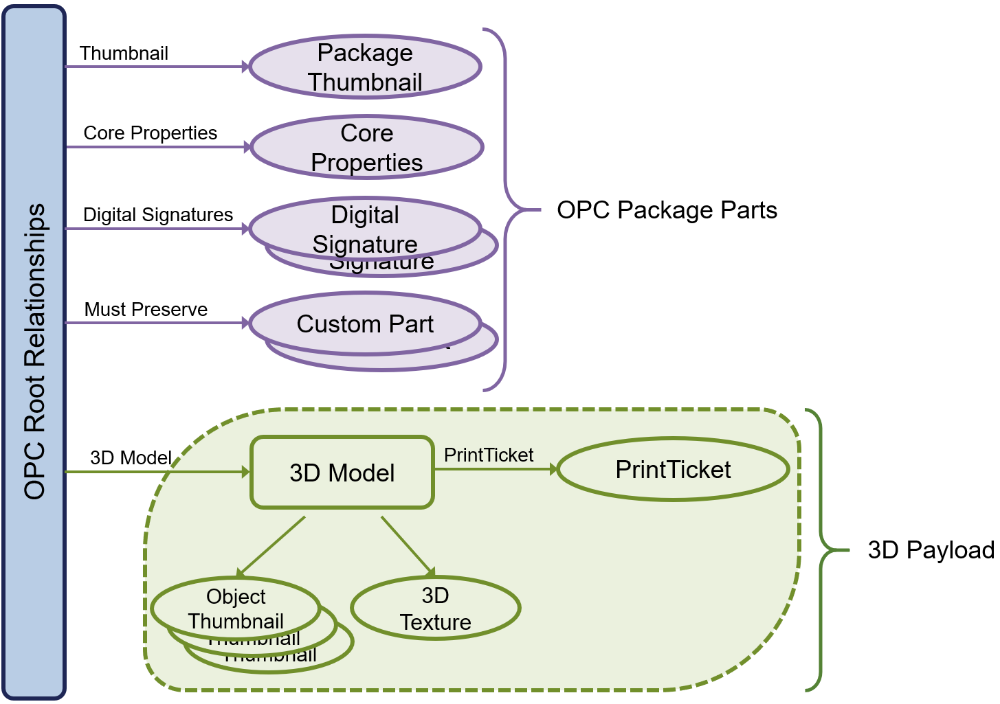

#
# 3MF Volumetric Extension

## Specification & Reference Guide


| **Version** | 0.6.0 |
| --- | --- |
| **Status** | Draft |

## Table of Contents

- [Preface](#preface)
  * [About this Specification](#11-about-this-specification)
  * [Document Conventions](#12-document-conventions)
  * [Language Notes](#13-language-notes)
  * [Software Conformance](#14-software-conformance)
- [Part I: 3MF Documents](#part-i-3mf-documents)
  * [Chapter 1. Overview of Additions](#chapter-1-overview-of-additions)
  * [Chapter 2. 3D Image](#chapter-2-3d-image)
  * [Chapter 3. Channel from 3D Image](#chapter-3-channel-from-3d-image)
  * [Chapter 4. Volumetric Stack](#chapter-4-volumetric-stack)
  * [Chapter 5. Volumetric Data](#chapter-5-volumetric-data)
- [Part II. Appendices](#part-ii-appendices)
  * [Appendix A. Glossary](#appendix-a-glossary)
  * [Appendix B. 3MF XSD Schema](#appendix-b-3mf-xsd-schema)
  * [Appendix C. Standard Namespace](#appendix-c-standard-namespace)
  * [Appendix D: Example file](#appendix-d-example-file)
- [References](#references)


# Preface

## 1.1. About this Specification


This 3MF volumetric specification is an extension to the core 3MF specification. This document cannot stand alone and only applies as an addendum to the core 3MF specification. Usage of this and any other 3MF extensions follow an a la carte model, defined in the core 3MF specification.

Part I, "3MF Documents," presents the details of the primarily XML-based 3MF Document format. This section describes the XML markup that defines the composition of 3D documents and the appearance of each model within the document.

Part II, "Appendices," contains additional technical details and schemas too extensive to include in the main body of the text as well as convenient reference information.

The information contained in this specification is subject to change. Every effort has been made to ensure its accuracy at the time of publication.

This extension MUST be used only with Core specification 1.3. or higher.


## 1.2. Introduction
Volumetric Modeling is an efficient approach to encode geometrical shapes and spatial properties that is based on a volumetric description.
Where traditional, explicit modelling use boundaries (e.g. NURBS, triangular meshes) to describe surfaces or bodies (if these surfaces form a closed shell), volumetric modeling relies on a mathematical, field based description of the whole volume of the object. This is illustrated in Figure 1-1 a).

The true advantage of volumetric modeling shows when properties of an object vary in space gradually, e.g. color or material-distribution and composition of an object vary in space, c.f. Figure 1-1 b).

This is only a brief illustration of the volumetric modelling approach to geometric design and more information can be found e.g. in  . or .

TODO: image of explicit vs implicit
TODO: image of volumetric color vs iso surfaces with same color.
TODO: reference to literature.

_Figure 1-1. Explicit vs. implicit representation_


## Document Conventions

See [the standard 3MF Document Conventions documentation](https://github.com/3MFConsortium/spec_resources/blob/master/document_conventions.md).

## Language Notes

See [the standard 3MF Language Notes documentation](https://github.com/3MFConsortium/spec_resources/blob/master/language_notes.md).

## Software Conformance

See [the standard 3MF Software Conformance documentation](https://github.com/3MFConsortium/spec_resources/blob/master/software_conformance.md).


# Part I. 3MF Documents

## Chapter 1. Overview of Additions

_Figure 1-1 Overview of model XML structure of 3MF with volumetric additions_


This document describes new elements, each of which is OPTIONAL for producers, but MUST be supported by consumers that specify support for this volumetric extension of 3MF.

The central idea of this extension is to enrich the geometry notion of 3MF with volumetic elements that can represent spatially varying properties which are quite inefficient to handle with a mesh representation, especially in cases where the variation is continuous in space.

This extension is meant to be an exact specification of geometric, appearance, material and in fact arbitary properties, and consumers MUST interpret it as such. However, the intent is also to enable editors of 3MF files to use the data structures for efficient interoperability and post processing the geometry and properties described in this extension.

A producer using the boundary element of the volumetric specification MUST mark the extension as required, as described in the core specification. Producers only using the other specification elements, in particular color-, composite- and property-elements, MAY mark the extension as required. Consumers of 3MF files that do not mark the volumetric extension as required are thus assured that the geometric shape of objects in this 3MF file are not altered by the volmetric specification.


# Chapter 2. 3D Image

## 2.1 3D Image

Element **\<image3d>**


| Name   | Type   | Use | Annotation |
| --- | --- | --- | --- |
| id | ST\_ResourceID | required | Specifies an identifier for this image3d resource. |
| name | xs:string | optional | 3d image resource name used for annotations purposes. |
| sizex | xs:positiveinteger | required | Size of all child \<image3dsheet>-elements in first dimension in pixels. |
| sizey | xs:positiveinteger | required | Size of all child \<image3dsheet>-elements in second dimension in pixels. |
| sheetcount | xs:positiveinteger | required | Number of \<image3dsheet>-elements within this \<image3d> element. |

Volumetric data can be encoded as 3d images that consist of voxels. Each \<image3d> element is assumed to represent a unit cube from which data can be sampled at any point. Volumetric images can be embedded inside a 3MF file using groups of PNG images that represent a stack of images.

All image3dsheets within an image3d MUST have the same x- and y-size that is specified in the sizex and sizey-attributes, respecitvely. sizex, sizey and sheetcount MUST not exceed 1024^3, each. The total number of voxels MUST be limited by 1024^5. There MUST be exactly sheetcount \<image3dsheet>-elements under \<image3d> that are implicitly ordered starting with index 0.

Image3D objects, and thus the underlying \<image3dsheet> elements, MUST follow one of the input pixel layouts shown in the table below. All image3dsheets within an image3d MUST have the same input pixel layouts, and each channel MUST have the same bit-depth accross all image3dsheets.

The following table shows the logical interpretation of sampling the "R", "G", "B" or "A"-channel depending on the input pixel layouts. The meaning of symbols is as follows: R – red, G – green, B – blue, A – alpha, Y – grayscale.

| Input pixel layout | | | | | |
| --- | --- | --- | --- | --- | --- |
| RGBA | R | G | B | A |
| RGB | R | G | B | 2^bitdepth-1 |
| YA | Y | Y | Y | A |
| Y | Y | Y | Y | 2^bitdepth-1 |

For example, if the specification says that a certain value is sampled from the image’s R channel, but the referenced image is only monochromatic then grayscale channel is interpreted as the R color channel. Similarly, color values sampled from a monochromatic image are interpreted as if all R, G, B color channels shared the same grayscale value. If there is no alpha channel present in the image, the highest possible value `2^bitdepth-1` MUST be used.

The \<image3d>-element defines a voxel grid of values (e.g. RGB, Grey-Alpha, Grey) values distributed in a cuboid ([0..sizex] x [0..sizey] x [0..sheetcount]). The centers of each voxel (ix, iy, iz) are at the half integer positions (ix + 0.5, iy + 0.5, iz + 0.5), see Figure 2-2.
The \<image3d> is not sampled in these absolute voxel coordinates, but instead in a normalized uvw-texture space: `(u,v,w) \in [0,1]x[0,1]x[0,1]`, where such that `(U,V,W) = (u*sizex,v*sizey,w*sheetcount)`.
Sampling at a point `(U,V,W)` that is not a half-integer coordinate is done according to the filter-rule, see the [filter attribute on the Channel From Image3D](#chapter-3-channel-from-3d-image).

_Figure 2-2: Voxel centers at half integer position and normalized uvw-texture space (2d-illustration)_


## 2.1.1 File Formats
PNG images can provide acceptable compression and bitdepth for the levelset-function, color information, material mixing ratios or arbitrary property information.

The following describes recommendations for the channel bit depth of PNG images used in this specification and is based on the nomenclature in the specification of the Portable Network Graphics (PNG, https://www.w3.org/TR/PNG) format.

- Color information, material mixing ratios and arbitrary properties can be deduced from PNG images with arbitrary channel depth. It is RECOMMENDED to store color into RGB-channels within a PNG.

- It is RECOMMENDED to store image information that will be used as levelset-function to represent a boundary in PNGs with one channel only. A special case to encode this levelset information is to encode the distance of the surface of the object in this channel. A different option is to deduce the levelset-function from a channel with binary values, i.e. from images of image type "Greyscale" with bit-depth of 1 or an indexed-color with bit depths of 1.

To achieve high accuracy, producers SHOULD store such information in image channels with bit depth of 16. Most professional image editing tools an standard implementations of the PNG format support channels with 16 bit.


## 2.1.2 OPC package layout
It is RECOMMENDED that producers of 3MF Documents use the following part naming convention:

Paths of  \<image3dsheet> SHOULD consist four segments. "/3D/volumetric/" as the first two segments, the name of a image3d-element that references this  \<image3dsheet> as third segment (for example "/3D/volumetric/mixingratios/", and the name of the image3dsheet as last segment (for example "sheet0001.png"). The 3D Texture part that is the  \<image3dsheet> MUST be associated with the 3D Model part via the 3D Texture relationship.

This implies that all  \<image3dsheet> parts for an image3d-object SHOULD be located in same OPC folder.

_Figure 2-3: OPC package layout_



## 2.2 3D Image Sheet

Element **\<image3dsheet>**


| Name   | Type   | Use | Default | Annotation |
| --- | --- | --- | --- | --- |
| path | ST\_UriReference | required | | Specifies the OPC part name (i.e. path) of the image data file |
| valueoffset | ST\_Number | | _0.0_ | Specifies a numerical offset for the values obtained from any channel this `image3dsheet`. |
| valuescale | ST\_Number | | _1.0_ | Specifies a numerical scaling for the values obtained from any channel this `image3dsheet`. |

Each \<image3dsheet> element has one required attribute. The path property determines the part name (i.e. path) of the 2D image data (see chapter 6 of the Materials & Properties Extension specification for more information).

The `valueoffset` and `valuescale` determine how the numerical values of any channel within the referenced PNG-file shall be interpreted.
If a channel in the image-file of this \<image3dsheet> holds a numerical value `V`, it needs to be sampled as `V' = V*valuescale + valueoffset`.
Specifying different `valueoffset` and `valuescale`-attributes for different \<image3dsheet>s is optional, but allows producers to more efficiently encode values in different regions of an object.

Any interpolation of values of an \<image3dsheet>-element (c.f. the [**filter** atribute on the Channel From Image3D](#chapter-3-channel-from-3d-image)) MUST be performed on the rescaled values `V'` according to the formula above. This is relevant if two subsequent \<image3dsheet>-elements have different values for `valueoffset` or `valuescale`.


# Chapter 3. Channel from 3D Image
 
Element type
**\<channelfromimage3d>**


| Name   | Type   | Use | Annotation |
| --- | --- | --- | --- |
| id | ST\_ResourceID | required | The resource id of this ChannelFromImage3D resource |
| image3did | ST\_ResourceID | required | Specifies the id of the 3d image resource |
| channel | ST\_ChannelName | required | Specifies which channel to reference in the 3d image resource |
| transform | ST\_Matrix3D | required | Transformation of the channel coordinate system into the \<image3d> coordinate system |
| valueoffset | ST\_Number | _0.0_ | Specifies a numerical offset for the values obtained from the `channel` within the `image3d` refered to by this CT_ChannelFromImage3D |
| valuescale | ST\_Number | _1.0_ | Specifies a numerical scaling for the values obtained from the `channel` within the `image3d` refered to by this CT_ChannelFromImage3D. |
| filter |ST\_Filter | _linear_ | "linear" or "nearest" neighbor interpolation |
| tilestyleu | ST\_TileStyle | Required |	Determines the behavior of the sampler for texture coordinate u outside the [0,1] range |
| tilestylev | ST\_TileStyle | Required |	Determines the behavior of the sampler for texture coordinate v outside the [0,1] range |
| tilestylew | ST\_TileStyle | Required |	Determines the behavior of the sampler for texture coordinate w outside the [0,1] range |

Elements of type \<CT_ChannelFromImage3D> define the way in which individual channels from volumetric image resources can be referenced inside the volumetric layer elements. Each channel reference MUST contain a resource id that maps to an actual \<image3d> element.

In addition, the elements of type \<CT_ChannelFromImage3D> MUST contain two string attributes which determine which channel to reference and how they should be mapped within the volumetric image. The srcchannel name string can use any of the reserved channel names (i.e. "R", "G", "B", or "A"). 

**channel**:

The channel-attribute determines which channel to reference in the 3d image resource. Note that attributes of type \<ST\_ChannelName> are case-sensitive.

**tilestyle-u, -v or -w**:

MUST be one of "wrap", "mirror",  "clamp" and "none". This property determines the behavior of the sampler of this channel for 3d texture coordinates (u,v,w) outside the [0,1]x[0,1]x[0,1] cell. The different modes have the following interpretation (for s = u, s = v, or s = w):

1. "wrap" assumes periodic texture sampling. A texture coordinate s that falls outside the [0,1] interval will be transformed per the following formula:
</br>s’ = s – floor(s)

    _Figure 3-1: tilestyle wrap_
    

2. "mirror" means that each time the texture width or height is exceeded, the next repetition of the texture MUST be reflected across a plane perpendicular to the axis in question following this formula:
</br>s’ = 1 - abs( s - 2 * floor(s/2) - 1 )

    _Figure 3-2: tilestyle mirror_
    

3. "clamp" will restrict the texture coordinate value to the [0,1] range. A texture coordinate s that falls outside the [0,1] interval will be transformed according to the following formula:
</br>s’ = min(1, max(0,s))

    _Figure 3-3: tilestyle clamp_
    

4. "none" will discard the \<CT_ChannelFromImage3D>'s value if the 3d texture coordinate s falls outside the [0,1] range. This means, when blending volumetric layers, no blending of values takes place if this \<CT_ChannelFromImage3D> is sampled outside the [0,1]-range. This is useful if a 3d texture is used as masking channel for a volumetric decal of sorts that affects only a limited region in the volume.

**transform**:
Transformation of the channel coordinate system into the \<image3d> coordinate system.
If this channel is being sampled at position `(x,y,z)` (e.g. from within a volumetric stack), the underlying \<image3d> must be sampled at normalized texture coordinates `(u,v,w) = T*(x,y,z)`.

**filter**:
The filter attribute defines the interpolation method.

- If the interpolation method of an elements of type \<channelfromimage3d> is "nearest", sampling it at an arbitrary (u,v,w) returns the floating point value defined by the closest point (u',v',w') to (u,v,w) which transforms back to a voxel center in the 3D image resource.

- If the interpolation method of an elements of type \<channelfromimage3d> is "linear", sampling it at an arbitrary (u,v,w) returns the floating point defined by trilinearly interpolating between the eight closest points coordinates which transforms back to voxel centers in the 3D image resource.

**`offsetvalue` and `scalevalue`**:

The values `V'` sampled from the \<image3d> are linearly scaled via `offsetvalue` and `scalevalue` giving a sampled value `V'' = V'*scalevalue + offsetvalue`


# Chapter 4. Volumetric Stack

Element **\<volumetricstack>**


| Name   | Type   | Use | Annotation |
| --- | --- | --- | --- |
| id | ST\_ResourceID | required | Specifies the id of this volumetricstack |

The volumetric stack is a resource within a 3MF model that defines how volumetric data
from multiple \<CT_ChannelFromImage3D> is composited to yield multiple custom scalar field in three dimensions (\<dstchannel>). This custom scalar field of a \<volumetricstack> element can then be used to define volumetric properties inside the \<volumedata>-element of an object, see the [volumedata-element](#chapter-5-volumetric-data).

1. It defines multiple destination channels, \<dstchannel>-elements. Each destinaton channel is a scalar field in 3d, whose values can be retrieved by sampling this volumetricstack.

2. The sampled values of each destination channel are built up by blending multiple layers, the \<volumetriclayer>-elements. This allows e.g. boolean opeartions on the scalar fields provided by different \<channelfromimage3d> elements.

The volumetricstack element MUST contain at least one \<dstchannel> child element and MUST NOT contain more than 2^10 \<dstchannel> child-elements. The volumetricstack element MUST NOT contain more than 2^31-1 \<volumetriclayer> child-elements.

## 4.1 Destination channel element

Element **\<dstchannel>**


| Name   | Type   | Use | Annotation |
| --- | --- | --- | --- |
| name | ST\_ChannelName | required | Specifies the name of this destination channel |
| background | ST\_Number | required | Specifies the background value of this channel |

A destination channel specifies a name of a channel that can be sampled from a volumetricstack element.
The background value is the value that serves as a base for the blending that takes place in the volumetriclayer elements
within the \<volumetricstack>-element.

The names of \<dstchannel>-elements must be unique within a \<volumetricstack>-element.

## 4.2 Volumetric Layer element

Element **\<volumetriclayer>**


| Name   | Type   | Use | Annotation |
| --- | --- | --- | --- |
| blendmethod | ST\_BlendMethod | required | Determines how this layer is applied to its sublayers. Allowed values are "weightedsum", "multiply", "min", "max" or "mask". |
| srcalpha | ST\_Number | optional |	Numeric scale factor for the source layer. Required if blendmethod is "weightedsum". |
| dstalpha | ST\_Number | optional |	Numeric scale factor for the destination layer. Required if blendmethod is "weightedsum".  |
| maskid | ST\_ResourceId | optional |	The resource id of a \<channelfromimage3d> resource which shall be used for masking. Required if blendmethod is "mask".  |

Each \volumetriclayer>-element modify the accumulated value of the destination channels of a volumetric stack. This modification is defined by the following attributes:

**blendmethod**: controls according to which formula the current layer (known as the source layer) is blended with the layers below it or with the stack’s background value.

Let "s" denote the value of the source channel, "d" the current value of the destination channel, then the modified value of the destination channel "d'" after blending is calculated according to the blendmethod:

- "weightedsum":

    d' = src_alpha * s + dst_alpha * d

    **srcalpha**: is a scalar value which is multiplied with the sampled values in the source layer during the blending process.

    **dstalpha**: is a scalar value which is multiplied with the sampled values in the destination during the blending process.
    
    The producer of a 3MF file is responsible to choose parameters srcalpha and dstalpha, such that sampling the blended value of a channel, e.g. a physical property, is sensible.

- "multiply":

    d' = s * d

- "min" or "max":
   
    d' = min(s,d) or d' = max(s,d)
    
    Blending methods "min" and "max" are useful to capture boolean operations (union and intersection, respectively) between fields representing levelset functions.

- "mask":

    The blendmethod "mask" provides a means to use another channel as a volumetric decal that only affects a region of complex shape within the volume.

    d' = m * s + (1 - m) * d
    
    Here, m is the value of the channel provided by the \<channelfromimage3d> refered to by the "maskid" attribute of this volumetriclayer.
    
    __Note__: The blendmethod "mask" implements the same formula as the blendmethod "mix" for the rgb-values of an \<multiproperties>-element in the [Materials and Properties Extension specification, Chapter 5](https://github.com/3MFConsortium/spec_materials/blob/1.2.1/3MF%20Materials%20Extension.md#chapter-5-multiproperties).


Figure 4-1 shows an example of two layers within a volumetric stack and the result using various blending functions with different source and destination alpha values.
A volumetriclayer MUST contain at least one \<channelmapping> element. The dstchannel attribute of the each \<channelmapping> within a volumetriclayer element MUST match a \<dstchannel> element within this \<volumetriclayer>.
The name of each \<dstchannel> element MUST occur at most once as dstchannel attribute in one of the \<channelmapping>.

Destination channels that are not mentioned as dstchannel attribute in this list are not modifed by this \<volumetriclayer>.

_Figure 4-1: tilestyle clamp_


## 4.3 Channelmapping element
Element **\<channelmapping>**


| Name   | Type   | Use | Annotation |
| --- | --- | --- | --- |
| sourceid | ST\_ResourceID | required | The resource id of a ChannelFromImage3D resource |
| dstchannel | ST\_ChannelName | required | Name of the destination channel that should be manipulated by this channelmapping within this volumetric layer |

# Chapter 5. Volumetric Data

## 5.1. Volumetric Data extension to Mesh
 
Element **\<mesh>**


| Name   | Type   | Use | Annotation |
| --- | --- | --- | --- |
| v:volumedata | CT\_VolumeData | optional | The entry point to volumetric information of this specification. |

The volumetric data \<volumedata> element is a new OPTIONAL element which extends the root triangular mesh representation (i.e. \<mesh> element).


## 5.2. Volumetric Data
 
Element **\<volumedata>**


The \<volumedata> element references the volumetric data given by \<volumetricstack>-elements and defines how their various channels are mapped to specific properties within the interior volume of the enclosing mesh.
Volumedata MUST only be used in a mesh of object type "model" or "solidsupport". This ensures that the \<mesh> defines a volume.
Moreover, the volumedata-element MUST not be used in a mesh that is referenced as "originalmesh" by any other mesh.

The volumedata element can contain up to one \<boundary> child element, up to one \<composite> child element,
up to one \<color> element, and an arbitray number of \<property> elements.

The child elements modify the enclosing \<mesh> in two fundamentally different ways:
1. the child \<boundary> element (if it exists) determines the geometry of the \<mesh object>.
2. the other child elements modify color, material compostion and other arbitrary properties of the \<mesh object>.

We need to define the clipping surface of a mesh with a \<volumedata> element. The clipping surface is defined as follows:
1. If no \<boundary> element exists, the clipping surface is defined by the surface of the enclosing \<mesh> element. This implicitly takes into account any geometry defined by e.g. the beamlattices specification.
2. If the \<boundary> element exists, the clipping surface is defined by the intersection of the geometrty from 1. and the interior of the levelset-channel used in the \<boundary> element.

This clipping surface trims any volumetric data defined therein. Any data outside the clipping surface MUST be ignored. The geometry that should be printed is defined by the interior of the clipping surface.

Volumetric content is always clipped to the clipping surface of the mesh that embedds it. If a property (color, composite or properties) defined at the surface of an object conflicts with the property within the object defined by this extension, a surface layer should be defined with a thickness as small as possible to achieve the surface property on the outside of the object. Outside of this thin surface region, the volumetric property should be applied everywhere within the object.

The properties at surface regions that are not explicitly specified are instead given by the volumetric properties.

Conflicting properties must be handled as follows:
1. Producers MUST not define colors, materials or properties via child elements of the \<volumedata> element that are impossible on phsycal grounds (e.g. non-conducting copper).
2. Consumers that read files with properties that cannot be realized due to limitations specific to them (e.g. a specific manufacturing device that does not support a material in a specific color), SHOULD raise a warning, but MAY handle this in any appropriate way for them. If there is an established process between Producer and Consumer, resolution of such conflicts SHOULD be performed e.g. via negotiation through printer capabilities and a print ticket.

__Note__: Behavior for overlapping meshes with volumedata elements:
If multiple volumes defined by the interior of clipping surfaces overlap, the volumedata elements in the overlapping volume are defined by the volumedata elements of interior of the last clipping surface.
If the last overlapping object does not have a volumedata element of an earlier object that is being overlapped, the resulting volume does not have the volumedata elements of the overlapped object.
This makes sure that volumedata elements of an overlapped object do not determine any volumedata elements of an overlapping object.
Figure 5-1 illustrates overlapping objects with their volume defined by the mesh surface and the boundary element of their respective volumedata elements. Evaluating volumedata elements X and volumedata elements Y at different positions p1 to p4.

_Figure 5-1: Sampling volumedata elements at different positions of overlapping meshes with volumedata_


### 5.2.1 Boundary element

Element **\<boundary>**


| Name   | Type   | Use | Annotation |
| --- | --- | --- | --- |
| sourceid | ST\_ResourceID | required | ResourceID of the volumetricstack that holds a channel that encodes boundary as a levelset |
| channel | ST\_ChannelName | required | Name of the channel that holds a levelset function which defines the boundary |
| solidthreshold | ST\_Number | *0.0* | Determines the values of the levelset function which are considered inside or outside the specified object  |
| transform | ST\_Matrix3D | required | Transformation of the object coordinate system into the volumetricstack coordinate system |

The boundary element is used to describe the interior and exterior of an object via a levelset function.

**sourceid** and **channel**:

The levelset function is given by the "dstchannel" within the \<volumetricstack>
with resource id matching the sourceid-attribute and with name matching the "channel"-attribute of the \<boundary>-element.

**solidthreshold**:

The value of the leveselt function `f` at a position `(x,y,z)` and the solidthreshold determine whether (x,y,z) is inside or outside the specified object:
 - If `f\<=solidthreshold`, then `(x,y,z)` is inside the specified object.
 - If `f\>solidthreshold`, then `(x,y,z)` is outside the specified object.

**transform**:

The transformation of the object coordinate system into the \<volumetricstack> coordinate system.
If the boundary-channel of the enclosing \<mesh> is being sampled at position `(x,y,z)` in the mesh's local object coordinate system, the referenced channel in the \<volumetricstack> must be sampled at position `(x',y',z') = T*(x,y,z)`.

_Figure 5-2 Illustration of different coordinate systems in the sampling process_


### 5.2.2 Color element

Element **\<color>**


| Name   | Type   | Use | Annotation |
| --- | --- | --- | --- |
| sourceid | ST\_ResourceID | required | ResourceID of the volumetricstack that holds the channels to be used in the child color elements. |
| transform | ST\_Matrix3D | required | Transformation of the object coordinate system into the volumetricstack coordinate system |

The \<color> element is used to define the color of the object.
The color MUST be interpreted in linearized sRGB color space as defined in the Materials and Properties specification https://github.com/3MFConsortium/spec_materials/blob/master/3MF%20Materials%20Extension.md#12-srgb-and-linear-color-values. If the value of the srcchannel of a \<red>-, \<green>- and \<blue>-element is \<0 or \>1 it has to be truncated at 0 or 1, respectively.

This specification does not capture well the properties for semi-transparent, diffusive materials. This specification is usefull for defining parts with with nontransparanet, opaque materials, e.g. for indicating wear and tear, sectioning the models and printing with nontransparent materials.

The \<color>-element MUST contain exactly three \<red>-, \<green>- and \<blue>-element.

**transform**:

The transformation of the object coordinate system into the \<volumetricstack> coordinate system.
If the \<red>-, \<green>- or \<blue>-channel is being sampled at position `(x,y,z)` in the mesh's local object coordinate system, the referenced channel in the \<volumetricstack> must be sampled at position `(x',y',z') = T*(x,y,z)`.

### 5.2.2.1 Color channel elements

Elements **\<red>, \<green> and \<blue>**


of

Complex type **\<colorchannel>**


| Name   | Type   | Use | Annotation |
| --- | --- | --- | --- |
| srcchannel | ST\_ChannelName | required | Source channel for the values of this color channel |

Each element instance of CT\_ColorChannel MUST have an attribute "srcchannel" that
references a destination channel from the \<volumetricstack> with Id matching the volumetricstackid of the parent \<color> element.

If the value of the srcchannel of a \<red>-, \<green>- and \<blue>-element is \<0 or \>1 it has to be truncated at 0 or 1, respectively. 


## 5.2.3 Composite element

Element **\<composite>**


| Name   | Type   | Use | Annotation |
| --- | --- | --- | --- |
| sourceid | ST\_ResourceID | required | ResourceID of the volumetricstack that holds the channels used in the child \<materialmapping>-elements |
| transform | ST\_Matrix3D | required | Transformation of the object coordinate system into the volumetricstack coordinate system |
| basematerialid | ST\_ResourceID | required | ResourceID of the basematerial that holds the \<base>-elements referenced in the child \<materialmapping>-elements |

The \<composite> element describes a mixing ratio of printer materials at each position in space. The CONSUMER can determine the halftoning, mixing or dithering strategy that can be used to achieve these mixtures.

This element MUST contain at least one \<materialmapping> element, which will encode the relative contribution of a specific basematerial to the material mix.

**transform**:

The transformation of the object coordinate system into the \<volumetricstack> coordinate system.
If any channel of a \<materialmapping> is being sampled at position `(x,y,z)` in the mesh's local object coordinate system, the referenced channel in the \<volumetricstack> must be sampled at position `(x',y',z') = T*(x,y,z)`.

## 5.2.4 Material mapping element

Element **\<materialmapping>**


| Name   | Type   | Use | Annotation |
| --- | --- | --- | --- |
| srcchannel | ST\_ChannelName | required | Source channel for the values of this material |
| pindex | ST\_ResourceIndex | required | ResourceIndex of the \<base>-element within the parent's associated \<basematerial>-element |

The \<materialmapping> element defines the relative contribution of a specific material to the mixing of materials in it's parent
\<composite>-element.

If the sampled value of a channel is `\<0` it must be evaluated as "0".

Procuer MUST NOT create files where the sum of all values in it's child \<materialmapping>-elements is smaller than `10^-7`. If the total is smaller than this threshold, the mixing ratio is up to the consumer.

- If we have N materials, then 
Ratio of Material i at point X: value of channel i at point X / sum(all N channels at point X)

Each element instance of \<CT\_MaterialMapping> MUST have an attribute "srcchannel" that
references a destination channel from the \<volumetricstack> with id matching the volumetricstackid of the parent \<composite> element.

### 5.2.4.1 Property element

Element **\<property>**


| Name   | Type   | Use | Annotation |
| --- | --- | --- | --- |
| sourceid | ST\_ResourceID | required | ResourceID of the volumetricstack that holds the channel used by this property |
| transform | ST\_Matrix3D | required | Transformation of the object coordinate system into the volumetricstack coordinate system |
| channel | ST\_ChannelName | required | Name of the channel that serves as source for the scalar value representing this property. |
| name | xs:QName | required | Namespace and name of this property property |
| required | xs:boolean | optional | Indicator whether this property is required to process this 3MF document instance. |

The \<property> element allows to assign any point in space a scalar value of a freely definable property. This can be used to assign, e.g. opacity, conductivity, or translucency.

**transform**:

The transformation of the object coordinate system into the \<volumetricstack> coordinate system.
If the channel of a \<property>-element is being sampled at position `(x,y,z)` in the mesh's local object coordinate system, the referenced channel in the \<volumetricstack> must be sampled at position `(x',y',z') = T*(x,y,z)`.

This specification does not provide qualified names for such properties as part of the standard volumetric namespace.
A later extension of the 3MF format might define such qualified names as part of a different extension specification or a later version of the volumetric extension specification. Producers that want to specify such properties now, SHOULD define a qualified name that can e.g. be called ="http://www.vendorwwebsite.com/3mf/vendor13mfextension/2021/05">.
The specifications of private namespaces (that are not ratified by the 3MF Consortium) need to be negotiated between producer and consumer of a 3MF file.

The names of \<property>-elements MUST be unique within a \<volumedata>. This name MUST be prefixed with a valid XML namespace name declared on the <model> element.
The interpretation of the value MUST be defined by the owner of the namespace. 

If the interpretation of a property might result in a conflict with the standard volumedata-elements (boundary, color, composite) the namespace-owner MUST specify a resolution to the conflict. A producer MUST NOT create files with properties that conflict with each other.

If a physical unit is necessary the namespace owner MUST define a unique and unambiguous physical unit system for the namespace. The unit system SHOULD be metric.

If a \<property> is marked as `required`, and a consumer does not support it, it MUST warn the user or the appropriate upstream processes that it cannot process all contents in this 3MF document instance.
Producers of 3MF files MUST mark all volumetric \<properties> required to represent the design intent of a model as `required`.


# Part II. Appendices

# Appendix A. Glossary

See [the standard 3MF Glossary](https://github.com/3MFConsortium/spec_resources/blob/master/glossary.md).

## Appendix B. 3MF XSD Schema for the Volumetric Extension
see: [volumetric.xsd](volumetric.xsd)
```xml
<?xml version="1.0" encoding="UTF-8"?>
<xs:schema xmlns="http://schemas.microsoft.com/3dmanufacturing/volumetric/2018/11" xmlns:xs="http://www.w3.org/2001/XMLSchema"
xmlns:xml="http://www.w3.org/XML/1998/namespace" targetNamespace="http://schemas.microsoft.com/3dmanufacturing/volumetric/2018/11"
	elementFormDefault="unqualified" attributeFormDefault="unqualified" blockDefault="#all">
	<xs:annotation>
		<xs:documentation>
			<![CDATA[
		Schema notes:

		Items within this schema follow a simple naming convention of appending a prefix indicating the type of element for references:

		Unprefixed: Element names
		CT_: Complex types
		ST_: Simple types
		
		]]>
		</xs:documentation>
	</xs:annotation>
	<!-- Complex Types -->

	<xs:complexType name="CT_Resources">
		<xs:sequence>
			<xs:any namespace="##other" processContents="lax" minOccurs="0" maxOccurs="2147483647"/>
			<xs:element ref="image3d" minOccurs="0" maxOccurs="2147483647"/>
			<xs:element ref="channelfromimage3d" minOccurs="0" maxOccurs="2147483647"/>
			<xs:element ref="volumetricstack" minOccurs="0" maxOccurs="2147483647"/>
		</xs:sequence>
		<xs:anyAttribute namespace="##other" processContents="lax"/>
	</xs:complexType>

	<xs:complexType name="CT_Image3D">
		<xs:sequence>
			<xs:any namespace="##other" processContents="lax" minOccurs="0" maxOccurs="2147483647"/>
			<xs:element ref="image3dsheet" minOccurs="0" maxOccurs="2147483647"/>
		</xs:sequence>
		<xs:attribute name="id" type="ST_ResourceID" use="required"/>
		<xs:attribute name="name" type="xs:string" use="required"/>
		<xs:attribute name="sizex" type="xs:positiveInteger" use="required"/>
		<xs:attribute name="sizey" type="xs:positiveInteger" use="required"/>
		<xs:attribute name="sheetcount" type="xs:positiveInteger" use="required"/>
		<xs:anyAttribute namespace="##other" processContents="lax"/>
	</xs:complexType>

	<xs:complexType name="CT_Image3DSheet">
		<xs:sequence>
			<xs:any namespace="##other" processContents="lax" minOccurs="0" maxOccurs="2147483647"/>
		</xs:sequence>
		<xs:attribute name="path" type="ST_UriReference" use="required"/>
    <xs:attribute name="valueoffset" type="ST_Number" use="optional" default="0.0"/>
    <xs:attribute name="valuescale" type="ST_Number" use="optional" default="1.0"/>
		<xs:anyAttribute namespace="##other" processContents="lax"/>
	</xs:complexType>

	<xs:complexType name="CT_VolumetricStack">
		<xs:sequence>
			<xs:any namespace="##other" processContents="lax" minOccurs="0" maxOccurs="2147483647"/>
			<xs:element ref="dstchannel" minOccurs="1" maxOccurs="1048576"/>
			<xs:element ref="volumetriclayer" minOccurs="1" maxOccurs="2147483647"/>
		</xs:sequence>
		<xs:attribute name="id" type="ST_ResourceID" use="required"/>
		<xs:anyAttribute namespace="##other" processContents="lax"/>
	</xs:complexType>

	<xs:complexType name="CT_Channel">
		<xs:sequence>
			<xs:any namespace="##other" processContents="lax" minOccurs="0" maxOccurs="2147483647"/>
		</xs:sequence>
		<xs:attribute name="name" type="ST_ChannelName" use="required"/>
		<xs:attribute name="background" type="ST_Number" use="optional" default="0"/>
		<xs:anyAttribute namespace="##other" processContents="lax"/>
	</xs:complexType>
	
	<xs:complexType name="CT_VolumetricLayer">
		<xs:sequence>
			<xs:any namespace="##other" processContents="lax" minOccurs="0" maxOccurs="2147483647"/>
			<xs:element ref="channelmapping" minOccurs="1" maxOccurs="2147483647"/>
		</xs:sequence>
		<xs:attribute name="blendmethod" type="ST_BlendMethod" use="required"/>
		<xs:attribute name="srcalpha" type="ST_Number" use="optional"/>
		<xs:attribute name="dstalpha" type="ST_Number" use="optional"/>
		<xs:attribute name="maskid" type="ST_ResourceId" use="optional"/>
		<xs:anyAttribute namespace="##other" processContents="lax"/>
	</xs:complexType>

	<xs:complexType name="CT_ChannelFromImage3D">
		<xs:sequence>
			<xs:any namespace="##other" processContents="lax" minOccurs="0" maxOccurs="2147483647"/>
		</xs:sequence>
		<xs:attribute name="id" type="ST_ResourceID" use="required"/>
		<xs:attribute name="image3did" type="ST_ResourceID" use="required"/>
		<xs:attribute name="channel" type="ST_ChannelName" use="required"/>
		<xs:attribute name="transform" type="ST_Matrix3D" use="required"/>
		<xs:attribute name="filter" type="ST_Filter" use="optional" default="linear"/>
		<xs:attribute name="valueoffset" type="ST_Number" use="optional" default="0.0"/>
		<xs:attribute name="valuescale" type="ST_Number" use="optional" default="1.0"/>
		<xs:attribute name="tilestyleu" type="ST_TileStyle" use="optional" default="wrap"/>
		<xs:attribute name="tilestylev" type="ST_TileStyle" use="optional" default="wrap"/>
		<xs:attribute name="tilestylew" type="ST_TileStyle" use="optional" default="wrap"/>
		<xs:anyAttribute namespace="##other" processContents="lax"/>
	</xs:complexType>

	<xs:complexType name="CT_ChannelMapping">
		<xs:sequence>
			<xs:any namespace="##other" processContents="lax" minOccurs="0" maxOccurs="2147483647"/>
		</xs:sequence>
		<xs:attribute name="sourceid" type="ST_ResourceID" use="required"/>
		<xs:attribute name="dstchannel" type="ST_ChannelName" use="required"/>
		<xs:anyAttribute namespace="##other" processContents="lax"/>
	</xs:complexType>

	<xs:complexType name="CT_Mesh">
		<xs:sequence>
			<xs:any namespace="##other" processContents="lax" minOccurs="0" maxOccurs="2147483647"/>
			<xs:element ref="volumedata" minOccurs="0" maxOccurs="1"/>
		</xs:sequence>
	</xs:complexType>

	<xs:complexType name="CT_VolumeData">
		<xs:sequence>
				<xs:element ref="boundary" minOccurs="0" maxOccurs="1"/>
				<xs:element ref="composite" minOccurs="0" maxOccurs="1"/>
				<xs:element ref="color" minOccurs="0" maxOccurs="1"/>
				<xs:element ref="property" minOccurs="0" maxOccurs="2147483647"/>
				<xs:any namespace="##other" processContents="lax" minOccurs="0" maxOccurs="2147483647"/> 
		</xs:sequence>
		<xs:anyAttribute namespace="##other" processContents="lax"/>
	</xs:complexType>

	<xs:complexType name="CT_Boundary">
		<xs:sequence>
			<xs:any namespace="##other" processContents="lax" minOccurs="0" maxOccurs="2147483647"/>
		</xs:sequence>
		<xs:attribute name="sourceid" type="ST_ResourceID" use="required" />
		<xs:attribute name="transform" type="ST_Matrix3D" use="required" />
		<xs:attribute name="channel" type="ST_ChannelName" use="required" />
		<xs:attribute name="solidthreshold" type="ST_Number" use="optional" default="0" />
		<xs:anyAttribute namespace="##other" processContents="lax"/>
	</xs:complexType>

	<xs:complexType name="CT_Color">
		<xs:sequence>
			<xs:element ref="red"/>
			<xs:element ref="green"/>
			<xs:element ref="blue"/>
			<xs:any namespace="##other" processContents="lax" minOccurs="0" maxOccurs="2147483647"/>
		</xs:sequence>
		<xs:attribute name="sourceid" type="ST_ResourceID" use="required" />
		<xs:attribute name="transform" type="ST_Matrix3D" use="required" />
		<xs:anyAttribute namespace="##other" processContents="lax"/>
	</xs:complexType>

	<xs:complexType name="CT_ColorChannel">
		<xs:sequence>
			<xs:any namespace="##other" processContents="lax" minOccurs="0" maxOccurs="2147483647"/>
		</xs:sequence>
		<xs:attribute name="channel" type="ST_ChannelName" use="required" />
		<xs:anyAttribute namespace="##other" processContents="lax"/>
	</xs:complexType>

	<xs:complexType name="CT_Composite">
		<xs:sequence>
			<xs:element ref="materialmapping" minOccurs="1" maxOccurs="2147483647"/>
			<xs:any namespace="##other" processContents="lax" minOccurs="0" maxOccurs="2147483647"/>
		</xs:sequence>
		<xs:attribute name="sourceid" type="ST_ResourceID" use="required" />
		<xs:attribute name="transform" type="ST_Matrix3D" use="required" />
		<xs:attribute name="basematerialid" type="ST_ResourceID" use="required" />
		<xs:anyAttribute namespace="##other" processContents="lax"/>
	</xs:complexType>

		<xs:complexType name="CT_MaterialMapping">
		<xs:sequence>
			<xs:any namespace="##other" processContents="lax" minOccurs="0" maxOccurs="2147483647"/>
		</xs:sequence>
		<xs:attribute name="channel" type="ST_ChannelName" use="required" />
		<xs:attribute name="pindex" type="ST_ResourceIndex" use="required" />
		<xs:anyAttribute namespace="##other" processContents="lax"/>
	</xs:complexType>

	<xs:complexType name="CT_Property">
		<xs:sequence>
			<xs:any namespace="##other" processContents="lax" minOccurs="0" maxOccurs="2147483647"/>
		</xs:sequence>
		<xs:attribute name="sourceid" type="ST_ResourceID" use="required" />
		<xs:attribute name="transform" type="ST_Matrix3D" use="required" />
		<xs:attribute name="channel" type="ST_ChannelName" use="required" />
		<xs:attribute name="name" type="xs:QName" use="required" />
		<xs:attribute name="required" type="xs:boolean" use="required" />
		<xs:anyAttribute namespace="##other" processContents="lax"/>
	</xs:complexType>

	<!-- Simple Types -->
	<xs:simpleType name="ST_TileStyle">
		<xs:restriction base="xs:string">
			<xs:enumeration value="wrap"/>
			<xs:enumeration value="mirror"/>
			<xs:enumeration value="clamp"/>
			<xs:enumeration value="none"/>
		</xs:restriction>
	</xs:simpleType>
	<xs:simpleType name="ST_Filter">
		<xs:restriction base="xs:string">
			<xs:enumeration value="nearest"/>
			<xs:enumeration value="linear"/>
		</xs:restriction>
	</xs:simpleType>
	<xs:simpleType name="ST_ResourceID">
		<xs:restriction base="xs:positiveInteger">
			<xs:maxExclusive value="2147483648"/>
		</xs:restriction>
	</xs:simpleType>
	<xs:simpleType name="ST_ResourceIndex">
		<xs:restriction base="xs:nonNegativeInteger">
			<xs:maxExclusive value="2147483648"/>
		</xs:restriction>
	</xs:simpleType>
	<xs:simpleType name="ST_UriReference">
		<xs:restriction base="xs:anyURI">
			<xs:pattern value="/.*"/>
		</xs:restriction>
	</xs:simpleType>
	<xs:simpleType name="ST_ChannelName">
		<xs:restriction base="xs:string">
			<xs:enumeration value="R"/>
			<xs:enumeration value="G"/>
			<xs:enumeration value="B"/>
			<xs:enumeration value="A"/>
		</xs:restriction>
	</xs:simpleType>
	<xs:simpleType name="ST_Number">
		<xs:restriction base="xs:double">
			<xs:whiteSpace value="collapse"/>
			<xs:pattern value="((\-|\+)?(([0-9]+(\.[0-9]+)?)|(\.[0-9]+))((e|E)(\-|\+)?[0-9]+)?)"/>
		</xs:restriction>
	</xs:simpleType>
	<xs:simpleType name="ST_BlendMethod">
		<xs:restriction base="xs:string">
			<xs:enumeration value="mix"/>
			<xs:enumeration value="multiply"/>
		</xs:restriction>
	</xs:simpleType>
	<xs:simpleType name="ST_Matrix3D">
		<xs:restriction base="xs:string">
			<xs:whiteSpace value="collapse"/>
			<xs:pattern value="((\-|\+)?(([0-9]+(\.[0-9]+)?)|(\.[0-9]+))((e|E)(\-|\+)?[0-9]+)?) ((\-|\+)?(([0-9]+(\.[0-9]+)?)|(\.[0-9]+))((e|E)(\-|\+)?[0-9]+)?) ((\-|\+)?(([0-9]+(\.[0-9]+)?)|(\.[0-9]+))((e|E)(\-|\+)?[0-9]+)?) ((\-|\+)?(([0-9]+(\.[0-9]+)?)|(\.[0-9]+))((e|E)(\-|\+)?[0-9]+)?) ((\-|\+)?(([0-9]+(\.[0-9]+)?)|(\.[0-9]+))((e|E)(\-|\+)?[0-9]+)?) ((\-|\+)?(([0-9]+(\.[0-9]+)?)|(\.[0-9]+))((e|E)(\-|\+)?[0-9]+)?) ((\-|\+)?(([0-9]+(\.[0-9]+)?)|(\.[0-9]+))((e|E)(\-|\+)?[0-9]+)?) ((\-|\+)?(([0-9]+(\.[0-9]+)?)|(\.[0-9]+))((e|E)(\-|\+)?[0-9]+)?) ((\-|\+)?(([0-9]+(\.[0-9]+)?)|(\.[0-9]+))((e|E)(\-|\+)?[0-9]+)?) ((\-|\+)?(([0-9]+(\.[0-9]+)?)|(\.[0-9]+))((e|E)(\-|\+)?[0-9]+)?) ((\-|\+)?(([0-9]+(\.[0-9]+)?)|(\.[0-9]+))((e|E)(\-|\+)?[0-9]+)?) ((\-|\+)?(([0-9]+(\.[0-9]+)?)|(\.[0-9]+))((e|E)(\-|\+)?[0-9]+)?)"/>
		</xs:restriction>
	</xs:simpleType>

	<!-- Elements -->
	<xs:element name="image3d" type="CT_Image3D"/>
	<xs:element name="image3dsheet" type="CT_Image3DSheet"/>
	<xs:element name="volumetricstack" type="CT_VolumetricStack"/>
	<xs:element name="channel" type="CT_Channel"/>
	<xs:element name="dstchannel" type="CT_Channel"/>
	<xs:element name="volumetriclayer" type="CT_VolumetricLayer"/>
  <xs:element name="channelmapping" type="CT_ChannelMapping"/>
	<xs:element name="channelfromimage3d" type="CT_ChannelFromImage3D"/>
	<xs:element name="volumedata" type="CT_VolumeData"/>
	<xs:element name="boundary" type="CT_Boundary"/>
	<xs:element name="composite" type="CT_Composite"/>
	<xs:element name="materialmapping" type="CT_MaterialMapping"/>
	<xs:element name="color" type="CT_Color"/>
	<xs:element name="red" type="CT_ColorChannel"/>
	<xs:element name="green" type="CT_ColorChannel"/>
	<xs:element name="blue" type="CT_ColorChannel"/>
	<xs:element name="property" type="CT_Property"/>
	<xs:element name="mesh" type="CT_Mesh"/>
</xs:schema>
```

# Appendix C. Standard Namespace

Volumetric [http://schemas.microsoft.com/3dmanufacturing/volumetric/2018/11](http://schemas.microsoft.com/3dmanufacturing/volumetric/2018/11)

# Appendix D: Example file

see: [Examples/3dmodel.model](Examples/3dmodel.model)
```xml
```

# References

See [the standard 3MF References](https://github.com/3MFConsortium/spec_resources/blob/master/references.md).

Copyright 3MF Consortium 2021.
