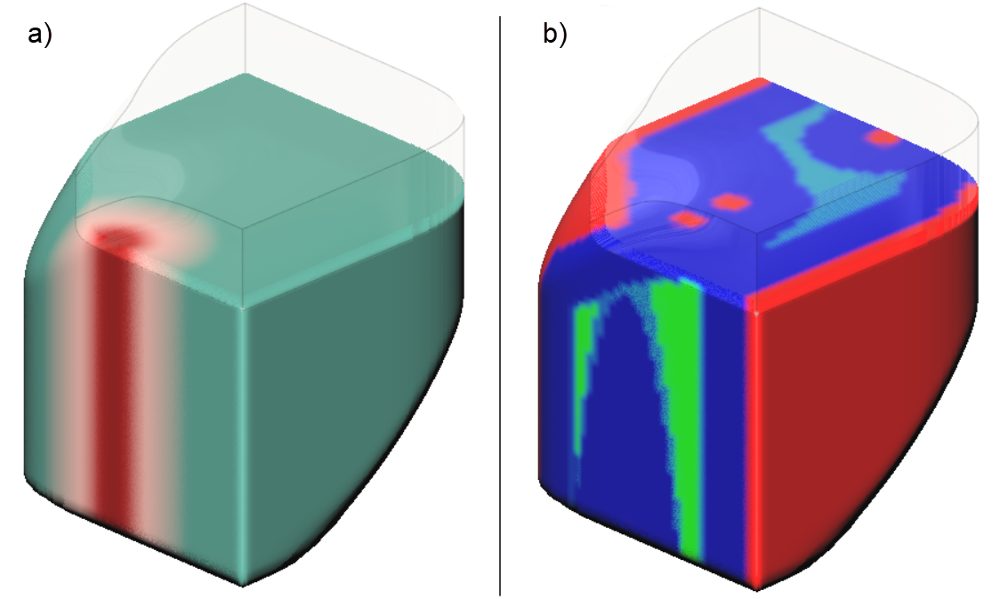
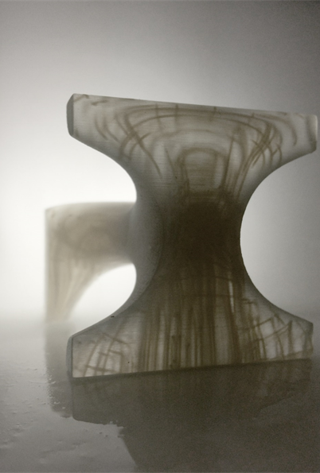
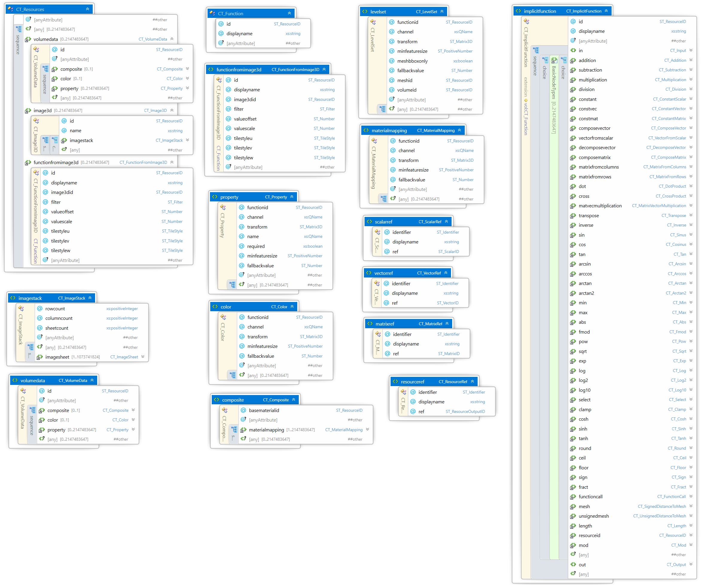
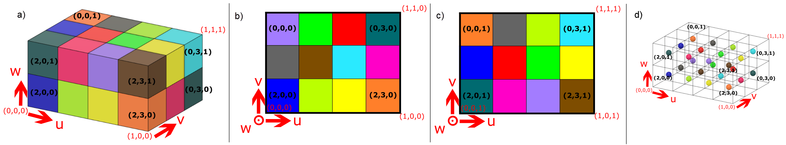
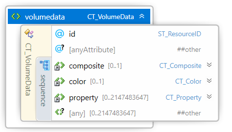
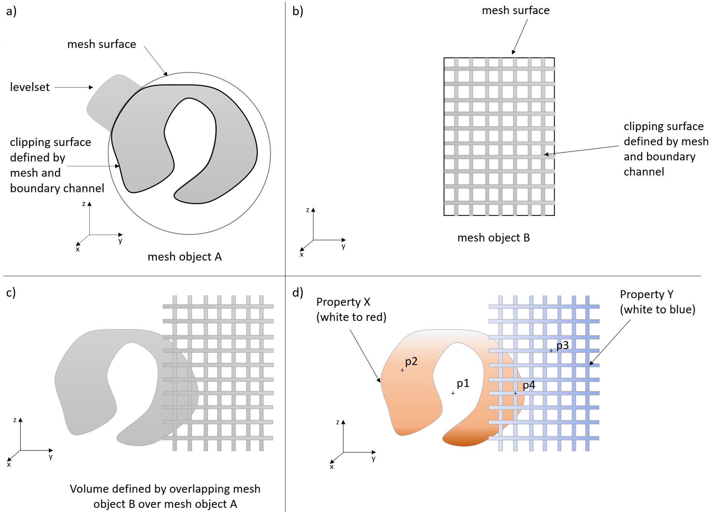
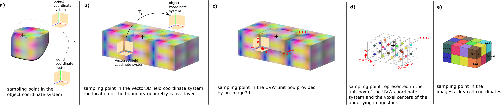

#
# 3MF Volumetric Extension

## Specification & Reference Guide


| **Version** | 0.7.0 |
| --- | --- |
| **Status** | Draft |

**Note**

## Table of Contents

- [Preface](#preface)
  * [Introduction](#introduction)
  * [About this Specification](#about-this-specification)
  * [Document Conventions](#document-conventions)
  * [Language Notes](#language-notes)
  * [Software Conformance](#software-conformance)
- [Part I: 3MF Documents](#part-i-3mf-documents)
  * [Chapter 1. Overview of Additions](#chapter-1-overview-of-additions)
  * [Chapter 2. 3D Image](#chapter-2-3d-image)
  * [Chapter 3. Scalar Fields](#chapter-3-scalar-fields)
  * [Chapter 4. 3D Vector Fields](#chapter-4-3d-vector-fields)
  * [Chapter 5. Volumetric Data](#chapter-5-volumetric-data)
  * [Chapter 6. Notes](#chapter-6-notes)
- [Part II. Appendices](#part-ii-appendices)
  * [Appendix A. Glossary](#appendix-a-glossary)
  * [Appendix B. 3MF XSD Schema for the Volumetric Extension](#appendix-b-3mf-xsd-schema-for-the-volumetric-extension)
  * [Appendix C. Standard Namespace](#appendix-c-standard-namespace)
  * [Appendix D: Example file](#appendix-d-example-file)
- [References](#references)


# Preface

## Introduction
Volumetric Modeling is an efficient approach to encode geometrical shapes and spatial properties and is based on a volumetric description.
Traditional, explicit modeling methodologies are based on surfaces (e.g. NURBS, triangular meshes) that describe the boundaries of an object. This is illustrated in Figure 1-1. a) a NURBS surface delimitates a region of space. Figure 1-1 b) shows a triangular mesh that describes the same surface. In each case, the top part of the described object is being shown transparently to allow viewing the "inside" of the described object.

The volumetric modeling approach relies on a mathematical, field-based description of the whole volume of the object. This is illustrated in Figure 1-1 c). Every point in space has a scalar (grey-scale) value. The iso-surface at value 0 describes the surface of the same object as in Figure 1-1 a). A section of this iso-surface is indicated by the blue line.

The true advantage of volumetric modeling shows when properties of an object vary in space gradually, e.g. color or material-distribution and -composition of an object vary in space. E.g. in Figure 1-2 a) the object has a uniform color except for a red stripe at the front-left surface that gradually turns into turquoise. Note that not only the surface, but also the interior volume has a non-uniform color in this region. Figure 1-2 b) shows a distribution of three different materials, indicated by three different colors, red, blue and green.

This is only a brief illustration of the volumetric modeling approach to geometric design and more information can be found in [references](#references) \[1\] and \[2\].

_Figure 1-1. Explicit (a) and (b) vs. implicit (c) representation_


_Figure 1-2. Spatially varying properties_


## About this Specification



This 3MF volumetric specification is an extension to the core 3MF specification. This document cannot stand alone and only applies as an addendum to the core 3MF specification. Usage of this and any other 3MF extensions follow an a la carte model, defined in the core 3MF specification.

Part I, "3MF Documents," presents the details of the primarily XML-based 3MF Document format. This section describes the XML markup that defines the composition of 3D documents and the appearance of each model within the document.

Part II, "Appendices," contains additional technical details and schemas too extensive to include in the main body of the text as well as convenient reference information.

The information contained in this specification is subject to change. Every effort has been made to ensure its accuracy at the time of publication.

This extension MUST be used only with Core specification version 1.3. or higher.

## Document Conventions

See [the 3MF Core Specification conventions](https://github.com/3MFConsortium/spec_core/blob/1.2.3/3MF%20Core%20Specification.md#document-conventions).

In this extension specification, as an example, the prefix "m" maps to the xml-namespace "http://schemas.microsoft.com/3dmanufacturing/material/2015/02". See Appendix [E.3 Namespaces](#e3-namespaces).

## Document Conventions

See [the standard 3MF Document Conventions documentation](https://github.com/3MFConsortium/spec_resources/blob/master/document_conventions.md).

## Language Notes

See [the standard 3MF Language Notes documentation](https://github.com/3MFConsortium/spec_resources/blob/master/language_notes.md).

## Software Conformance

See [the standard 3MF Software Conformance documentation](https://github.com/3MFConsortium/spec_resources/blob/master/software_conformance.md).


# Part I. 3MF Documents

## Chapter 1. Overview of Additions

_Figure 1-1: Overview of model XML structure of 3MF with volumetric additions_


This document describes new elements, each of which is OPTIONAL for producers, but MUST be supported by consumers that specify support for this volumetric extension of 3MF.

The central idea of this extension is to enrich the geometry notion of 3MF with volumetric elements that can represent spatially varying properties which are quite inefficient to handle with a mesh representation, especially in cases where the variation is continuous in space.

This extension is meant to be an exact specification of geometric, appearance-related, material and in fact arbitrary properties, and consumers MUST interpret it as such. However, the intent is also to enable editors of 3MF files to use the designated data structures for efficient interoperability and post-processing of the geometry and properties described in this extension.

A producer using the boundary element of the volumetric specification MUST mark the extension as required, as described in the core specification. Producers only using the other specification elements, in particular color-, composite- and property-elements, MAY mark the extension as REQUIRED, and MAY be marked as RECOMMENDED. Consumers of 3MF files that do not mark the volumetric extension as required are thus assured that the geometric shape of objects in this 3MF file are not altered by the volumetric specification.


# Chapter 2. 3D Image

## 2.1 3D Image

Element **\<image3d>**


| Name   | Type   | Use | Default | Annotation |
| --- | --- | --- | --- | --- |
| id | ST\_ResourceID | required | | Specifies an identifier for this image3d resource. |
| name | xs:string | | | 3d image resource name used for annotations purposes. |

Volumetric data can be encoded as 3d images that consist of voxels. Each \<image3d> element is assumed to represent a finite voxel grid from which data can be sampled.

\<image3d> is a container for different representations of voxeldata. This specification defines only the \<imagestack>-elements. Later versions of this specification might provide alternative child elements for the \<image3d> element.

## 2.2 ImageStack

Element **\<imagestack>**


| Name   | Type   | Use | Default | Annotation |
| --- | --- | --- | --- | --- |
| rowcount | xs:positiveinteger | required || Number of pixel rows in all child \<imagesheet>-elements. |
| columncount | xs:positiveinteger | required || Number of pixel columns in all child \<imagesheet>-elements. |
| sheetcount | xs:positiveinteger | required || Number of \<imagesheet>-elements within this \<imagestack> element. |

Volumetric images can be embedded inside a 3MF file using groups of PNG images that represent a stack of images.

All \<imagesheet>-elements within an imagestack MUST have the same number of rows and columns that is specified in the rowcount and columncount-attributes, respectively. rowcount, columncount and sheetcount MUST not exceed 1024^3, each. The total number of voxels MUST be limited by 1024^5. There MUST be exactly sheetcount \<imagesheet>-elements under \<imagestack> that are implicitly ordered starting with index 0.

Imagestack objects, and thus all underlying \<imagesheet> elements, MUST follow one of the input pixel layouts shown in the table below. All imagesheets within an imagestack MUST have the same input pixel layouts, and each channel MUST have the same bit-depth across all imagesheets. Pixel values sampled from a PNG file with a bitdepth of `N` bits will be normalized to 
`pixelvalue / (2^N-1)`, i.e. a fully separated channel is normalized to 1, the minimum sampled value is normalized to 0.

The following table shows the logical interpretation of sampling the "R", "G", "B" or "A"-channel depending on the input pixel layouts. The meaning of symbols is as follows: R – red, G – green, B – blue, A – alpha, Y – greyscale.

| Input pixel layout | | | | | |
| --- | --- | --- | --- | --- | --- |
| RGBA | R | G | B | A |
| RGB | R | G | B | 1 |
| YA | Y | Y | Y | A |
| Y | Y | Y | Y | 1 |

For example, if a field (see [\<scalarfieldfromimage3d>](#3-2-scalar-field-from-image3d)- and [\<vector3dfieldfromimage3d>](#4-2-3d-vector-field-from-image3d)) in a 3MF-file specifies that a certain value is sampled from the image’s R channel, but the referenced image is only monochromatic, then the greyscale channel is interpreted as the R color channel. Similarly, color values sampled from a monochromatic image are interpreted as if all "R", "G", "B" color channels share the same greyscale value. If there is no alpha channel present in the image, the highest possible value `1` MUST be used.

The \<imagestack>-element defines a voxel grid of values (e.g. RGB, grey-Alpha, grey) values distributed in a cuboid ({0,1,...,rowcount-1} x {0,1,...,columncount-1} x {0,1,...,sheetcount-1}). The left-front-bottom corner of this grid corresponds to the (0,0,0)-UVW coordinate when this 3D Image is being sampled, whereas the right-back-top corner corresponds to the (1,1,1) UVW-coordinate. Each \<imagesheet> corresponds to one PNG-file in the package. Figure 2-1 a) illustrates a voxel grid with `rowcount=3`, `columncount=4` and `sheetcount=2` voxels. Voxel indices are shown as bold black triple, the UVW-coordinate values as red triples.
Figure 2-1 b) illustrates the voxel indices and the UVW-values throughout the first \<imagesheet>, Figure 2-1 c) illustrates these quantities throughout the second \<imagesheet>. A voxel index triple `(i,j,k)` corresponds to a voxel with rowindex `i`, columnindex `j` and sheetindex `k`.

__Note__: The columnindex (`j`) relates to the UVW-coordinate `U`, whereas the rowindex `i` relates to the UVW-coordinate `V`. This definition is inline with the
Materials and Properties specification https://github.com/3MFConsortium/spec_materials/blob/1.2.1/3MF%20Materials%20Extension.md#chapter-6-texture-2d.

The sampling rules for UVW values are determined by the filter-rule, and the behavior for UVW-values outside the unit-cube are determined by the tilestyle attributes [of the \<scalarfieldfromimage3d>](#3-2-scalar-field-from-image3d)- and [\<vector3dfieldfromimage3d>](#4-2-3d-vector-field-from-image3d)-elements.

_Figure 2-1: Voxel indixes and UVW-texture space of a sample voxel grid: a) shows a voxel grid of 3x4x2 voxels. b) shows a section view of the bottom voxels, c) shows a section view of the top voxels. The orange voxel at the right, front and bottom of a) has rowindex=2, columnindex=3 and sheetindex=0. d) shows the voxelcenters of this configuration._


## 2.1.1 File Formats
PNG images can provide acceptable compression and bit-depth for the boundary-function, color information, material mixing ratios or arbitrary property information.

The following describes recommendations for the channel bit depth of PNG images used in this specification and is based on the nomenclature in the specification of the Portable Network Graphics (PNG, https://www.w3.org/TR/PNG) format.

- Color information, material mixing ratios and arbitrary properties can be deduced from PNG images with arbitrary channel depth. It is RECOMMENDED to store color into RGB-channels within a PNG.

- It is RECOMMENDED to store image information that will be used as levelset-function to represent a boundary in PNGs with one channel only. A typical approach to store this levelset information is to encode the signed distance field of the boundary of the object in this channel, or to limit the encoding to a narrow region around the boundary of the object. A different option is to deduce the levelset-function from a channel with binary values, i.e. from images of image type "greyscale" with bit-depth of 1 or an indexed-color with bit depths of 1, but with a very high spatial resolution.

	_Figure 2-2: 2D-slice through the levelset representation of a sphere of radius 5 illustrated as red circle. a) the greyscale values of the image represent the signed distance function in a box around the sphere. Values range from -10 to 10. b) High resolution image of the slice. White indicates a point that is inside the sphere, black outside the sphere. c) Image encoding the signed distance in a narrow band of thickness 2 around the boundary of the sphere. Values outside this band only indicate whether the point is inside or outside the sphere, as in b)._
	


- Producers SHOULD store information for which they require high resolution in image channels with bit depth of 16. Most professional image editing tools and standard implementations of the PNG format support channels with 16 bit.


## 2.2.2 OPC package layout
__Note__: Introductory information about the Open Packaging Conventions (OPC) can be found in the 3MF Core Specification (see https://github.com/3MFConsortium/spec_core/blob/1.3.0/3MF%20Core%20Specification.md#11-package).

It is RECOMMENDED that producers of 3MF Documents with the Volumetric Extension specification use the following part naming convention:

Paths of \<imagesheet> SHOULD consist of four segments. "/3D/volumetric/" as the first two segments, the name of a \<image3d>-element that references this \<imagesheet> as third segment (for example "/3D/volumetric/mixingratios/", and the name of the imagesheet as last segment (for example "sheet0001.png"). Each part in the 3MF package that is referred to by the path of an \<imagesheet> MUST be associated with the 3D Model part via the 3D Texture relationship.

This implies that all parts for \<imagesheet> in an imagestack SHOULD be located in the same OPC folder.

_Figure 2-3: OPC package layout_


## 2.2.3 3D Image Sheet

Element **\<imagesheet>**


| Name   | Type   | Use | Default | Annotation |
| --- | --- | --- | --- | --- |
| path | ST\_UriReference | required | | Specifies the OPC part name (i.e. path) of the image data file |

Each \<imagesheet> element has one required attribute. The path property determines the part name (i.e. path) of the 2D image data (see chapter 6 of the Materials & Properties Extension specification for more information).

__Note__:
Other file formats like OpenVDB, OpenEXR, or VTK offer similar functionality as a stack of PNGs and are more efficient at doing so. However, their use in a manufacturing environment is hard as these formats are conceptually more complex and harder to implement. Therefore, this specification relies on the human readable and conceptually simpler stack of PNGs. Later versions of this extension, or private extension of the 3MF format MAY use different 3D image formats to encode a volumetric data as different child elements of \<image3d> and benefit from their advanced features. The remainder of this specification deals with the mapping of volumetric data onto mesh-objects in a 3MF file and giving this volumetric data a meaning for additive manufacturing processes. Adding a different data format for a voxel grid as child under \<image3d> would not affect the remaining parts of this specification.

# Chapter 3. Scalar Fields
 
This specification relies on the notion of scalar and vectorial fields.
A scalar field is a mathematical function `f:R^3 -> R` that assigns to every point in 3D space a single numerical (scalar) value. Examples would be the temperature in degrees Celsius in a room at any point in space or the function `f(x,y,z) = x^2 + y^2 + z^2`.

Similarly, a vectorial field is a mathematical function `f:R^3 -> R^3` that assigns to every point in 3D space a 3D vector value. Examples would be the speed and direction of wind that also differs in space or the function `f(x,y,z) = (sin(x), cos(y), (x+y)/sqrt(1+z^2))`. More about 3d vector valued fields in [Chapter 4. 3D Vector Fields](#chapter-4-3d-vector-fields).

## 3.1 Scalar Field

Mathematical fields naturally lend themselves to represent volumetric structures. Their defining property is that one can attain (or sample) their value at any point in 3D space. To deal with them in the context of this specification, it introduces a container \<scalarfield> that is a resource in the 3MF model file.

Element type
**\<scalarfield>**


| Name   | Type   | Use | Default| Annotation |
| --- | --- | --- | --- | --- |
| id | ST\_ResourceID | required | | The resource id of this scalarfield resource |
| name | xs:string | | | Field for a human readable name of this field |

This container contains one of multiple specialization. This specification defines the \<scalarfieldfromimage3d>,  \<scalarfieldconstant> and \<scalarfieldcomposed>-elements. Later versions of this specification or third parties may provide alternative child elements for the \<scalarfield> element in different XML namespaces.

Whenever a language element of this specification refers to a \<scalarfield> element, this element provides an additional, optional transform-attribute, which determines the transformation of the coordinate space of said element into the coordinate system of the referred to element.

## 3.2 Scalar Field From Image3D

Element type
**\<scalarfieldfromimage3d>**


| Name   | Type   | Use | Default| Annotation |
| --- | --- | --- | --- | --- |
| image3did | ST\_ResourceID | required | | Specifies the id of the 3d image resource. |
| channel | ST\_ChannelName | required | | Specifies which channel to reference in the 3d image resource. |
| valueoffset | ST\_Number |  | 0.0 | Specifies a numerical offset for the values obtained from the `channel` within the `image3d` referred to by this `scalarfieldfromimage3d`. |
| valuescale | ST\_Number | | 1.0 | Specifies a numerical scaling for the values obtained from the `channel`  within the `image3d` referred to by this `scalarfieldfromimage3d`. |
| filter |ST\_Filter | | linear | "linear" or "nearest" neighbor interpolation. |
| tilestyleu | ST\_TileStyle | | wrap | Determines the behavior of the sampler for texture coordinate u outside the [0,1] range. |
| tilestylev | ST\_TileStyle | | wrap | Determines the behavior of the sampler for texture coordinate v outside the [0,1] range. |
| tilestylew | ST\_TileStyle | | wrap | Determines the behavior of the sampler for texture coordinate w outside the [0,1] range. |

Elements of type \<scalarfieldfromimage3d> define a scalar field (which can be sampled at any point in space) from values on a voxel grid defined in the \<image3d> element.

To simplify parsing, producers MUST define \<image3d>-elements prior to referencing them via imaged3did in a \<scalarfieldfromimage3d>-element.

**channel**:

The channel-attribute determines which channel to reference in the 3d image resource. Note that attributes of type \<ST\_ChannelName> are case-sensitive.
The elements of type \<scalarfieldfromimage3d> MUST contain a \<ST\_ChannelName> attribute which determines which channel to pick from the \<image3d> element. This attribute must be any of the reserved channel names (i.e. "R", "G", "B", or "A").


**tilestyle-u, -v or -w**:

MUST be one of "wrap", "mirror" or  "clamp". This property determines the behavior of the sampler of this \<scalarfieldfromimage3d> for 3d texture coordinates (u,v,w) outside the [0,1]x[0,1]x[0,1] cell. The different modes have the following interpretation (for s = u, s = v, or s = w):

1. "wrap" assumes periodic texture sampling, see Figure 3-1 a). A texture coordinate s that falls outside the [0,1] interval will be transformed per the following formula:
</br>s’ = s – floor(s)

2. "mirror" means that each time the texture width or height is exceeded, the next repetition of the texture MUST be reflected across a plane perpendicular to the axis in question, see Figure 3-1 b). This behavior follows this formula:
</br>s’ = 1 - abs( s - 2 * floor(s/2) - 1 )

3. "clamp" will restrict the texture coordinate value to the [0,1] range, see Figure 3-1 c). A texture coordinate s that falls outside the [0,1] interval will be transformed according to the following formula:
</br>s’ = min(1, max(0,s))

	_Figure 3-1: Illustration of different tilestyles. a) tilestyle wrap illustrated throughout the second \<imagesheet>. b) tilestyle mirror illustrated throughout the second \<imagesheet>. c) tilestyle clamp along the u-direction illustrated throughout the second \<imagesheet>_
	

**filter**:
The filter attribute defines the interpolation method used when a \<scalarfieldfromimage3d> is being sampled. This is illustrated in Figure 3-4.

- If the interpolation method of an elements of type \<channelfromimage3d> is "nearest", sampling it at an arbitrary (u,v,w) returns the floating point value defined by the closest point (u',v',w') to (u,v,w) which transforms back to a voxel center in the 3D image resource. If a coordinate u,v, or w maps exactly at the middle between to voxel centers, sampling (u,v,w) should return the floating point value defined by the voxel center with the lower index value of the two voxel centers in question.

	_Figure 3-3: voxel lookup using filter method "nearest" neighbor: sampling at uvw=(1/8,2/3,0) evaluates the voxel with index-triple (0,0,0) (not (1,0,0)), and sampling at (u,v,w)=(0.5,0.5,0) evaluates the voxel with index-triple (1,1,0) (not (1,2,0))._

	


- If the interpolation method of an elements of type \<scalarfieldfromimage3d> is "linear", sampling it at an arbitrary (u,v,w) returns the floating point defined by trilinearly interpolating between the eight closest points coordinates which transforms back to voxel centers in the 3D image resource.

_Figure 3-4: filter attributes "nearest" (a) and "linear" (b). The consider that the greyscale channel ("Y") of the image 3d of Figure 2-1 is reused in this example. The region shown is clipped at w=0.75, v=1/6 and u=2. The grey wireframe box indicates the UVW unit box. The tilesyle is "wrap" in all directions._


**`offsetvalue` and `scalevalue`**:

The values `V'` sampled from the \<image3d> are linearly scaled via `offsetvalue` and `scalevalue` giving a sampled value `V'' = V'*scalevalue + offsetvalue`


## 3.3 Constant Scalar Field

Element type
**\<scalarfieldconstant>**


| Name   | Type   | Use | Default| Annotation |
| --- | --- | --- | --- | --- |
| value | ST\_Number | required | | The constant value this scalar field evaluates to. |

A \<scalarfieldconstant>-element encodes a constant function, i.e. when the \<scalarfieldconstant>-element is being sampled, it evaluates to the constant value given by its attribute `value`.

## 3.4 Composed Scalar Field

Element type
**\<scalarfieldcomposed>**


| Name   | Type   | Use | Default| Annotation |
| --- | --- | --- | --- | --- |
| method | ST\_Method | required | | Determines how the referenced scalar fields are composed. Allowed values are "weightedsum", "multiply", "min", "max" or "mask". |
| scalarfieldid1 | ST\_ResourceId | required | | The resource id of a \<scalarfield> resource that will be used as first field during the composition.  |
| scalarfieldid2 | ST\_ResourceId | required | | The resource id of a \<scalarfield> resource that will be used as second field during the composition.  |
| factor1 | ST\_Number | | 1.0 | Numeric scale factor for the first composited field. Only used if method is "weightedsum". |
| factor2 | ST\_Number | | 1.0 | Numeric scale factor for the second composited field. Only used if method is "weightedsum". |
| transform1 | ST\_Matrix3D | | | Transformation of this \<scalarfieldcomposed> coordinate system into the coordinate system of the \<scalarfield> used for as first field during the composition. |
| transform2 | ST\_Matrix3D | | | Transformation of this \<scalarfieldcomposed> coordinate system into the coordinate system of the \<scalarfield> used for as second field during the composition. |
| scalarfieldmaskid | ST\_ResourceId | | | The resource id of a \<scalarfield> resource which shall be used for masking. Required if method is "mask".  |
| transformmask | ST\_Matrix3D | | | Transformation of this \<scalarfieldcomposed> coordinate system into the coordinate system of the \<scalarfield> used for masking. |

Each \<scalarfieldcomposed>-element encodes a simple volumetric modeling operation, that is the composition of two (or three, in the case of the method "mask") scalar fields.

To simplify parsing, producers MUST define \<scalarfield>-elements prior to referencing them via scalarfieldid1, scalarfieldid1 or scalarfieldmaskid in a \<scalarfieldcomposed>-element.

**method**: controls according to which formula referred scalar fields should be composed.

Let's denote the sampled value of this \<scalarfieldcomposed>-element at point `(x,y,z)` as `c`.
To evaluate `c`, the first scalar field needs to be evaluated at `T1*(x,y,z)`, yielding `s2`, where `T1` is given by the transform1 attribute.
The second scalar field needs to be evaluated at `T2*(x,y,z)`, yielding `s2`, where `T2` is given by the transform2 attribute.

With these definitions at hand the sampled value of this composed scalar field `c` is calculated according to the method attribute:

- "weightedsum":

    `c = factor1 * s1 + factor2 * s2`
    
- "multiply":

    `c = s1 * s2`

- "min" or "max":
   
    `c = min(s1, s2)`  or  `c = min(s1, s2)`
    
    Methods "min" and "max" are useful to capture boolean operations (union and intersection, respectively) between fields representing levelset functions.

- "mask":

    The method "mask" provides a means to use another scalarfield as a volumetric decal that only affects a region of complex shape within the volume.

    `c = m * s1 + (1 - m) * s2`
    
    Here, `m` is the value of the scalar field referred to by the `scalarfieldmaskid` attribute of this \<scalarfieldcomposed>-element evaluated at `Tmask*(x,y,z)`, where `Tmask` is given by the transformmask attribute.
    
    __Note__: The method "mask" implements the same formula as the method "mix" for the rgb-values of an \<multiproperties>-element in the [Materials and Properties Extension specification, Chapter 5](https://github.com/3MFConsortium/spec_materials/blob/1.2.1/3MF%20Materials%20Extension.md#chapter-5-multiproperties).


Figure 4-1 shows example of the composition of two scalar fields by a \<scalarfieldcomposed> using the different methods and varying factors.

_Figure 4-1: Example of composition methods and parameters_


# Chapter 4. 3D Vector Fields

3D Vector fields work analogously to scalar fields, however, each composition or sampling operation is being performed for the three components of the vector valued function: `f=(f1,f2,f3)`. Each of these vector-components could as well be described as a scalar field. However, when describing color values or vector valued properties, it is more natural to choose a vector-based representation.

The only differences are in how the 3D Vector Field gets sampled from an image3d, and how the method "mask" during composition work.
The rigorous specification of the 3D Vector field follows now.

## 4.1 3D Vector Field

Element type **\<vector3dfield>**


| Name   | Type   | Use | Default| Annotation |
| --- | --- | --- | --- | --- |
| id | ST\_ResourceID | required | | The resource id of this vector3dfield resource |
| name | xs:string | | | Field for a human readable name of this field |

This container contains one of multiple specialization. This speficiation defines the \<vector3dfieldfromimage3d>-, \<vector3dfieldconstant>- and \<vector3dfieldcomposed>-elements. Later versions of this specification might provide alternative child elements for the \<vector3dfield> element.

Whenever a language element of this specification refers to a \<vector3dfield> element, this element provides an additional, optional transform-attribute, which determines the transformation of the coordinate space of said element into the coordinate system of the element referred to.


## 4.2 3D Vector Field from Image3D

Element type
**\<vector3dfieldfromimage3d>**


| Name   | Type   | Use | Default| Annotation |
| --- | --- | --- | --- | --- |
| image3did | ST\_ResourceID | required | | Specifies the id of the 3d image resource. |
| filter |ST\_Filter | | linear | "linear" or "nearest" neighbor interpolation. |
| valueoffset | ST\_Number |  | 0.0 | Specifies a numerical offset for the values obtained from any channel within the `image3d` referred to by this `vector3dfieldfromimage3d`. |
| valuescale | ST\_Number | | 1.0 | Specifies a numerical scaling for the values obtained from any channel within the `image3d` referred to by this `vector3dfieldfromimage3d`. |
| tilestyleu | ST\_TileStyle | | wrap | Determines the behavior of the sampler for texture coordinate u outside the [0,1] range. |
| tilestylev | ST\_TileStyle | | wrap | Determines the behavior of the sampler for texture coordinate v outside the [0,1] range. |
| tilestylew | ST\_TileStyle | | wrap | Determines the behavior of the sampler for texture coordinate w outside the [0,1] range. |

Elements of type \<vector3dfieldfromimage3d> define a 3d-vector valued field (which can be sampled at any point in space) from values on a voxel grid defined in the \<image3d> element.

To simplify parsing, producers MUST define \<image3d>-elements prior to referencing them via imaged3did in a \<vector3dfieldfromimage3d>-element.

This element samples the channels "R", "G" and "B" from the image3d. Channels "R", "G" and "B" of the image3d are interpreted as components `f1`, `f2` and `f3` respectively. If the image3d does not provide either of these channels, the image3d provides the values for "R", "G" and "B" according to the table in [Chapter 2. 3D Image](#chapter-2-3d-image).

The attributes tilestyleu, tilestylev, tilestylew, and filter, valueoffset and valuescale work as they do for the scalar field from image3d for the individual vector components of this 3d vector field from image3d.

## 4.3 Constant 3D Vector Field

Element type
**\<vector3dfieldconstant>**


| Name   | Type   | Use | Default| Annotation |
| --- | --- | --- | --- | --- |
| valuex | ST\_Number | required | | The constant x-component that this 3d vector field evaluates to. |
| valuey | ST\_Number | required | | The constant y-component that this 3d vector field evaluates to. |
| valuez | ST\_Number | required | | The constant z-component that this 3d vector field evaluates to. |

A \<vector3dfieldconstant>-element encodes a constant 3d vector valued function, i.e. when the \<vector3dfieldconstant>-element is being sampled, it evaluates to the constant vector `(valuex, valuey, valuez)`.

## 4.4 Composed 3D Vector Field

Element type
**\<vector3dfieldcomposed>**


| Name   | Type   | Use | Default| Annotation |
| --- | --- | --- | --- | --- |
| method | ST\_Method | required | | Determines how the referenced scalar fields are composed. Allowed values are "weightedsum", "multiply", "min", "max" or "mask". |
| vector3dfieldid1 | ST\_ResourceId | required | | The resource id of a \<vector3dfield> resource that will be used as first field during the composition.  |
| vector3dfieldid2 | ST\_ResourceId | required | | The resource id of a \<vector3dfield> resource that will be used as second field during the composition.  |
| factor1 | ST\_Number | | 1.0 | Numeric scale factor for the first composited field. Only used if method is "weightedsum". |
| factor2 | ST\_Number | | 1.0 | Numeric scale factor for the second composited field. Only used if method is "weightedsum". |
| transform1 | ST\_Matrix3D | | | Transformation of this \<vector3dfieldcomposed> coordinate system into the coordinate system of the \<vector3dfield> used for as first field during the composition. |
| transform2 | ST\_Matrix3D | | | Transformation of this \<vector3dfieldcomposed> coordinate system into the coordinate system of the \<vector3dfield> used for as second field during the composition. |
| compositionspace | ST\_CompositionSpace | | "raw" | Determines whether composition should take place with raw numerircal values, or in linearized space. |
| scalarfieldmaskid | ST\_ResourceId | | | The resource id of a \<scalarfield> resource which shall be used for masking. Required if method is "mask".  |
| transformmask | ST\_Matrix3D | | | Transformation of this \<vector3dfieldcomposed> coordinate system into the coordinate system of the \<scalarfield> used for masking. |

Each \<vector3dfieldcomposed>-element encodes a simple volumetric modeling operation that acts on a 3D-vector-valued function, that is the composition of two 3D vector fields and optionally a scalar field in the case of the method "mask".

To simplify parsing, producers MUST define \<vector3dfield>- and \<scalarfield>-elements prior to referencing them via scalarfieldid1, scalarfieldid1 or scalarfieldmaskid in a \<vector3dfieldcomposed>-element, respectively.

All attributes work analogously to how they work in the \<scalarfieldcomposed>-element in that they are applied per vector component `f1`, `f2` and `f3`. The only deviation is in the method "mask" which applies the same scalar mask field to all components of the \<vector3dfields> vector3dfieldid1 and vector3dfieldid2.

Let's denote the sampled value of this \<vector3dfieldcomposed>-element at point `(x,y,z)` as **`c`**.
To evaluate **`c`**, the first 3D vector field is evaluated at `T1*(x,y,z)`, yielding **`s2`**, where `T1` is given by the transform1 attribute.
To evaluate **`c`**, the second 3D vector field is evaluated at `T2*(x,y,z)`, yielding **`s2`**, where `T2` is given by the transform2 attribute.

With these definitions at hand the sampled value of this composed 3D vector field **`c`** is calculated according to the method attribute:

- "mask":

    The method "mask" provides a means to use another 3D vector field as a volumetric decal that only affects a region of complex shape within the volume.

    `c = m * s1 + (1 - m) * s2`
    
    Here, m is the value of the scalar field referred to by the `scalarfieldmaskid` attribute of this composed 3D vector field evaluated at `Tmask*(x,y,z)`, where `Tmask` is given by the transformmask attribute.

The compositionspace-attribute determines whether values of the input 3D vector fields are composited as they are being sampled ("raw") or whether the composition takes place in linearized space ("linear").
The "linear" option SHOULD be used when the results of a \<vector3dfieldcomposed> are used (directly or indirectly) as \<color>-element (see [\<volumedata>](#5-2-volumetric-data)). This is to be consistent with the blending in the Materials and Properties extension specification https://github.com/3MFConsortium/spec_materials/blob/1.2.1/3MF%20Materials%20Extension.md#12-srgb-and-linear-color-values.

If the option is "linear" the following modification to the formulae of the composition methods above and in [3.3 Composed Scalar Field](##3.3-composed-scalar-field) MUST be made:
1. Values sampled from any of the input 3D vector fields MUST be transformed into "linear-space" values according to this formula:

	

2. These transformed values values_linear are composited using the formulae above and in [3.3 Composed Scalar Field](##3.3-composed-scalar-field).

3. The values from step 2 must be transformed back into raw-values according to this formula:

	

__Note:__
The values sampled from the masking scalar field MUST NOT be linearized.

_Figure 4-2: Example of the composition method "mask" for the composed 3D vector field_


# Chapter 5. Volumetric Data

## 5.1. Volumetric Data extension to Mesh
 
Element **\<mesh>**


The volumetric data \<volumedata> element is a new OPTIONAL element which extends the root triangular mesh representation (i.e. the \<mesh> element).


## 5.2. Volumetric Data

Element **\<volumedata>**



The \<volumedata> defines the volumetric properties in the interior of a \<mesh> element.

The child-element of the \<volumedata> element reference the field-data given by \<scalarfield>- and \<vector3dfiled>-elements and defines how they are mapped to specific properties within the interior volume of the enclosing mesh.
Volumedata MUST only be used in a mesh of object type "model" or "solidsupport". This ensures that the \<mesh> defines a volume.
Moreover, the volumedata-element MUST not be used in a mesh that is referenced as "originalmesh" by any other mesh. This excludes the possibility to implicitly mirror volumedata, which makes it easier to consume files with this extension.

The \<volumedata> element can contain up to one \<boundary> child element, up to one \<composite> child element, up to one \<color> element, and up to 2^31-1 of \<property> elements.

The child elements modify the enclosing \<mesh> in two fundamentally different ways:
1. the child \<boundary> element (if it exists) determines the geometry of the \<mesh> object.
2. the other child elements modify color, material composition and other arbitrary properties of the \<mesh> object.

To rationalize how this specification modifies the definition of geometry within a 3MF model, the concept of a "clipping surface" of a mesh with a \<volumedata> element is introduced.
The clipping surface is defined as follows:
1. If no \<boundary> element exists, the clipping surface is defined by the surface of the enclosing \<mesh> element. This implicitly takes into account any geometry defined by e.g. the beamlattices specification.
2. If the \<boundary> element exists, the clipping surface is defined by the intersection of the geometry from 1. and the interior of the levelset-channel used in the \<boundary> element.

This clipping surface trims any volumetric data defined therein. Any data outside the clipping surface MUST be ignored. The geometry that should be printed is defined by the interior of the clipping surface.

__Note__
At least some closed mesh is required to enclose any volumedata element, for example a simple box that represents the bounding box of the geometry encoded in the \<boundary>-element. An empty mesh would not represent infinite space.

Volumetric content is always clipped to the clipping surface of the mesh that embeds it. If a property (color, composite or properties) defined at the surface of an object conflicts with the property within the object defined by this extension, the surface property has precedence in the following sense:
The consumer MUST define a surface layer with a thickness as small as possible to achieve the surface property on the outside of the object. Outside of this thin surface region, the volumetric property MUST be applied everywhere within the object.

__Note__
The thickness of this surface layer can vary between consumers depending on the manufacturing technology they employ.

The properties at surface regions that are not explicitly specified are instead given by the volumetric properties.


Conflicting properties must be handled as follows:
1. Producers MUST not define colors, materials or properties via child elements of the \<volumedata> element that are impossible on physical grounds (e.g. non-conducting copper).
2. Consumers that read files with properties that cannot be realized due to limitations specific to them (e.g. a specific manufacturing device that does not support a material in a specific color), SHOULD raise a warning, but MAY handle this in any appropriate way for them. If there is an established process between Producer and Consumer, resolution of such conflicts SHOULD be performed e.g. via negotiation through printer capabilities and a print ticket.

__Note__: In the case where objects with different \<volumedata> child elements overlap, only the \<volumedata> child elements from last object can be used.
This makes sure that \<volumedata> child elements of an overlapped object do not determine the value of any \<volumedata> child elements of an overlapping object. Figure 5-1 illustrates this behavior.

_Figure 5-1: a) Mesh object A (circle) with \<volumedata> child element X. b) Mesh object B (rectangle) with \<volumedata> child element Y. The mesh objects are defined in the order A-B. c) shows the volume defined by the overlapped mesh objects. d) shows \<volumedata> child element X in object A, and \<volumedata> child element Y in object B. The table lays out how these \<volumedata> child elements are sampled at positions p1 to p4._



### 5.2.1 Boundary element

Element **\<boundary>**


| Name   | Type   | Use | Default | Annotation |
| --- | --- | --- | --- | --- |
| scalarfieldid | ST\_ResourceID | required | | ResourceID of the \<scalarfield> that encodes the boundary as a levelset. |
| transform | ST\_Matrix3D | | | Transformation of the object coordinate system into the \<scalarfield> coordinate system. |
| solidthreshold | ST\_Number | | 0.0 | Determines the values of the levelset function which are considered inside or outside the specified object. |

The boundary element is used to describe the interior and exterior of an object via a levelset function.

To simplify parsing, producers MUST define a \<scalarfield>-element prior to referencing it via the scalarfieldid-attribute in a \<boundary>-element.

**scalarfieldid**:

The levelset function is given by the scalar field with resource id matching the sourceid-attribute of the \<boundary>-element.

**solidthreshold**:

The value of the levelset function `f` at a position `(x,y,z)` and the solidthreshold determine whether (x,y,z) is inside or outside the specified object:
 - If `f<=solidthreshold`, then `(x,y,z)` is inside the specified object.
 - If `f>solidthreshold`, then `(x,y,z)` is outside the specified object.

**transform**:

The transformation of the object coordinate system into the scalar field coordinate system.
If the boundary-property of the enclosing mesh is being sampled at position `(x,y,z)` in the mesh's local object coordinate system, the referenced scalar field must be sampled at position `(x',y',z') = T*(x,y,z)`.
See Figure 6-1 for an illustration of this transform in the sampling process.

### 5.2.2 Color element

Element **\<color>**


| Name   | Type   | Use | Default | Annotation |
| --- | --- | --- | --- | --- |
| vector3dfieldid | ST\_ResourceID | required | | ResourceID of the \<vector3dfield> that holds color information. |
| transform | ST\_Matrix3D | | | Transformation of the object coordinate system into the \<vector3dfield> coordinate system. |

To simplify parsing, producers MUST define a \<vector3dfield>-element prior to referencing it via the vector3dfieldid in a \<color>-element.

The \<color> element is used to define the color of the object.
The color MUST be interpreted in linearized sRGB color space as defined in the Materials and Properties specification https://github.com/3MFConsortium/spec_materials/blob/1.2.1/3MF%20Materials%20Extension.md#12-srgb-and-linear-color-values.

The vector components `x`, `y` and `z` of the 3D vector field are interpreted as the "R", "G" and "B" channels of the color of the enclosing meshobject, respectively. If either channel evaluates to a value \<0 or \>1 it has to be truncated at 0 or 1, respectively.

This specification does not capture well the properties for semi-transparent, diffusive materials. This specification is useful for defining parts with non transparent, opaque materials, e.g. for indicating wear and tear, sectioning the models and printing with non transparent materials.

**transform**:

The transformation of the object coordinate system into the 3D vector field coordinate system.
If this \<color>>-element is being sampled at position `(x,y,z)` in the mesh's local object coordinate system, the 3D vector field must be sampled at position `(x',y',z') = T*(x,y,z)`.

## 5.2.3 Composite element

Element **\<composite>**


| Name   | Type | Use | Default | Annotation |
| --- | --- | --- | --- | --- |
| basematerialid | ST\_ResourceID | required | | ResourceID of the \<basematerials> element that holds the \<base>-elements referenced in the child \<materialmapping>-elements. |

The \<composite> element describes a mixing ratio of printer materials at each position in space. The CONSUMER can determine the halftoning, mixing or dithering strategy that can be used to achieve these mixtures.

This element MUST contain at least one \<materialmapping> element, which will encode the relative contribution of a specific basematerial to the material mix.

The number of \<base>-elements in the \<basematerials> element referenced by a \<composite> element MUST equal the number of \<materialmapping>-elements in the \<composite> element. To simplify parsing, producers MUST define the referenced \<basematerials>-element prior to referencing it via the basematerialid in a \<composite>-element.

## 5.2.4 Material mapping element

Element **\<materialmapping>**


| Name   | Type   | Use | Default | Annotation |
| --- | --- | --- | --- | --- |
| scalarfieldid | ST\_ResourceID | required | | ResourceID of the \<scalarfield> providing the mixing contribution value for a material in the \<basematerial>-element. |
| transform | ST\_Matrix3D | | | Transformation of the object coordinate system into the \<scalarfield> coordinate system |

The \<materialmapping> element defines the relative contribution of a specific material to the mixing of materials in it's parent \<composite>-element.

To simplify parsing, producers MUST define the referenced \<scalarfield>-element prior to referencing it via the scalarfieldid in a \<materialmapping>-element.

**transform**:

The transformation of the object coordinate system into the scalar field coordinate system.
If any channel of a \<materialmapping> is being sampled at position `(x,y,z)` in the mesh's local object coordinate system, the referenced scalar field must be sampled at position `(x',y',z') = T*(x,y,z)`.

If the sampled value of a \<scalarfield> is `<0` it must be evaluated as "0".

Producers MUST NOT create files where the sum of all values in its child \<materialmapping>-elements is smaller than `10^-7`. If the total is smaller than this threshold, the mixing ratio is up to the consumer.

- If there are `N` materials, then the mixing ration of material `i` at point `X` is given by:
   ```
   value of channel i / sum(value of all N scalarfields at point X)
   ```

The order of the <materialmapping>-elements defines an implicit 0-based index. This index corresponds to the index defined by the \<base>- elements in the \<basematerials>-element of the core specification.

### 5.2.4.1 Property element

Element **\<property>**


| Name   | Type   | Use | Default | Annotation |
| --- | --- | --- | --- | --- |
| fieldid | ST\_ResourceID | required | | ResourceID of the \<scalarfield> or \<vector3dfield> that holds the value of this property |
| transform | ST\_Matrix3D | | | Transformation of the object coordinate system into the \<scalarfield> or \<vector3dfield> coordinate system |
| name | xs:QName | required | | Contains either the name of the property, defined in a 3MF extension specification, or the name of a vendor-defined property. Either MUST be prefixed with a valid XML namespace name declared on the \<model> element. |
| required | xs:boolean | | false | Indicator whether this property is required to process this 3MF document instance. |

The \<property> element allows to assign any point in space a scalar or vectorial value of a freely definable property. This can be used to assign, e.g. opacity, conductivity, or translucency.

To simplify parsing, producers MUST define the referenced \<scalarfield>- or \<vector3dfield>-element prior to referencing it via the sourcefieldid in a \<property>-element.

**transform**:

The transformation of the object coordinate system into the \<scalarfield> or \<vector3dfield> coordinate system.
If a \<property>-element is being sampled at position `(x,y,z)` in the mesh's local object coordinate system, the referenced \<scalarfield> or \<vector3dfield> must be sampled at position `(x',y',z') = T*(x,y,z)`.

This specification does not provide qualified names for such properties as part of the standard volumetric namespace.
A later extension of the 3MF format might define such qualified names as part of a different extension specification or a later version of the volumetric extension specification. Producers that want to specify such properties now, SHOULD define a qualified name that can e.g. be called "http://www.vendorwwebsite.com/3mf/vendor13mfextension/2021/05".
The specifications of private namespaces (that are not ratified by the 3MF Consortium) MUST be negotiated between producer and consumer of a 3MF file.

The names of \<property>-elements MUST be unique within a \<volumedata>. This name MUST be prefixed with a valid XML namespace name declared on the <model> element.
The interpretation of the value MUST be defined by the owner of the namespace. 
The producer of a 3MF file is responsible for assembling the values in the \<property> (and the referenced \<scalarfield> or \<vector3dfields>) such that sampling it in the print-bed coordinate system as a e.g. physical property, is sensible. This requirement is particularly important if the accumulated transformation `T0` between print-bed coordinates and local object coordinates is not a rigid body transformation.
(The transformation `T0` of the print-bed coordinate system into the object coordinate system is given by the `transform`-attributes on the `item` and `component`-elements in the path that leads to this object in the `build`-hierarchy of the 3MF Core Specification (see https://github.com/3MFConsortium/spec_core/blob/1.3.0/3MF%20Core%20Specification.md#3431-item-element and https://github.com/3MFConsortium/spec_core/blob/1.3.0/3MF%20Core%20Specification.md#421-component, and Figure 6.2 in this document).

If the interpretation of a property might result in a conflict with the standard volumedata-elements (boundary, color, composite) the namespace-owner MUST specify a resolution to the conflict. A producer MUST NOT create files with properties that conflict with each other.

If a physical unit is necessary, the namespace owner MUST define a unique and unambiguous physical unit system for the namespace. The unit system SHOULD be metric.

If a \<property> is marked as `required`, and a consumer does not support it, it MUST warn the user or the appropriate upstream processes that it cannot process all contents in this 3MF document instance.
Producers of 3MF files MUST mark all volumetric \<property>-elements required to represent the design intent of a model as `required`.

# Chapter 6. Notes

## 6.1. Evaluation Graph

The elements in this specification form an acyclic directed graph when evaluating the value of any volumedata-subelement.
The evaluation order of this graph can end with an \<scalarfieldconstant> (or \<vector3dfieldconstant>), or with a \<scalarfieldfromimage3d> (or \<vector3dfieldfromimage3d>), which inturn evaluated an \<image3d>-element.
Optionally, the evaluation graph can contain potentially multiple \<scalarfieldcomposed> (or \<vector3dfieldcomposed>)-elements.

In this sense, the \<scalarfieldfromimage3d> (or \<vector3dfieldfromimage3d>) and \<scalarfieldconstant> (or \<vector3dfieldconstant>) elements form standalone, atomic ways to define \<scalarfield>s (or \<vector3dfield>s), whereas the \<scalarfieldcomposed> (or \<vector3dfieldcomposed>)-elements encode volumetric modeling operations, as described in [3.4 Composed Scalar Field](##3.4-composed-scalar-field) and [4.4 Composed 3D Vector Field](##4.4-composed-3d-vector-field).

Calculations during evaluation of the graph SHOULD be performed in single- or double-precision floating-point arithmethic, according to IEEE 754.

## 6.2. Evaluation Process

Equipped with the language elements of this specification, one can recapitulate the core concepts with an overview of the sampling process.

Figure 6-1 illustrates the 3MF elements, the different coordinate systems and transforms between them when a \<volumedata> element (in this case \<color>) is sampled in the object coordinate space.

Figure 6-1 a) The object's color is sampled at position (+) in the object coordinate system. The clipping surface is hinted at with a wireframe. The transformation `T0` of the print-bed coordinate system into the object coordinate system is given by the `transform`-attributes on the `item` and `component`-elements in the path that leads to this object in the `build`-hierarchy of the 3MF Core Specification (see https://github.com/3MFConsortium/spec_core/blob/1.3.0/3MF%20Core%20Specification.md#3431-item-element and https://github.com/3MFConsortium/spec_core/blob/1.3.0/3MF%20Core%20Specification.md#421-component).

Figure 6-1 b) shows the \<vector3dfieldfromimage3d> underlying the color of the object. The sampling point is represented in the coordinate system of the \<vector3dfieldfromimage3d>. The transformation `T1` from object coordinate space to \<vector3dfieldfromimage3d> coordinate system is given by the `transform`-element in the \<color>-element. The original clipping surface from a) is only shown for illustration porpuses. It does not exist in the \<vector3dfieldfromimage3d> context.
The color value sampled in this illustration directly originates from a \<vector3dfieldfromimage3d> element. However, as mentioned in the note above, it could as well be the result of one or multiple compositions via \<vector3dfieldcomposed>, see Figure 4-1.

Figure 6-1 c) Shows the \<vector3dfieldfromimage3d> again. The unit box of the UVW coordinate system is shown as a wireframe. The transformation `T2` between \<vector3dfieldfromimage3d> coordinate system and UVW space is given according to the `transform`-attribute of the \<vector3dfieldfromimage3d> element.

Figure 6-1 d) Shows the UVW coordinate space of the \<image3d>-element and where the sampling point (+) is evaluated, and the UVW-locations to which the voxel centers of the underlying \<imagestack>-element map.

Figure 6-1 e) illustrates where the sampling point (+) ends up in the voxel index space of the \<imagestack>. The mapping of UVW to voxel indices in the \<imagestack>-element is described in [Chapter 2. 3D Image](#chapter-2-3d-image).

_Figure 6-1: Illustration of the different coordinate systems and 3MF elements in the sampling process. a) the object to be sampled at position (+). b) A view into the \<vector3dfieldfromimage3d>. The original clipping surface from a) is only shown for illustration porpuses. c) Shows the \<vector3dfieldfromimage3d> again. The unit box of the UVW coordinate system is shown as a wireframe. d) The UVW coordinate space and the UVW-locations to which the voxel-centers map. e) The sampling point (+) in the voxel index space._


## 6.3. Limitations

This speciication is limited in scope. Three notoworthy limitations are

1. One cannot overlay a scalar or vector field over a meshless (composite) object, one has to duplicate the scalar fields at the object leaves.

2. The fields in this definition are limited to be scalar- (or 1D-vector-) valued and 3D-vector valued. Vectors of other dimensionality must be assembled by the producer / consumer using multiple scalar / 3D-vector fields.

3. It is not possible to assemble a field object that represents the RGB and alpha-channels from images. However one may assamble and blend data from RGBA-images explicitely by extracting the alpha channel into a scalar field and by using the alpha scalar field as a composition mask of two RGB 3d vector fields.


# Part II. Appendices

# Appendix A. Glossary

See [the standard 3MF Glossary](https://github.com/3MFConsortium/spec_resources/blob/master/glossary.md).

## Appendix B. 3MF XSD Schema for the Volumetric Extension
```xml
<?xml version="1.0" encoding="UTF-8"?>
<xs:schema xmlns="http://schemas.microsoft.com/3dmanufacturing/volumetric/2022/01" xmlns:xs="http://www.w3.org/2001/XMLSchema"
xmlns:xml="http://www.w3.org/XML/1998/namespace" targetNamespace="http://schemas.microsoft.com/3dmanufacturing/volumetric/2022/01"
	elementFormDefault="unqualified" attributeFormDefault="unqualified" blockDefault="#all">

	<xs:annotation>
		<xs:documentation>
			<![CDATA[
		Schema notes:

		Items within this schema follow a simple naming convention of appending a prefix indicating the type of element for references:

		Unprefixed: Element names
		CT_: Complex types
		ST_: Simple types
		
		]]>
		</xs:documentation>
	</xs:annotation>
	<!-- Complex Types -->

	<xs:complexType name="CT_Resources">
		<xs:sequence>
			<xs:any namespace="##other" processContents="lax" minOccurs="0" maxOccurs="2147483647"/>
			<xs:element ref="image3d" minOccurs="0" maxOccurs="2147483647"/>
			<xs:element ref="scalarfield" minOccurs="0" maxOccurs="2147483647"/>
			<xs:element ref="vector3dfield" minOccurs="0" maxOccurs="2147483647"/>
		</xs:sequence>
		<xs:anyAttribute namespace="##other" processContents="lax"/>
	</xs:complexType>

	<xs:complexType name="CT_Image3D">
		<xs:sequence>
			<xs:choice>
				<xs:element ref="imagestack"/>
				<xs:any namespace="##other" processContents="lax"/>
			</xs:choice>
		</xs:sequence>
		<xs:attribute name="id" type="ST_ResourceID" use="required"/>
		<xs:attribute name="name" type="xs:string"/>
	</xs:complexType>

	<xs:complexType name="CT_ImageStack">
		<xs:sequence>
			<xs:any namespace="##other" processContents="lax" minOccurs="0" maxOccurs="2147483647"/>
			<xs:element ref="imagesheet" minOccurs="1" maxOccurs="1073741824"/>
		</xs:sequence>
		<xs:attribute name="rowcount" type="xs:positiveInteger" use="required"/>
		<xs:attribute name="columncount" type="xs:positiveInteger" use="required"/>
		<xs:attribute name="sheetcount" type="xs:positiveInteger" use="required"/>
		<xs:anyAttribute namespace="##other" processContents="lax"/>
	</xs:complexType>

	<xs:complexType name="CT_ImageSheet">
		<xs:sequence>
			<xs:any namespace="##other" processContents="lax" minOccurs="0" maxOccurs="2147483647"/>
		</xs:sequence>
		<xs:attribute name="path" type="ST_UriReference" use="required"/>
		<xs:anyAttribute namespace="##other" processContents="lax"/>
	</xs:complexType>

	<xs:complexType name="CT_ScalarField">
		<xs:sequence>
			<xs:choice>
				<xs:element ref="scalarfieldfromimage3d"/>
				<xs:element ref="scalarfieldconstant"/>
				<xs:element ref="scalarfieldcomposed"/>
				<xs:any namespace="##other" processContents="lax"/>
			</xs:choice>
		</xs:sequence>
		<xs:attribute name="id" type="ST_ResourceID" use="required"/>
		<xs:attribute name="name" type="xs:string"/>
		<xs:anyAttribute namespace="##other" processContents="lax"/>
	</xs:complexType>

	<xs:complexType name="CT_ScalarFieldFromImage3D">
		<xs:sequence>
			<xs:any namespace="##other" processContents="lax" minOccurs="0" maxOccurs="2147483647"/>
		</xs:sequence>
		<xs:attribute name="image3did" type="ST_ResourceID" use="required"/>
		<xs:attribute name="channel" type="ST_ChannelName" use="required"/>
		<xs:attribute name="filter" type="ST_Filter" default="linear"/>
		<xs:attribute name="valueoffset" type="ST_Number" default="0.0"/>
		<xs:attribute name="valuescale" type="ST_Number" default="1.0"/>
		<xs:attribute name="tilestyleu" type="ST_TileStyle" default="wrap"/>
		<xs:attribute name="tilestylev" type="ST_TileStyle" default="wrap"/>
		<xs:attribute name="tilestylew" type="ST_TileStyle" default="wrap"/>
		<xs:anyAttribute namespace="##other" processContents="lax"/>
	</xs:complexType>

	<xs:complexType name="CT_ScalarFieldComposed">
		<xs:sequence>
			<xs:any namespace="##other" processContents="lax" minOccurs="0" maxOccurs="2147483647"/>
		</xs:sequence>
		<xs:attribute name="method" type="ST_Method" use="required"/>
		<xs:attribute name="scalarfieldid1" type="ST_ResourceID" use="required"/>
		<xs:attribute name="scalarfieldid2" type="ST_ResourceID" use="required"/>
		<xs:attribute name="scalarmaksfieldid" type="ST_ResourceID"/>
		<xs:attribute name="factor1" type="ST_Number" default="1.0"/>
		<xs:attribute name="factor2" type="ST_Number" default="1.0"/>
		<xs:attribute name="transform1" type="ST_Matrix3D"/>
		<xs:attribute name="transform2" type="ST_Matrix3D"/>
		<xs:attribute name="transformmask" type="ST_Matrix3D"/>
		<xs:anyAttribute namespace="##other" processContents="lax"/>
	</xs:complexType>

	<xs:complexType name="CT_ScalarFieldConstant">
		<xs:sequence>
			<xs:any namespace="##other" processContents="lax" minOccurs="0" maxOccurs="2147483647"/>
		</xs:sequence>
		<xs:attribute name="value" type="ST_Number" use="required"/>
		<xs:anyAttribute namespace="##other" processContents="lax"/>
	</xs:complexType>

	<xs:complexType name="CT_Vector3DField">
		<xs:sequence>
			<xs:choice>
				<xs:element ref="vector3dfieldfromimage3d"/>
				<xs:element ref="vector3dfieldconstant"/>
				<xs:element ref="vector3dfieldcomposed"/>
				<xs:any namespace="##other" processContents="lax"/>
			</xs:choice>
		</xs:sequence>
		<xs:attribute name="id" type="ST_ResourceID" use="required"/>
		<xs:attribute name="name" type="xs:string"/>
		<xs:anyAttribute namespace="##other" processContents="lax"/>
	</xs:complexType>
	
	<xs:complexType name="CT_Vector3DFieldFromImage3D">
		<xs:sequence>
			<xs:any namespace="##other" processContents="lax" minOccurs="0" maxOccurs="2147483647"/>
		</xs:sequence>
		<xs:attribute name="image3did" type="ST_ResourceID" use="required"/>
		<xs:attribute name="filter" type="ST_Filter" default="linear"/>
		<xs:attribute name="valueoffset" type="ST_Number" default="0.0"/>
		<xs:attribute name="valuescale" type="ST_Number" default="1.0"/>
		<xs:attribute name="tilestyleu" type="ST_TileStyle" default="wrap"/>
		<xs:attribute name="tilestylev" type="ST_TileStyle" default="wrap"/>
		<xs:attribute name="tilestylew" type="ST_TileStyle" default="wrap"/>
		<xs:anyAttribute namespace="##other" processContents="lax"/>
	</xs:complexType>

	<xs:complexType name="CT_Vector3DFieldComposed">
		<xs:sequence>
			<xs:any namespace="##other" processContents="lax" minOccurs="0" maxOccurs="2147483647"/>
		</xs:sequence>
		<xs:attribute name="method" type="ST_Method" use="required"/>
		<xs:attribute name="vector3dfieldid1" type="ST_ResourceID" use="required"/>
		<xs:attribute name="vector3dfieldid2" type="ST_ResourceID" use="required"/>
		<xs:attribute name="scalarmaksfieldid" type="ST_ResourceID"/>
		<xs:attribute name="factor1" type="ST_Number" default="1.0"/>
		<xs:attribute name="factor2" type="ST_Number" default="1.0"/>
		<xs:attribute name="transform1" type="ST_Matrix3D"/>
		<xs:attribute name="transform2" type="ST_Matrix3D"/>
		<xs:attribute name="transformmask" type="ST_Matrix3D"/>
		<xs:attribute name="compositionspace" type="ST_CompositionSpace" default="raw"/>
		<xs:anyAttribute namespace="##other" processContents="lax"/>
	</xs:complexType>

	<xs:complexType name="CT_Vector3DFieldConstant">
		<xs:sequence>
			<xs:any namespace="##other" processContents="lax" minOccurs="0" maxOccurs="2147483647"/>
		</xs:sequence>
		<xs:attribute name="valuex" type="ST_Number" use="required"/>
		<xs:attribute name="valuey" type="ST_Number" use="required"/>
		<xs:attribute name="valuez" type="ST_Number" use="required"/>
		<xs:anyAttribute namespace="##other" processContents="lax"/>
	</xs:complexType>

	<xs:complexType name="CT_Mesh">
		<xs:sequence>
			<xs:element ref="volumedata" minOccurs="0" maxOccurs="1"/>
			<xs:any namespace="##other" processContents="lax" minOccurs="0" maxOccurs="2147483647"/>
		</xs:sequence>
	</xs:complexType>

	<xs:complexType name="CT_VolumeData">
		<xs:sequence>
				<xs:element ref="boundary" minOccurs="0" maxOccurs="1"/>
				<xs:element ref="composite" minOccurs="0" maxOccurs="1"/>
				<xs:element ref="color" minOccurs="0" maxOccurs="1"/>
				<xs:element ref="property" minOccurs="0" maxOccurs="2147483647"/>
				<xs:any namespace="##other" processContents="lax" minOccurs="0" maxOccurs="2147483647"/> 
		</xs:sequence>
		<xs:anyAttribute namespace="##other" processContents="lax"/>
	</xs:complexType>

	<xs:complexType name="CT_Boundary">
		<xs:sequence>
			<xs:any namespace="##other" processContents="lax" minOccurs="0" maxOccurs="2147483647"/>
		</xs:sequence>
		<xs:attribute name="scalarfieldid" type="ST_ResourceID" use="required"/>
		<xs:attribute name="transform" type="ST_Matrix3D"/>
		<xs:attribute name="solidthreshold" type="ST_Number" default="0"/>
		<xs:anyAttribute namespace="##other" processContents="lax"/>
	</xs:complexType>

	<xs:complexType name="CT_Color">
		<xs:sequence>
			<xs:any namespace="##other" processContents="lax" minOccurs="0" maxOccurs="2147483647"/>
		</xs:sequence>
		<xs:attribute name="vector3dfieldid" type="ST_ResourceID" use="required"/>
		<xs:attribute name="transform" type="ST_Matrix3D"/>
		<xs:anyAttribute namespace="##other" processContents="lax"/>
	</xs:complexType>

	<xs:complexType name="CT_Composite">
		<xs:sequence>
			<xs:element ref="materialmapping" minOccurs="1" maxOccurs="2147483647"/>
			<xs:any namespace="##other" processContents="lax" minOccurs="0" maxOccurs="2147483647"/>
		</xs:sequence>
		<xs:attribute name="basematerialid" type="ST_ResourceID" use="required"/>
		<xs:anyAttribute namespace="##other" processContents="lax"/>
	</xs:complexType>

	<xs:complexType name="CT_MaterialMapping">
		<xs:sequence>
			<xs:any namespace="##other" processContents="lax" minOccurs="0" maxOccurs="2147483647"/>
		</xs:sequence>
		<xs:attribute name="scalarfieldid" type="ST_ResourceID" use="required"/>
		<xs:attribute name="transform" type="ST_Matrix3D"/>
		<xs:anyAttribute namespace="##other" processContents="lax"/>
	</xs:complexType>

	<xs:complexType name="CT_Property">
		<xs:sequence>
			<xs:any namespace="##other" processContents="lax" minOccurs="0" maxOccurs="2147483647"/>
		</xs:sequence>
		<xs:attribute name="fieldid" type="ST_ResourceID" use="required"/>
		<xs:attribute name="transform" type="ST_Matrix3D"/>
		<xs:attribute name="name" type="xs:QName" use="required"/>
		<xs:attribute name="required" type="xs:boolean" use="required"/>
		<xs:anyAttribute namespace="##other" processContents="lax"/>
	</xs:complexType>

	<!-- Simple Types -->
	<xs:simpleType name="ST_TileStyle">
		<xs:restriction base="xs:string">
			<xs:enumeration value="wrap"/>
			<xs:enumeration value="mirror"/>
			<xs:enumeration value="clamp"/>
		</xs:restriction>
	</xs:simpleType>
	<xs:simpleType name="ST_Filter">
		<xs:restriction base="xs:string">
			<xs:enumeration value="nearest"/>
			<xs:enumeration value="linear"/>
		</xs:restriction>
	</xs:simpleType>
	<xs:simpleType name="ST_CompositionSpace">
		<xs:restriction base="xs:string">
			<xs:enumeration value="raw"/>
			<xs:enumeration value="linear"/>
		</xs:restriction>
	</xs:simpleType>
	<xs:simpleType name="ST_ResourceID">
		<xs:restriction base="xs:positiveInteger">
			<xs:maxExclusive value="2147483648"/>
		</xs:restriction>
	</xs:simpleType>
	<xs:simpleType name="ST_UriReference">
		<xs:restriction base="xs:anyURI">
			<xs:pattern value="/.*"/>
		</xs:restriction>
	</xs:simpleType>
	<xs:simpleType name="ST_ChannelName">
		<xs:restriction base="xs:string">
			<xs:enumeration value="R"/>
			<xs:enumeration value="G"/>
			<xs:enumeration value="B"/>
			<xs:enumeration value="A"/>
		</xs:restriction>
	</xs:simpleType>
	<xs:simpleType name="ST_Number">
		<xs:restriction base="xs:double">
			<xs:whiteSpace value="collapse"/>
			<xs:pattern value="((\-|\+)?(([0-9]+(\.[0-9]+)?)|(\.[0-9]+))((e|E)(\-|\+)?[0-9]+)?)"/>
		</xs:restriction>
	</xs:simpleType>
	<xs:simpleType name="ST_Method">
		<xs:restriction base="xs:string">
			<xs:enumeration value="min"/>
			<xs:enumeration value="max"/>
			<xs:enumeration value="multiply"/>
			<xs:enumeration value="weightedsum"/>
			<xs:enumeration value="mask"/>
		</xs:restriction>
	</xs:simpleType>
	<xs:simpleType name="ST_Matrix3D">
		<xs:restriction base="xs:string">
			<xs:whiteSpace value="collapse"/>
			<xs:pattern value="((\-|\+)?(([0-9]+(\.[0-9]+)?)|(\.[0-9]+))((e|E)(\-|\+)?[0-9]+)?) ((\-|\+)?(([0-9]+(\.[0-9]+)?)|(\.[0-9]+))((e|E)(\-|\+)?[0-9]+)?) ((\-|\+)?(([0-9]+(\.[0-9]+)?)|(\.[0-9]+))((e|E)(\-|\+)?[0-9]+)?) ((\-|\+)?(([0-9]+(\.[0-9]+)?)|(\.[0-9]+))((e|E)(\-|\+)?[0-9]+)?) ((\-|\+)?(([0-9]+(\.[0-9]+)?)|(\.[0-9]+))((e|E)(\-|\+)?[0-9]+)?) ((\-|\+)?(([0-9]+(\.[0-9]+)?)|(\.[0-9]+))((e|E)(\-|\+)?[0-9]+)?) ((\-|\+)?(([0-9]+(\.[0-9]+)?)|(\.[0-9]+))((e|E)(\-|\+)?[0-9]+)?) ((\-|\+)?(([0-9]+(\.[0-9]+)?)|(\.[0-9]+))((e|E)(\-|\+)?[0-9]+)?) ((\-|\+)?(([0-9]+(\.[0-9]+)?)|(\.[0-9]+))((e|E)(\-|\+)?[0-9]+)?) ((\-|\+)?(([0-9]+(\.[0-9]+)?)|(\.[0-9]+))((e|E)(\-|\+)?[0-9]+)?) ((\-|\+)?(([0-9]+(\.[0-9]+)?)|(\.[0-9]+))((e|E)(\-|\+)?[0-9]+)?) ((\-|\+)?(([0-9]+(\.[0-9]+)?)|(\.[0-9]+))((e|E)(\-|\+)?[0-9]+)?)"/>
		</xs:restriction>
	</xs:simpleType>

	<!-- Elements -->
	<xs:element name="image3d" type="CT_Image3D"/>
	<xs:element name="imagestack" type="CT_ImageStack"/>
	<xs:element name="imagesheet" type="CT_ImageSheet"/>
	<xs:element name="scalarfield" type="CT_ScalarField"/>
	<xs:element name="scalarfieldfromimage3d" type="CT_ScalarFieldFromImage3D"/>
	<xs:element name="scalarfieldcomposed" type="CT_ScalarFieldComposed"/>
	<xs:element name="scalarfieldconstant" type="CT_ScalarFieldConstant"/>
	<xs:element name="vector3dfield" type="CT_Vector3DField"/>
	<xs:element name="vector3dfieldfromimage3d" type="CT_Vector3DFieldFromImage3D"/>
	<xs:element name="vector3dfieldcomposed" type="CT_Vector3DFieldComposed"/>
	<xs:element name="vector3dfieldconstant" type="CT_Vector3DFieldConstant"/>
	<xs:element name="volumedata" type="CT_VolumeData"/>
	<xs:element name="boundary" type="CT_Boundary"/>
	<xs:element name="composite" type="CT_Composite"/>
	<xs:element name="materialmapping" type="CT_MaterialMapping"/>
	<xs:element name="color" type="CT_Color"/>
	<xs:element name="property" type="CT_Property"/>
	<xs:element name="mesh" type="CT_Mesh"/>
</xs:schema>
```

# Appendix C. Standard Namespace

Volumetric [http://schemas.microsoft.com/3dmanufacturing/volumetric/2022/01](http://schemas.microsoft.com/3dmanufacturing/volumetric/2022/01)

# Appendix D: Example file

3dmodel.model-file corresponding to the structure in Figure 3-4 b):
```xml
<?xml version="1.0" encoding="utf-8"?>
<model xmlns="http://schemas.microsoft.com/3dmanufacturing/core/2015/02" unit="millimeter" xml:lang="en-US" 
xmlns:v="http://schemas.microsoft.com/3dmanufacturing/volumetric/2022/01" >
	<resources>
		<v:image3d id="1">
			<v:imagestack rowcount="3" columncount="4" sheetcount="2">
				<v:imagesheet path="/3D/volumetric/colors/sheet0.png"/>
				<v:imagesheet path="/3D/volumetric/colors/sheet1.png"/>
			</v:imagestack>
		</v:image3d>
		<v:vector3dfield id="2">
			<v:vector3dfieldfromimage3d image3did="1"/>
		</v:vector3dfield>
		<object id="3" name="Body1" type="model">
			<mesh>
				<vertices>
					<vertex x="200" y="100" z="75"/>
					<vertex x="-100" y="100" z="75"/>
					<vertex x="-100" y="16.66667" z="75"/>
					<vertex x="200" y="16.66667" z="75"/>
					<vertex x="-100" y="100" z="-100"/>
					<vertex x="200" y="100" z="-100"/>
					<vertex x="200" y="16.66667" z="-100"/>
					<vertex x="-100" y="16.66667" z="-100"/>
				</vertices>
				<triangles>
					<triangle v1="1" v2="2" v3="0"/>
					<triangle v1="0" v2="2" v3="3"/>
					<triangle v1="5" v2="6" v3="4"/>
					<triangle v1="4" v2="6" v3="7"/>
					<triangle v1="3" v2="6" v3="0"/>
					<triangle v1="0" v2="6" v3="5"/>
					<triangle v1="2" v2="7" v3="3"/>
					<triangle v1="3" v2="7" v3="6"/>
					<triangle v1="1" v2="4" v3="2"/>
					<triangle v1="2" v2="4" v3="7"/>
					<triangle v1="0" v2="5" v3="1"/>
					<triangle v1="1" v2="5" v3="4"/>
				</triangles>
				<v:volumedata>
					<color vector3dfieldid="2" transform="0.01 0 0 0 0.0133333333333 0 0 0 0.02 0 0 0"/>
				</v:volumedata>
			</mesh>
		</object>
	</resources>
	<build>
		<item objectid="3"/>
	</build>
</model>

```

_sheet0.png_


_sheet1.png_


# References

[1] Pasko, Alexander, et al. "Function representation in geometric modeling: concepts, implementation and applications." The visual computer 11.8 (1995): 429-446.

[2] Wyvill, Brian, Andrew Guy, and Eric Galin. "Extending the csg tree. warping, blending and boolean operations in an implicit surface modeling system." Computer Graphics Forum. Vol. 18. No. 2. Oxford, UK and Boston, USA: Blackwell Publishers Ltd, 1999.

See also [the standard 3MF References](https://github.com/3MFConsortium/spec_resources/blob/master/references.md).

Copyright 3MF Consortium 2021.
